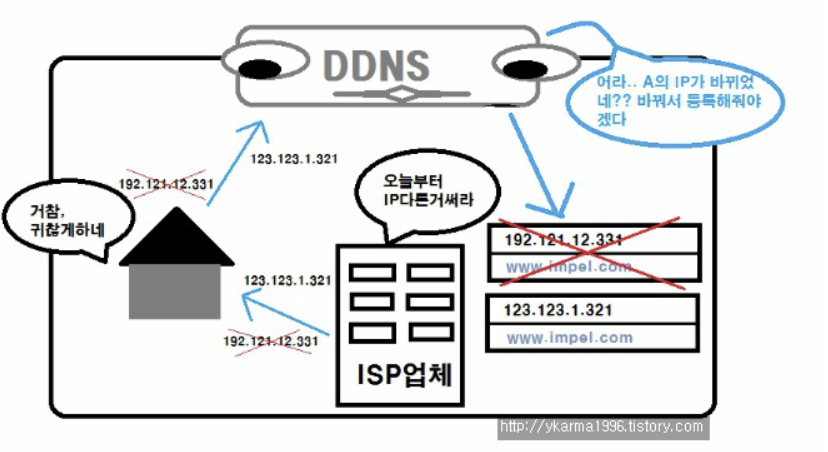

# DDNS란 ?

한마디로 설명하면 ..

**IP 주소가 바뀔 때마다 DNS Record를 자동으로 업데이트 할 수 있는 Service이다.**  

```
DNS Service는 IP 주소를 Record와 매칭시켜 Domain으로 만들어 접근하기 쉽도록 도와주는 서비스이다.
하지만 Network 엔지니어는 IP를 주로 동적으로 할당받고 IP 주소를 자주 변경한다. 

만약 domain이 skill.com인 IP  192.168.0.1이 A Record abc로 매칭 되어있다고 가정하였을 때

abc.skill.com은 192.168.0.1 이지만 IP가 192.168.0.2로 바뀌면 abc.skill.com으로 접속을 하지 못한다.
```

위와 같은 상황처럼 IP 주소가 바뀌는 경우에 대비하여 Record를 자동으로 업데이트 하는 Service를 `DDNS`라고 한다.

즉, DDNS Service는 IP가 바뀔 때 마다 Record 업데이트 한다. 

---

## DDNS가 중요한 이유는 ?

과거에는 IP 주소를 고정 주소로 사용하여 **거의 변경되지 않았다**.

하지만 Internet의 발달에 따라 IP 주소는 점점 고갈 되어 갔고 `IPv6`가 개발되었다.

하지만 고정 IP 주소를 사용하는 것은 비용 적으로 더 이상 효율적이지 않다.

```
고정 IP 주소를 사용하는 경우에는 대 규모 환경에서 해당 IP간의 충돌과 선점 등 고려 사항이 너무 많다.
```

그러므로 네트워크 관리자는 주로 **DHCP**를 활용하여 IP 주소를 동적으로 할당하고 관리한다. 

### IP 주소가 변경되는 이유

1. `할당 시간`
    - Network 관리자는 일반적으로 Client에게 할당할 Pool을 지정한다.
    - 미리 정해진 주소를 정해진 시간 동안 임대 하므로 주소를 반납 한 후 다시 할당 받게 되면 IP의 주소가 바뀔 수 있다.
2. `Shutdown & Logoff`
    - Computer는 Network에 연결될 때마다 새로운 동적 IP를 할당 받는다.
    - Computer가 Network에서 Logoff를 하면 DHCP는 나머지 Client에게 주소를 재 할당 한다.
        - 재 할당은 Logoff를 하면 남은 IP를 다른 Client에게 준 다는 뜻.
        - 

따라서 동적 IP 할당 및 관리는 불규칙한 간격으로 자주 변경될 수 있다. 

```
즉 DDNS는 IP 주소를 수동으로 입력하는것이 아닌 항상 Domain으로 접근할 수 있도록 해준다.
```

---

## DDNS의 작동 방식

**아래는 일반적인 DDNS의 작동 단계이다.** 




1. DDNS Server는 기본적인 초기 DNS를 먼저 구성한다.
2. IP가 변경되는 Device 또는 Server Instance에 DDNS Client를 설치한다. 
3. DDNS Client는 지속적으로 IP의 변동 사항을 확인하고 감지한다. 
4. 만약 감지 됐다면, DDNS Server에게 자신의 IP가 변경되었다는 알림을 보낸다. 
5. DDNS는 바뀐 IP를 초기 Record가 가르키도록 수정한다. 

IP 변경이 계속하여 감지된다면 1~5 단계의 Process 과정을 거친다. 

---