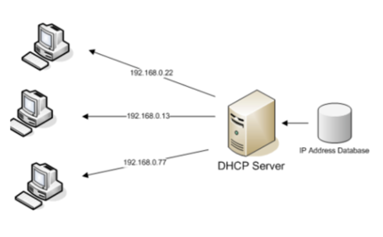

# DHCP

- DHCP는 `Dynamic Host Configuration Protocol`의 약자이다.
- DHCP는 IP 주소 관리를 용이하게 하기 위해서 개발되었다. DHCP를 사용하면 네트워크 관리자는 IP 주소 할당을 자동화하고 중앙에서 관리할 수 있다.
- 또한 네트워크에 장비들이 추가 또는 제거 등이 될 때 유연하게 대응할 수 있다.
- DHCP는 Port Number `UDP 67`번을 사용한다.

### DHCP의 장점

- PC의 수가 많거나 PC 자체 변동사항이 많은 경우에 IP 설정이 자동으로 되기 때문에 효율적으로 사용이 가능하고, IP를 자동으로 할당을 해주므로 IP 충돌을 막을 수 있다.

### DHCP의 단점

- DHCP 서버에 의존되기 때문에 DHCP 서버가 다운되면 IP 할당이 제대로 이루어지지 않는다.

---

## DHCP의 구성요소

### 1. DHCP Server

- DHCP Server는 네트워크 인터페이스를 통해서 DHCP Client에게 자신의 일정한 범위의 IP 주소 내에서 다른 클라이언트에게 할당하여 자동으로 설정하게 해주는 역할을 한다.
- 또한, Client에게 IP 할당 요청이 들어오면 IP를 부여해주고 할당 한 후 빌려준 IP들을 중앙에서 관리도 해준다.

### 2. DHCP Client

- Client들은 시스템이 시작하면 DHCP 서버를 찾기 위해 브로드캐스트를 계속 날린다.
- DHCP 서버로부터 IP주소를 부여받으면 TCP/IP 설정은 초기화되고 다른 호스트와 TCP/IP를 사용해서 통신이 가능해진다.

---

## DHCP 프로토콜의 원리

- DHCP를 통한 IP 주소 할당은 `임대` 라는 개념을 가지고 있다.
- 즉, 이 주소를 영구적으로 가지지 않고 `임대기간(IP Lease Time`을 명시해서 그 기간 동안만 IP 주소를 사용하도록 하는 것이다.
- Client는 임대기간이 끝나고도 계속 그 주소를 사용하고 싶다면 DHCP Server에게 임대기간 연장(IP Address Renewal)을 요청해야한다.
- 또한, Client들은 할당받은 IP 주소가 더 이상 필요치 않게 되면 IP 주소 반납 절차 (IP Address Release) 를 수행하게 된다.

---

## DHCP Server → DHCP Client

### 1. DHCP Discover

- DHCP Client는 DHCP Server를 찾기위해 BroadCast 패킷을 계속하여 보낸다.

### 2. DHCP Offer

- BroadCast 패킷을 확인한 서버는 DHCP Client에게 자신의 IP 주소와 할당할 수 있는 범위내의 IP 주소를 Client에게 알려준다.

### 3. DHCP Request

- DHCP Client는 DHCP Server의 IP와 자신이 할당받을 수 있는 IP를 확인 후, DHCP Server에게 IP 할당을 Request(요구) 한다.

### 4. DHCP ACK

- DHCP Server는 Client Request를 확인하고 주소 임대 기간과 주소를 같이 Client에게 할당해준다.
- 또한 기타 네트워크 정보까지 같이 임대를 해준다.