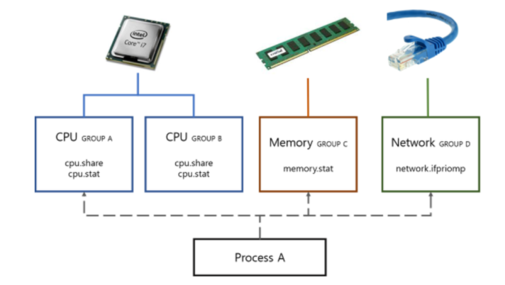
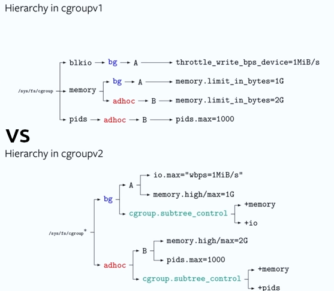

# cgroups




- Control Groups의 약자로 `Process들이 사용할 수 있는 Computing 자원들을 제한하고 격리`시킬 수 있는 Linux Kernel의 주요 핵심 기능이다.
- cgroups를 이용하게 되면 다음의 Resource들을 제한 할 수 있다.

```docker
                             Memory
                              CPU
                             Network
                             Device
                              I/O
```

- cgroups로 Container 안의 Process가 사용할 수 있는 Resource를 제한 함으로써 특정 Container가 Host OS의 자원을 모두 사용하는 일을 막는다.
- 하나 또는 복수의 장치를 묶어서 하나의 Group을 만들 수 있으며 개별 Group은 System에서 설정한 값만큼 HW를 사용할 수 있다.

```docker
ex) 어떤 그룹이 CPU를 더 많이 차지할 것인가?
ex) 어떤 그룹이 얼만큼의 Memory를 사용할 수 있는가?
ex) 각 그룹에 네트워크 우선순위를 어떻게 줄 것인가?
```

---

## Cgroups의 특징

- cgroup은 Mount하여 사용 할 수 있다..

```docker
이후에 설명하겠지만 cgroup은 디렉터리 구조로 나타난다.
/sys/fs/cgroup/ 경로 아래에 여러 Sub Directory들이 생성된다. 
cgroup을 사용할 때, /sys/fs/cgroup을 특정 Directory에 mount하여 cgroup sub system을 사용할 수 있다.
```

- Resource 분배는 Sub System을 사용해야 한다.

```docker
Cgroup을 사용하여 Linux에서 Process 그룹 간에 Resource를 분배하고 제한하려면 Sub System을 사용해야한다.
예를 들어, CPU Resource를 관리하려면 CPU Sub system을 사용. Memory Resource를 관리하려면 Memory Sub System을 사용.
Sub System은 /sys/fs/cgroup Directory 내의 각각의 Directory로 나타난다.
```

- Kernel 설정 시 `CONFIG_CGROUPS` 옵션을 선택해야 사용할 수 있다.

```docker
이 설명은 Linux Kernel의 Compile Option 중 하나인 'CONFIG_CGROUPS'를 활성화해야 cgroups를 사용할 수 있다는 것이다.
Kernel이 Compile 될 때, CONFIG_CGROUPS를 활성화하면 System에서 Cgroups를 사용할 수 있다.
CONFIG_CGROUPS를 활성화 하는 설정은 Kernel Source Code를 수정해야한다. 나중에 실습하면서 다뤄보겠다.
```

- 가상 File System의 Directory로 표시되는 다중 계층 구조로 구성되어있다.

```docker
이 설명은 Linux System에서 사용되는 /sys Directory드은 실제 물리적인 Disk 공간에 저장되어있는 것이 아닌
System의 여러가지 정보 및 설정을 동적으로 제공하는 데 사용되는 가상 Directory 구조를 나타낸다.
```

---

## Cgroups Sub System

- Cgroup은 여러 개의 Sub System으로 이루어져 있다.
- **Sub System을 활용하여 Process가 사용하는 Resource들을 제한하고 분배할 수 있다.**
- 아래 설명한 Sub System이 다가 아닐 수 있으니 추가적으로 발견하면 그때그때 업데이트 하겠다.

### 1. cpu

```docker
말 그대로 CPU의 사용량을 제한하는 것이다.

자세히 설명

- cgroups는 System이 BUSY 상태일 때 CPU 공유를 최소화, 즉 Container 별로 사용량을 제한 할 수 있다.
- 이 Sub System은 CPU에 cgroup 작업 Access를 제공하기 위한 Scheduler를 제공한다.
```

### 2. cpuacct

```docker
Process 그룹 별 CPU Resource 사용에 대한 분석 통계를 생성한다.
```

### 3. cpuset

```docker
개별 CPU 및 Memory Node를 cgroup에 Binding 하기 위해 사용되는 Sub System이다.
cpuset을 사용하면 특정 CPU 및 Memory Node에 Process를 제한함으로써 Resource를 효율적으로 사용할 수 있다.

- 즉, 그 말은 Process가 실행 될 때 해당 CPU나 Memory에서만 동작하도록 하는 것이다.
- 특정 CPU 코어에 Process를 제한할 경우 해당 CPU에서만 동작한다.
- 특정 Memory Node에 제한할 경우 Process들이 특정 Memory에서만 할당 받을 수 있다.
```

### 4. memory

```docker
- memory Sub System은 cgroup에서 사용하는 Memory Resource에 대해 Process가 사용하는 Memory의 
  양과 사용 가능한 Memory Resource를 Control 할 수 있다.
- 그리고 사용되는 Memory Resource에 대한 Reports도 자동으로 생성해주는 Sub System이다.
- 또한 특정 Memory에 대한 접근을 제어할 수도 있다.
```

### 5. blkio

- Block I/O : 데이터를 일정 크기의 블록 단위로 읽고 쓰는 것을 뜻함.
    - 주로 Disk Drive, SSD, Network STORAGE와 같은 블록 장치에 대한 읽고 쓰기 작업을 말함.

```docker
특정 Block I/O에 대한 접근을 제어하거나 제한하기 위한 Sub System이다.

- 이는 System에서 여러 Process가 동시에 디스크를 사용하는 상황에서 각 Process에 할당되는 
  DISK 대역폭을 제어하는데 유용하다.
```

### 6. devices

```docker
cgroup의 작업 단위로 device에 대한 접근을 허용하거나 제한한다.

- 예를 들어, 특정 cgroup에서 USB나 그래픽카드에 대한 접근을 제한하면 해당 cgroup내의 process들은 접근하지 못한다.
```

### 7. freezer

```docker
cgroup의 작업을 일시적으로 정지하거나 다시시작 할 수 있다.
Process나 Process 그룹을 정지하거나 다시 시작하는 것이다.

예를 들어, Container를 중지할 때, freezer를 사용하여 Process를 정지하고 그 후에 Container를 정지한다.
그럼 컨테이너의 상태를 보존하기 용이하다.
```

### 8. net_cls

```docker
cgroup 내의 process나 process group에 대한 네트워크 트래픽을 제어하는데 사용된다.

- net_cls를 사용해 process들의 Network Packet에다가 Class Tag(cls)를 붙일 수 있다.
- 이 Tag는 방화벽 규칙 또는 트래픽 제어에 사용된다.
```

### 9. net_prio

```docker
cgroup 내의 process나 process group에 대한 네트워크 트래픽에 우선순위를 부여하는데 사용된다.

- net_prio로 네트워크 트래픽에 우선순위를 붙여 중요한 트래픽에 대해서는 성능을 향상시키는 것이다.
```

### 10. hugetlb

```docker
Linux Kernel에서 대규모 Page를 지원하는 Sub System이다.

- 일반적인 Page의 크기는 4KB이지만, hugetlb을 사용하면 최대 2MB의 Page를 지원한다.
- 큰 Page를 사용하면 System에서 주소 할당과 Memory Mapping을 효율적으로 실행할 수 있다.
```

### 11. pid

```docker
Cgroup에서 실행되는 process를 관리하고 제어하는데 사용되는 Sub System이다.

- pid를 사용하여 process group의 process 수를 제어할 수 있다.
- process의 기능을 중지하거나 시작할 수 있고 우선순위를 조정하고 CPU 또는 Memory 할당 등 제어 작업도 할 수 있다.
```

---

## cgroup v1 vs cgroup v2



- Cgroup은 두 가지 Version으로 나뉘며 두 Version은 다른 계층 구조를 보인다.

### cgroup v1

- 여러 Sub System을 별도로 관리하는 방식이다.
- 각 Sub System은 별도의 계층 구조를 가지고 있다.
- 그러므로 복잡한 구현이 가능하지만 관리 또는 설정이 복잡하다는 단점이 있다.

### cgroup v2

- cgroup v2는 단일 통합된 계층 구조를 지원한다.
- 또한, 모든 Sub System은 통합된 계층에서 동작한다.
- v1에 비해 간단한 계층 구조를 가지고 있어 설정 또는 관리가 수월한 편이다.