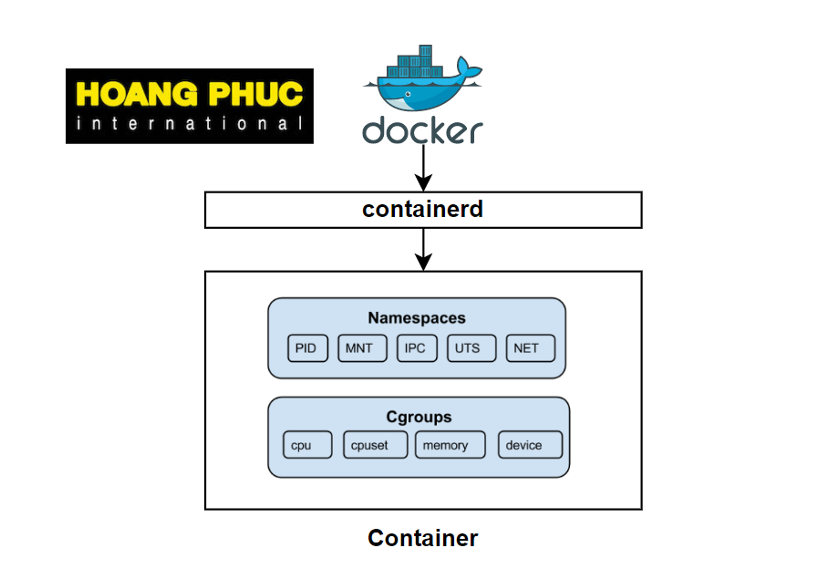

# 컨테이너를 구획하는 장치(namespace)



- Docker는 Container라는 독립된 환경을 만들고, **Container를 구획화 하여 Application의 실행        환경을 만든다.**
- 이 Container를 구획 하는 기술은 `Linux Kernel의 Namespace`라는 기능을 사용한다.

```markdown
구획 : 어떠한 물체나 객체를 나누어 구분하는 것.
```

---

## NameSpace란 ?

```markdown
한 덩어리에 이름을 붙여 분할함으로써 충돌 가능성을 줄이고, 쉽게 참조할 수 있게 하는 개념이다.

- 이름과 연결된 실체는 그 이름이 어떤 NameSpace에 속해 있는지 고유하게 정해진다.
- 즉, Namespace가 다르면 이름이 같더라도 다른 실체로 처리된다.
```

---

## NameSpace의 기능

- Namespace 기능은 Kernel에 내장되어있다.
- Linux는 Kernel에서는 다음 6가지 namespace 기능을 지원하고 있다.

### 1. mnt (File System Mount)


- Host File System에 구애 받지 않고 독립적으로 File System을 Mount하거나 UnMount를 할 수 있다.
- 즉, Container에서 mount를 할 때 Host OS에 영향을 미치지 않는다.

```markdown
예를 들어 ..

Host System에서 /home/user 디렉터리를 마운트 했을 때 /home/user 내의 파일이 보이겠지만..
Container 내부에서는 /home/user 디렉터리에 다른 파일 시스템을 마운트 할 수 있다.
왜냐하면 Container 내부에서는 독립된 환경이기 때문이다. 
```

### 2. pid (Process)

- 각 Container,Namespace 에서 실행되는 Process의 공간을 격리할 수 있다.

```markdown
* Container는 Host System에서 격리된 상태로 동작되어야한다. 
* PID Namespace를 사용하면 Host System과 Container간에 Process ID를 격리함으로써, 각 Container가 자체적인 Process 공간을 가질 수 있다.
```

### 3. net (Network)


- Container 안에 여러 Namespace간에 network 충돌을 방지할 수 있다.
- 각 격리 화 된 Network Interface를 제공하는 기술이다.
- 중복 Port Binding 등 ..

### 4. uts (hostname)

- 독립적인 hostname을 할당할 수 있다.
- HOST OS와 이름이 같아도 Namespace가 다르면 다른 실체로 처리된다.

### 5. user(UID)

- 독립적인 사용자를 할당할 수 있다.
- 이것도 마찬가지로 Namespae가 다르면 다른 실체로 처리된다.

### 6. ipc (SystemV IPC)


- Process간에 독립적인 통신 경로를 제공한다.
- Container 별로 process가 있을 때 process간에 통신 할 때 사용되는 통신 경로가 독립적인 것이다.