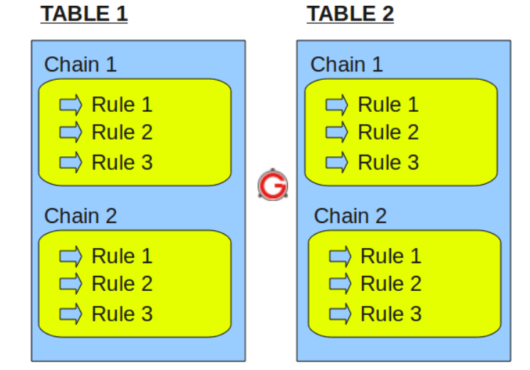
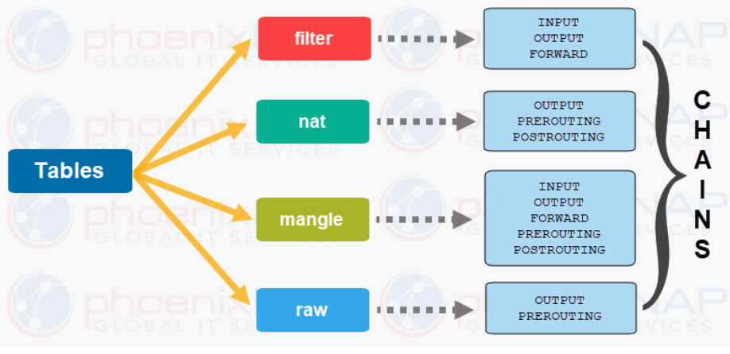
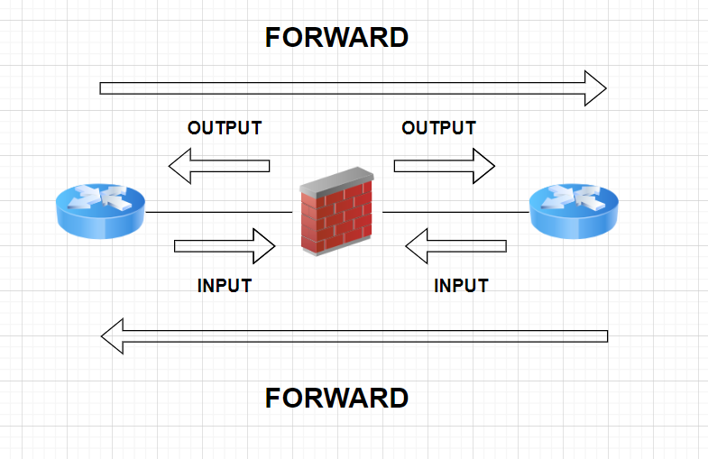
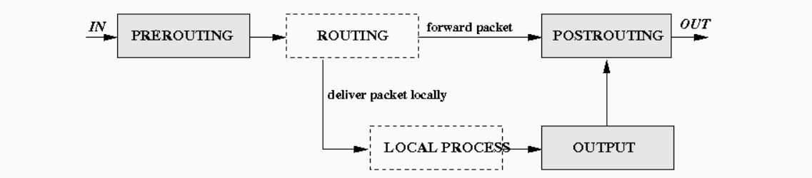

# IP Tables의 개요


## IP Tables란 무엇일까 ??

쉽게 말해 **Linux**에서 **방화벽**을 사용할 수 있게 하는 `Tool`이다.

또한 `Packet Filetering` 기능을 제공한다. 

### packet filtering이란 ?

packet filtering이란 **Packet의 Header**를 보고 Packet 전체를 어떻게 처리할 것인지 결정하는 것이다.

```markdown
Packet = Header(헤더) + Data(실질적인 데이터)
```

Header에는 Filtering할 출발지 주소, 목적지 주소, checksum, Protocol을 가진다. 

Data는 말 그대로 처리가 되는 Data를 가지고 있다. 

Header에 특정 정보를 사용하여 특정 조건에 따라 Packet을 **ACCEPT** 또는 **DROP** 할 수 있다.

---

# IP Tables의 구조

IP Tables는 크게 **3개**로 나뉘게 된다.

1. **Table**
2. **Chain**
3. **Rules**

---

## IP Tables 구조 (Table)




IP Tables에서 **가장 큰 설정의 기준**이 되는 단위 이다. 

각 Table은 **자신만의 고유한 Chain**을 구성할 수 있으며 **Admin이 Chain을 분류**하기 위한 Table을      생성할 수 있다.

아래 `5개의 Table`은 Linux IP Tables에서 기본적으로 내장되어있는 Table의 종류이다.

1. **Filter**
2. **NAT**
3. **Mangle**
4. **Raw**
5. **Security** 

### Filter Table

IP Tables의 기본적인 Table이 되는 Table이다. 

위에서 언급한 Packet Filtering을 이 Table에서 처리하게 된다. 

### NAT Table

말 그대로 NAT의 역할을 수행하게 되는 Table이다.

IP 주소 변환을 수행하게 되는 Table이다. 

### Mangle Table

Packet Data를 변경하는 특수한 규칙을 적용하는 Table이다.

주로 Header의 정보를 수정하기 위해 사용되며 QOS 및 다양한 네트워크 작업에 사용된다.

### Raw Table

Raw Table은 Linux kernel이 packet을 처리하게 되는 방식을 변경하는데 사용된다.

주로 kernel에서 Connection Tracking을 활성화 또는 비활성화 하는데 사용된다.

```markdown
Connection Tracking 
- 연결 상태를 추적하는 기능 
- kernel이 네트워크 연결 상태를 기록하고 관리하여 네트워크 패킷이 어느 네트워크에 속해 있는지 알 수 있다.
```

### Security Table

Linux 보안 모듈인 SELinux에 의해 사용되는 MAC(Mandatory Access Control) 네트워크 관련 규칙을 적용하는 Table 이다

---

## IP Tables 구조 (Chain)




**일치하는 Packet의 규칙을 연결**하는 단위이다. 

위의 그림과 같이 각각의 Table 마다 Chain이 Match 되어 있다. 

대표적인 Chain으로 `INPUT, OUTPUT, FORWARD, POSTROUTING,PREROUTING`이 있다.




### INPUT

방화벽을 목적지로 삼아 방화벽을 향하여 들어오는 모든 Traffic을 처리하는 Chain

### OUTPUT

방화벽에서 발생하여 외부로 나가는 모든 Traffic을 처리하는 Chain

### FORWARD

방화벽에서 발생하지도 않고, 방화벽을 향하지도 않는 방화벽을 거쳐하는 모든 Traffic을 처리 하는 Chain.




### POSTROUTING

Postrouting은 Packet을 Routing 하는 기능을 가지고 있지는 않다. 

POSTROUTING은 **Packet이 System에서 떠나는 시점**에 적용이 된다.

그렇기 때문에 **SNAT에서 주로 사용**이 ****되고 있다.

### PREROUTING

PREROUTING도 마찬가지로 Packet을 Routing 하는 기능을 가지고 있지는 않다.

PREROUTING은 **Packet이 System에 도착하는 시점**에 적용이 된다.

그렇기 때문에 **Port forwarding**에 주로 사용이 되고 있다.

### **MASQUERADE**

사설 Network를 공인 IP와 통신 시켜주는 기술이다. SNAT와 비슷하다.

```markdown
결론적으로 말하자면

사설 Network가 공인 IP와 통신하기 위해 SNAT를 사용하여 MASQUERADE 하는 것이다.
```

---

## IP Tables 구조 (Rules)

Chain에 내장 되어 있는 실질적으로 Packet의 처리를 담당하는 규칙이다.

주로 사용되는 아래와 같은 Command로 사용할 수 있다.

## `Chain Option`

**-N :**

 **새로운 Chain을 생성한다.**

**-X :** 

**비어있는 Chain을 삭제한다. 기본 INPUT,OUTPUT,Forward는 제거 XX.**

**-P :** 

**Chain이 어떤 정책을 사용할지 결정한다. (ACCEPT,DROP 등)**

**-L :**

 **현재 Chain의 정책을 확인한다.**

**-F :**

 **Chain의 규칙을 제거한다.**

**-Z :** 

**Chain 내의 모든 규칙들의 packet & byte를 0으로 설정한다.**

**-C  :**

 **packet을 test 한다.**

## `Chain 내부 규칙 Option`

**-A :** 

**Chain에 새로운 규칙을 추가한다. 자동으로 맨 앞에 추가가 된다.**

**-I :** 

**Chain의 규칙을 맨 앞에 추가한다.**

**-R :** 

**Chain의 규칙을 교환한다.**

**-D :**

 **Chain의 규칙을 제거한다.**

## `일반 Option`

**-s(—source),-d(—destination) :** 

**각각 출발지와 목적지를 정하는 Option.**

**-j(—jumb) :** 

**특정한 정책 설정 Option (규칙에 맞는 Packet을 어떻게 처리할지 ?)**

**-p(—protocol) :** 

**Protocol을 설정하는 Option**

**-t(—table) :** 

**Table을 지정하는 Option**

**—sport,—dport :** 

**출발 port와 도착 port를 지정하는 Option**

**-i(—in-interface), -o(—out-interface) :** 

**들어오는 interface와 나가는 interface를 지정하는 Option**

**-m :**

 **특정 모듈과의 Match (state, multiport 등등)**