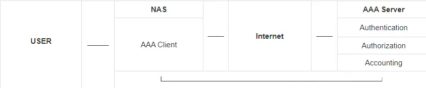
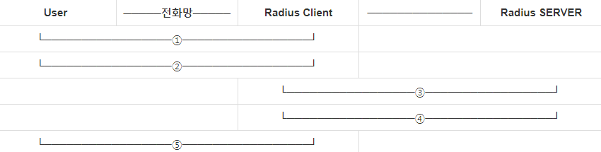

# `AAA`(Authentication,Authorization,Accouting)란 ?

- AAA는 일관된 방식으로 3개의 독립적인 보안 기능의 세트를 구성 하기 위한 `프레임 워크`이다.
- 사용자가 네트워크에 접근하여 자원을 사용하려고 하는 것을 제어하기 위해 사용되는 기술이다.

### 인증 (Authentication)

- 시스템, 네트워크 망에 접근하기 전 `사용자의 신원을 검증`하는 것이다.
- Password, 암호화의 기능을 제공

### 권한 부여 (Authorization)

- 검증된 사용자에게 어떤 수준의 `권한과 서비스를 허용`해주는 것이다.
- 사용자의 권한 정보는 NAS나 원격 AAA 서버의 Database에 저장됨.

### 계정 관리 (Accounting)

- 권한이 부여된 후 사용자가 행한 행위의 기록, 사용 정보를 모아서 감사 또는 보고서 기능을 수행하는 것이다.

```markdown
쉽게 말해, 위 세가지를 제공해줌으로써 사용자 계정에 대한 인증과 권한을 부여해주는 Server이다.
```

## AAA의 특징

### 1. 분산 구조

- 분산된 Client - Server 구조를 가지고 있다.
    - AAA Server : 분산된 정보를 중앙에서 관리하고 저장한다.
    - AAA Client : 원격 사용자의 인증용 정보를 중앙 AAA Server에게 전달한다.

### 2. 보안 강화

- AAA는 사용자의 신원을 확인하고 권한을 관리하여 민감한 정보와 자원을 보호한다.

### 3. 효율적 관리

- 인가 (Authorizatoin) 단계에서 사용자가 필요한 자원에만 접근할 수 있도록 하기 때문에 불필요한 접근을 없애 성능을 최적화하고 부하를 분산하는데 도움이 된다.

### 4. 중앙 통합 관리

- 분산 되어 존재하는 Client를 중앙에서 관리 할 수 있다.

---

## AAA 구성




- 사용자는 NAS(Network Access System)에 접속하여 네트워크에 대한 접근을 요청하고, NAS의 AAA Client 기능을 Client 사용자의 인증 정보를 받아서 AAA Server로 전달한다.
- AAA 서버는 수신한 데이터를 처리하고 AAA Client에게 네트워크 사용 허용 또는 권한 허용 등 다른 관련 데이터를 전송
- AAA Client는 사용자에게 정한 자원에 대한 접근이 허용되었는지 거절되었는지 통지함.

```markdown
Wireless가 Radius Server에게 인증하는 상황을 예시로 들면 ..

User : Radius Server에 등록되어있고 Wireless를 사용하는 PC 사용자 
AAA Client : Wireless 장치
AAA Server : Radius Server
```

---

# AAA Protocol

- AAA Protocol은 대표적으로 4가지로 나뉜다.

```markdown
1. Radius
2. TACACS+
3. Diameter 
```

---

## 1. `Radius` (Remote Authentication Dial In User Service)

- Radius는 인증 방식의 하나 이다.
- System 내부에서 인증하는 것이 아닌 RADIUS 서버를 두고 그 서버에 인증 요청을 보내 서버에서 인증 대상을 인증하는 방식이다. (그 후, 응답을 보내주는 형식으로 동작한다.)
- 주로 `무선 네트워크`, `일반 네트워크 및  통합 메일 서비스` 등에서 사용된다.
- UDP 를 사용하여 통신하는 `응용 계층`의 프로토콜이라 할 수 있다.

## Radius 특징

### 1. 분산형 구조

- 분산형 Client - Server를 기반으로 동작한다.
- 사용자 관리는 `중앙 집중식`으로 수행한다.

### 2. 인증 방법

- PAP, CHAP 등 다양한 방법을 지원한다.

```markdown
PAP (Password Authentication Protocol)
* 단순한 인증 프로토콜 
* 사용자 이름과 비밀번호를 평문으로 전송하므로 보안에 취약하다.
* Client가 Server에게 사용자 이름과 비밀번호를 보내면, Server는 이를 확인하고 인증 여부를 결정한다.
* PAP는 간단하게 구현할 수 있으나, 보안 상의 이유로 사용을 권장하지 않는다.

CHAP (Challenge Handshake Authentication Protocol)
* CHAP는 비밀번호를 전송하지 않고도 인증을 수행한다.
* 암호화된 통신을 제공한다. 
* PAP에 비해 강력한 보안을 제공하며 중간에서의 도청을 방지할 수 있다.
```

```markdown
CHAP는 도전-응답 방식은 다음과 같다.

1. Server는 Client에게 무작위의 Challenge 문자열을 보낸다. 이 문자열은 각 인증 시도마다 달라진다.
2. Client는 받은 문자열과 미리 정의된 Password를 Hash 함수를 사용하여 Hash 값을 생성하고 이를 Server에게 보낸다.
3. Hash 값을 받는 Server는 동일한 비밀번호과 저장된 정보를 사용하여 도전 문자열을 해시하여 Hash 값을 만든다. 자신이 만든 Hash값과 Client가 보낸 Hash값을 비교하여 인증한다. 
```

### 3. UDP 프로토콜

- UDP 1812와 1813을 사용한다.
- 1812 : 인증 포트
- 1813 : 계정 관리 포트

```markdown
이전에는 1645(인증) 및 1646(계정 관리)를 사용했다.
```

## FreeRadius란 ?

- `Free Radius`는 GNU(General Public License) 버전 2에 따라 개발 및 배포된 모듈이다.
    - 다운로드 및 사용이 무료이다.
- Client/Server 방식으로 동작하며, 세계에서 가장 많이 사용되는 RADIUS 제품이다.

## FreeRadius의 장점

### 1. Open Source

- Open Source 이므로 개방적이고 확장 가능한 Solution을 제공한다.

### 2. 쉬운 수정

- 다양한 상황에 맞게 쉽게 수정할 수 있다.

### 3. 호환성

- 대부분의 보안 시스템에 적용이 가능하다.
- 시장에 나와있는 많은 보안 시스템에 RADIUS 기반 인증 서버를 연동할 수 있다.
- 또한, Radius Client Protocol을 지원하는 모든 장치들과 통신할 수 있다.

## 간단한 Radius 동작 원리



1. User와 Radius Client는 PAP,CHAP 등의 사용자 인증 프로토콜을 어떤 것을 사용할지 협상한다.
2. 사용자는 계정과 Password를 협의된 사용자 인증 프로토콜을 사용하여 Radius Client에게 보낸다.
3. Radius Client는 사용자의 정보를 Radius 서버에 `Access Request`로 전달한다. 
4. Radius Server는 사용자의 정보를 확인하여 인터넷 접근 허용 여부를 확인한 뒤 `Access Accept`를 Radius Client에게 전달한다.
5. Radius Client는 인증 여부를 User에게 전달한다.

---

## 2. TACACS+ (Terminel Access Controller Access Contrd System)

- TACACS 프로토콜은 RFC 1492에서 정의되었다. 그리고 현재는 TACACS+가 널리 사용되고 있다.
- Client-Server 형태의 AAA Protocol로써 Radius와 여러 가지 면에서 동일하다.
- 하지만 TACACS+는 Radius와 다르게 UDP를 사용하지 않고  `TCP 49번`을 사용한다.

### TACACS+ vs RADIUS

| TACACS+ | RADIUS |  |
| --- | --- | --- |
| Cisco 프로토콜  | 표준 프로토콜 |  |
| TCP  | UDP |  |
| TCP 49번을 사용 | UDP 1812,1813을 사용 |  |
| AAA Packet 전체를 암호화 한다. | 보내는 Password만 암호화를 하고 나머지는 암호화를 하지 않는다. |  |
| 인증(Authentication)과 인가(Authorization)을 분리하여 전송한다. | 인증(Authentication)과 인가(Authorization)을 하나로 다루면서 전송한다. |  |

---

## 3. Diameter

- AAA 프로토콜이지만 Mobile 환경에서 사용할 수 있다.
- 또한 프로토콜 구조는 Server - Client가 아닌 `Peer-to-Peer 양방향` 구조이다.
- 또한 TACACS+ 와 같이 Packet 전체를 암호화한다.
- 특이한 점은 모든 오류 처리를 지원하고,  Failover 기능을 제공한다.

---

