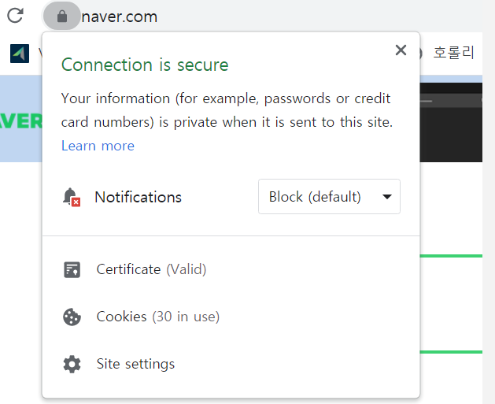
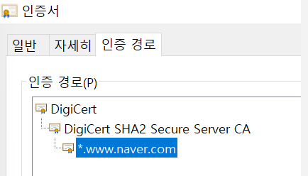
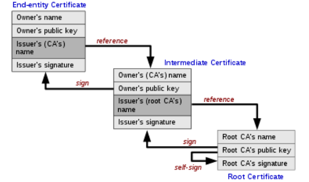

# CA(Certificate Authority)란 ?

```markdown
한마디로 설명하면, 인증기관(Certificate Authorty,CA)이란 SSL 보안 인증서를 발급하는 기관을 말한다.
```

- 즉, 전자 서명 및 암호화를 위한 `디지털 인증서`를 발급,관리하는 서비스 제공 기관/서버를 말한다.
- 하지만 인증서를 작성하는 인증 기관마다 서로 다르면 인증서의 내용을 이해하는데 문제가 있을 것이다.
- 이러한 인증서들의 표준이 되는 규칙이 있어야 하는데, 현재 가장 널리 사용되고 있는 표준은                   `X509`이다.

```markdown
X509와 인증서 확장자에 대해서는 따로 포스팅 해둠.
```

## 인증서를 왜 사용하는 걸까 ?

- 인증서를 발급하여 도대체 어떻게, 어디서 사용하는 걸까 ?
- 디지털 인증서는 주로 두 가지 주요 역할을 수행하여 신뢰할 수 있는 통신을 보장한다.

### 1. 서버 인증

- Server가 자신의 인증서를 Client에게 제공함으로써 자신은 인증된 서버임을 밝히는 것이다.
- Client는 해당 인증서가 `신뢰할 수 있는 인증서`인지 확인한다.
- 따라서, Client는 확실하게 인증된 Server의 공개키를 얻음으로써 안전한 통신을 할 수 있는것이다.

### 2. Client 신원 인증

- Client 신원 인증은 주로 다음과 같은 상황에서 사용된다.

```markdown
1. 서버의 인증서 요청 
  1-1. Client가 서버에 연결할 때, Server는 Client에게 Server 자신의 디지털 인증서를 제공하도록 요청할 수 있다.
2. 클라이언트의 인증서 요청
  2-1. Client는 Server에 대한 신원을 증명하기 위해 자신의 인증서를 Server에게 제공한다. 
3. 사용자 인증
  3-1. VPN 기술에서 사용자의 자격을 증명할 때 주로 사용되기도 한다.
4. 유효성 검증
  4-1. Server는 Client의 공개 키를 인증서에서 추출하여 안전한 통신을 위해 사용할 수 있다. 
```

---

## 인증서

- 앞서 언급 한처럼 신뢰할 수 있는 인증서는 `공인 인증기관`이 발급하게 된다.
- `공인 인증기관`은 철저하게 수직적인 구조를 기반으로 `신뢰성이 상속`되는 구조이다.

```markdown
예시 

최상위 루트 기관이 서명한 하위 인증서
하위 인증서를 사용하는 하위 인증기관 
하위 인증기관이 발급하는 인증서
```

- Naver의 주소창 왼쪽의 자물쇠를 눌러보면 이렇게 **Connection is secure**라고 뜨고 밑의 *Certificate*는 *Valid*하다고 확인할 수 있다.



- Certificate를 눌러서 인증 경로 탭으로 가보면 아래와 같이 트리 구조로 인증서가 발급 되어 있는 것을 확인할 수 있다.



```markdown
네이버는 최상위 인증기관인 Digicert로부터 인증받은 DigiCert SHA2 인증기관으로부터 발급된 인증서로 인증을 하고 있는것으로 볼 수 있다.
DigiCert SHA2 인증기관은 DigiCert에서 발급된 인증서로 설립된 인증기관이란것도 알 수 있다.
```

- 오늘날에는 무조건 신뢰할 수 있는 기관이 몇 군데 존재한다.
- `최상위 인증기관(Root CA)`이라고도 하고 가장 최상위의 인증서를 발급하는 기관이다.
    - 여기서는 DigiCert가 Root CA라고 볼 수 있다.

`이러한 Root CA의 인증서들은 일반적으로 Web Browser에 미리 내장되어있거나 내장 시켜야 한다.`

`또한 해당 인증서에 대응하는 공개키 또한 인증서 내부에 포함되어 있다.`

- 그리고 암묵적으로 이 **Root CA들은 신용할 수 있다!** 라고 서로 약속하고 Root CA들의 공개키로 복호화가 가능한 데이터는 신용할 수 있는 데이터라고 간주하는 것이다.

```markdown
왜냐하면, Root CA의 공개키로 복호화가 가능한 데이터는 Root CA의 감추어진 개인키로 암호화를 했기 때문이다.
```

- 네이버 CA의 예시와 같이 Root CA가 모든 일을 하면 Root CA의 개인키를 탈취 당한다면 대참사가 벌어지는 것이다.
- 그렇기 때문에 CA는 2계층 혹은 3계층 구조의 형태를 띄고 있다.

### Root CA → Intermediate CA



```markdown
1. 우리는 SSL 인증서를 발급하기 위해 자신의 공개키를 인증서에 담아 Intermediate Certificate로 보낸다.
  1-1. 하지만 Root CA가 아닌 Intermediate Certificate를 완벽히 신뢰할 수는 없다.
2. 그러므로 Intermediate Certificate는 End-entity Certificate에서 받은 인증서를 자신의 개인키로 암호화하여 Root CA에게 보낸다.
3. Root CA는 모두가 신뢰하도록 약속되어있기 때문에 Root CA는 자신이 Self-Sign을 수행한다.
```