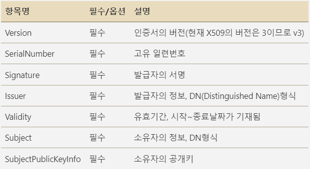
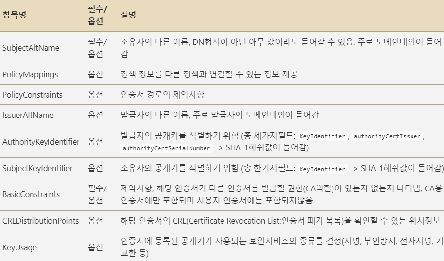

# CA 용어 설명

- SSL 인증서 파일 포맷 종류를 알아보자 .

---

## 그전에, X.509란 ?

### X.509 란?

- X.509란 ITU-T가 만든 PKI(Public Key Infrastructure)의 표준이다.
- 공개 키 기반으로 생성된 인증서의 표준 형식을 정의한다.
- 인증서를 만들 때는 다음과 같은 규칙을 따라야 한다 ! 라는 것이다.
- 아래는 X.509 규칙을 따르는 인증서에 무슨 내용이 있는지 살펴보도록 하자.



- 이제는 X.509과 v3가 되면서 이전 버전과 달라진 점들은 -extensions를 사용하여 Extensions 정보들을 인증서에 추가할 수 있게 되었다.
- 아래는 Extensions 항목의 일부분이다.




### PKI란 ?

- PKI는 `Public Key Infrastructure`의 약자이다.
- 인터넷과 같이 안전이 보장되어있지 않은 공개된 망 사용자들이 한 쌍의 Key (공개키&개인키)를 사용함으로써 안전하게 데이터를 교환할 수 있게 한다.
- PKI를 사용하면 공개키 암호화 알고리즘이 가지는 장점을 모두 가질 수 있다.
- 다음은 PKI를 사용하는 두 가지 상황이다.

## PKI 상황 가정

### 1. 공개키 암호화


- A의 공개키를 사용하여 암호화를 하면 A가 가지고 있는 개인키로만 복호화를 할 수 있다.

### 2. 개인키 암호화


- 자신의 개인키로 암호화를 하면 누구든지 공개키로 이 암호문을 복호화 할 수 있다.
- 이 경우는 자신이 보낸 내용을 증명할 때 쓰이게 된다.

### `이 두 가지의 경우가 공개키 암호화와 전자서명의 원리이다`

### 하지만 ?

- 앞서 언급한 대로 공개키는 말 그대로 `공개` 되어있기 때문에 전자 서명의 경우 해당 공개키가 `과연 내가 원하는 공개키` 인가 ? 라고 생각할 수 있다.

### `그래서 ! 신뢰할 수 있는 인증기관, CA가 등장하게 된다.`

- CA는 따로 설명하겠다.
---

### .pem (Privacy Enhanced Mail)

- PEM 형식의 Data는 Base64로 인코딩된 ASCII 텍스트로 나타낼 수 있다.
- NOTEPAD에서 열기 및 수정도 가능하다.
- 개인 키, Server 인증서, Root 인증서 등 SSL 관련 모든 과정에서 사용하는 기본 Format이다.
- 가장 광범위 하고 거의 99% 시스템에 호환되는 산업 표준 포맷이다. (예 : sslcert.crt.pem)
- ‘——-BEGIN CERTIFICATE——’ 와 ‘——-END CERTIFICATE——’ 사이에 Base 64로 인코딩된 데이터가 들어있을 것이다.

```markdown
Base64는 이진(0&1) 데이터를 ASCII 문자로 표현하기 위한 인코딩 방식 중 하나이다. 

예시

-----BEGIN CERTIFICATE-----
MIIDozCCAougAwIBAgIJAOi9CDe3N3u1MA0GCSqGSIb3DQEBCwUAMIGpMQswCQYD
VQQGEwJVUzERMA8GA1UECAwIU2hhbmdoYWkxETAPBgNVBAcMCFNoYW5naGFpMRUw
EwYDVQQKDAxPb3QgSW5lcm5ldDEUMBIGA1UEAwwLU3lzdGVtIEtleTEgMB4GCSqG
SIb3DQEJARYRa2V5QG15LmNvbTAeFw0yMjAzMTIxMTE2MzdaFw0zMjAzMTAxMTE2
MzdaMIGpMQswCQYDVQQGEwJVUzERMA8GA1UECAwIU2hhbmdoYWkxETAPBgNVBAcM
CFNoYW5naGFpMRUwEwYDVQQKDAxPb3QgSW5lcm5ldDEUMBIGA1UEAwwLU3lzdGVt
IEtleTEgMB4GCSqGSIb3DQEJARYRa2V5QG15LmNvbTCCASIwDQYJKoZIhvcNAQEB
BQADggEPADCCAQoCggEBALPkIrHsL0Kt+1GwJd+6ctU0viIa0OVQJSysZjyDtzF
Uf/+BbRUm2iJKxPmWjkCEv6qktqy8VYJwE21NfWzH/Z6vBskNrmwtam8GRgM/bI
2j4d2QmkSaZAPvaAXnnvP40oY/8cey6S2X1ZVpxgB5GydC8/Afd9DV+Z/DLl2sU
AASrPdHovmFfLsFgQe6PvwWepHr3q9cKMbfu5eANazkpDNTWkJz+rJoChJqCOre
GXo/VX9zA9SEbrWMkfgm7n9SD5zz4s3It4dS3DLgEFq4cdSEpP06dftdb1FZb8L
fx6WqFV8G2Bo1M6Jq12TczCoy2v5dbKS7GkFf9HNBE0CAwEAAaOBkDCBjTAdBgNV
HQ4EFgQUk5lSYgBF6WX95iIqQAWbFwni+E0wHwYDVR0jBBgwFoAUk5lSYgBF6WX9
5iIqQAWbFwni+E0wDwYDVR0TAQH/BAUwAwEB/zANBgkqhkiG9w0BAQsFAAOCAQEA
d6z8trGwCTA3NDCP1W2MX9hKuR5v9dpPktW7IT5uFETPjHhys6j+3Wu9lY9FpMhO
LkmwxhDprW4p67Fz3rCIzTcdmH2FfUfjsntQsQpXs8tB/WJ4Q4gfyjpfwR1E0Y5X
W1Y1vfaVil2eR5d9t3LFWF1lxgq98OOFjE7ufRllnlx9tRMiWW6nQ4RKnNvzkXMR
4XXI1N1BnV0mB/pqjsuHcOUBTLE7VOsZ7POsE4oUVl3HHj5EVoBtKgh0U9Yci4yM
iWYIhv4Eh/KroQf1/1oHQU3d+czHTT+VJZQ06SSIT9qlWv3SImTRDbFFrg5vD1xm
qJtV+K39KS5VXSHgMVZbjw==
-----END CERTIFICATE-----
```

---

### .crt

- `인증서 파일이다`라는 의미로 붙여지는 확장자이다.
- 거의 대부분 `PEM` 포맷이고 **UNIX/LINUX**기반 시스템에서 자주 사용되는 확장자이다.
- cer 확장자를 붙이기도 한다. (crt 확장자 보다는 파일 포맷이 명확하도록 .pem을 붙이는 걸 권장)
    - ssslcert.crt.pem

---

### .cer

- 대부분 PEM 포맷이고 주로 **Windows** 기반에서 인증서 파일임을 구분하기 위해서 사용된다.
- crt 확장자와 거의 동일한 의미이며, cer이나 crt 확장자 모두 Windows에서는 기본 인식되는 확장자이다.

---

### .csr (Certificate Signing Request)

- CSR은 `Certificate Signing Request`의 약자이며 거의 대부분 `PEM 포맷`이다.
- SSL 인증서 발급 신청을 위해서 CSR 파일 내용을 인증 기관 CA에 제출하는 요청서 파일임을 구분하기 위한 확장자이다. (Base64 Text File 이다.)
- SSL 인증서는 csr파일 안에 있는 정보로 인증서를 발급한다.

```markdown
1. 공개키 정보 
2. 요청자 정보
  2-1 : Common Name (CN) : Domain name 
  2-2 : Organization (O) : Organization Name
  2-3 : Organization Unit (OU) : 조직 내의 특정 부서 또는 단위 
  2-4 : Location(L),State(ST),Country(C) : 개체가 속한 위치
3. 공개 키 알고리즘 : RSA 같은 알고리즘 정보
4. Extensions : 인증기관에 대한 추가 정보 

- 이러한 정보가 csr 파일에 포함된다. 
```

---

### .der (Distinguished Encoding Rules)

- DER은 `Distinguished Encoding Rules` 의 약자이며, Binary 포맷이다.
    - 그러므로 Notepad나 일반적인 Editer로 열면 깨져보인다.

```markdown
Binary 포맷은 데이터가 이진 형태로 이루어져 있는 것이다.
```

- Binary 형식으로 저장된 인증서의 확장자로 많이 사용된다.
- 요즘 X.509 인증서들은 거의 Base64 포맷이기 때문에 `사설 또는 금융` 등 특수 분야 및 아주 오래된 구형 시스템을 제외하고는 많이 사용되지 않는다.

---

### .key

- 주로 openssl 및 java에서 `Private Key 파일`임을 구분하기 위해서 사용되는 확장자이다.
- PEM 포맷일 수도 있고 DER Binary 포맷일 수도 있으며, 파일을 열어봐야 어떤 포맷인지 알 수 있다.
- 저장할 때 어떤 포맷으로 했는지에 따라 달라지며, 확장자는 이름 붙이기 나름이다.
    - sslcert.key.pem

---

### .jks (Java Key Store)

- JKS는 `Java Key Store` 의 약자이며, Java 기반의 독자 인증서 Store 포맷이다.
- JKS는 인증서 라기 보다는 인증서를 모아 놓은 저장소,바구니 용도의 파일이다.
- Java 기반의 Tomcat 서버에서 SSL 적용 시 가장 많이 사용되는 Format이다.
- Binary 이진 파일이다.

---

### .pfx / .p12 (Personal Information Exchange Format)

- PKCS#12 Binary 포맷의 인증서 Store이며, `Personal Information Exchange Format`을 의미한다.
- 주로 Windows IIS 기반에서 인증서 적용/이동 시 활용된다.
    - Private Key, 서버 인증서, 루트 인증서, 체인 인증서를 모두 담을 수 있어 적용 및 이동 시 편리하다.
    - `내보내기/가져오기`가 편하다는 뜻.
- pfx/p12도 인증서 라기 보다는 인증서를 모아 놓은 저장소, 바구니 용도의 파일 확장자이다.