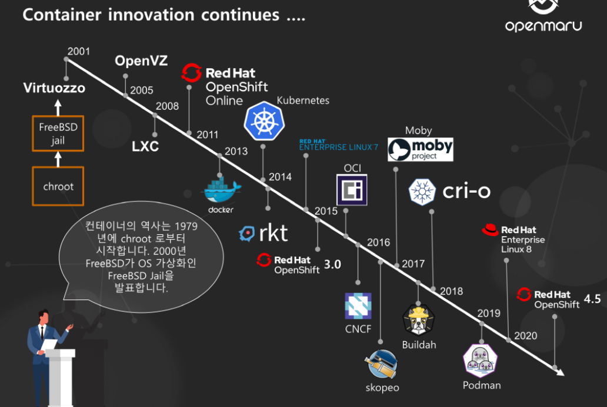

## 컨테이너 (Container)


- 무겁고 느린 가상화 방식을 해결하기 위해 Process를 격리하는 방안이 등장했다.
- Container화는 `Kernel 하나에 격리된 여러 사용자 공간 Instance가 포함될 수 있도록 Application 수준에서 이루어지는 가상화`의 일종이다. Kernel 하나에 여러 개로 나누어져 있는 여러 사용자 공간 (Instance)가 Container이다.
- Container는 HW에 설치된 Kernel(운영 체제) 하나를 공유하여 사용한다.
- Docker의 Container는 독립된 실행 환경을 제공하지 않는다.
- 즉 OS의 많은 자원들을 Container들 끼리 공유한다. (높은 이동성)
- 덕분에 부팅 시간이 훨씬 짧고, Container 개수가 늘어나더라도 Disk 공간을 많이 차지하지 않는다.
- 또한, Container가 완전히 독립된 실행 환경을 제공하지 않고 공유를 한다고 하더라도 Container들의 Process들은 자신이 OS의 모든 자원을 독차지 하고 있다고 생각한다.

---

## VM과 Container

- Container는 일반적으로 크기가 MB단위이다. 또한 경량화 속성과 공유 운영 체제로 인해 여러 환경 간에 매우 쉽게 이동한다.
- VM은 일반적으로 크기가 GB단위이다. VM에서 사용할 수 있는 Resource가 늘어남에 따라 Resource를 많이 사용하는 집약적인 작업을 수행할 수 있다.

```markdown
예를 들어 ...

Database, 분할, 복제와 같은 Resource를 많이 요구하는 작업을 VM에서 사용할 수 있는 
Resource가 늘어남에 따라 수행할 수 있다.

```

- 하지만 위에서 언급 했듯이 VM은 Hypervisor 위에 Guest OS가 올라가고 그 위에 Binary, 라이브러리 전부 구성해야 하기 때문에 무겁고 성능 저하가 발생한다. (OverHead)

---

## Container의 장점

### 1. 가벼움

- 위에서 언급 했듯이 VM은 기본적으로 GB단위이고 Container는 기본적으로 MB 단위이다.
- 또한, 부팅 시 몇 초 밖에 걸리지 않는다.

### 2. 탄력성

- Container는 물리적 Server의 Resource를 더 효율적이고 동적으로 사용한다.
- 다른 Container 하나의 수요가 감소하면 여분의 Resource를 다른 Container에서 사용할 수 있다.

### 3. 밀도

```markdown
밀도란, 물리적 Server 한 대에서 동시에 실행할 수 있는 개체 수를 의미한다.
```

- Container화를 사용하면 물리적 Server의 Resource를 완전히 이용하지만, 과다하게 이용하지 않는 `밀집된 환경`을 조성할 수 있다.
- Container는 전용 OS를 운영할 필요가 없으므로 가상화와 비교하면 보다 밀집한 환경이 가능하다.

### 4. 성능

- Resource 압박이 큰 경우 Application 성능은 Hypervisor를 사용하는 것보다 Container가 훨씬 우수하다.

```markdown
왜냐하면, VM에서는 Guest OS도 자체 Memory 요구사항을 충족해야하므로 Host OS에서 RAM을 가져와야한다.

Guest OS도 각 VM마다 Resource를 효율적으로 관리하고 다양한 작업을 수행하기 위해 Memory를
요구하는데, 여기서 요구하는 Memory는 Host OS의 Memory를 가져와야한다.

```

### 5. 유지 관리 및 효율

- OS Kernel이 하나밖에 없기 때문에 OS 수준에서 업데이트 또는 패치 작업을 하면 변경사항이 모든 Container에 적용된다.
- 이를 통해 Server를 더 효율적으로 운영하고 관리한다.

## Container 단점

### 보안 Issue

- Container는 Kernel을 공유한다. 즉, 논리적으로는 격리한 개념인데 당연히 물리적으로 격리한 가상머신에 비해서는 보안이 취약할 수 밖에 없다.

---

## Container Ocastration

- Container Ocastration은 Conatiner의 배포, 관리, 확장, Networking을 자동화 한다.
- 수백 또는 수천 개의 Container와 Host를 배포하고 관리해야 하는 대규모 환경에서는 Container Ocastration을 사용할 수 있다.
- 또한 Container Ocastration은 Container를 사용하는 모든 환경에서 사용할 수 있다.

## Container Ocastration의 종류

- Container Ocastration은 대표적으로 3개로 나뉜다.

### 1. Docker Swarm


- Docker Swarm은 여러 대의 Docker Host 들을 마치 하나인 것처럼 만들어주는 Orchestration 도구이다.
- 즉, Docker host들을 Cluster로 묶어 Container화된 Application을 관리하고 배포할 수 있게 해주는 Tool이다.

### 2. Apache Mesos


- Apache Mesos는 Cloud Infra 및 Computing Engine들의 자원을 통합적 으로 관리 할 수 있도록 만든 자원 관리 Project이다.
- Mesos는 분산 시스템 커널(Distributed systems Kernel)이다.

```markdown
뭔가 복잡해 보이지만..

Network로 묶여 있는 여러 개의 컴퓨터의 자원 즉, CPU,Memory,Disk 등의 자원을 하나로 묶어서 
Resource Pool로 만들어 마치 하나의 Computer 처럼 보이게 하겠다는 것이다.
그리고 Kernel로서 작동하기 위한 기능인 스케쥴러와 Application 관리 기능을 더해서, 분산 커널을 만든다.
```

### 3. Kubernetes


- Kubernetes는 Container화된 Application의 배포, 확장 및 관리를 자동화하는 오픈소스 시스템이다.
- Kubernetes는 단순한 Container 플랫폼이 아닌, 마이크로 서비스, 클라우드 플랫폼을 지향하며, Container로 이루어진 것들을 손쉽게 담고 관리할 수 있는 그릇 역할을 한다.
- Serverless, CI/CD, 머신러닝 등 다양한 기능이 Kubernetes위에서 동작한다.

## Container의 역사 - CHROOT부터 KUBERNETES 까지

- Container 기술의 시작과 현재까지 발전해온 역사를 살펴보자.




## 2000년 이전

### 1. chroot

```markdown
- Container의 역사는 1979년에 chroot를 발표한 것으로부터 사직한다.
- chroot는 이름 그대로 "root(/)디렉토리(기준이 되는 디렉터리) 변경" 하는 것 이다.
- chroot는 process의 Root Directory를 변경하는 것으로, 이를 통해 Process가 Access할 수 있는
  디렉터리를 제한하거나 시스템 라이브러리를 로드할 수 있다.
```

### 2. Virtuozzo

```markdown
- Virtuozzo는 1999년에 개발되었다.
- Container 가상화의 새로운 방향을 제시하였다.
- Virtuozzosms Linux Container 기술을 사용하여 가상화를 구현하는 기술이다.
```

### 3. FreeBSD Jail

```markdown
- 2000년 Unix OS인 FreeBSD에서 OS 가상화 기능인 FreeBSD Jail을 발표했다.
- FreeBSD Jail은 chroot처럼 파일 Access를 제어하는 것이 아닌 Host OS 가상화 환경에서 
  파일 System, Process, Network을 분리 할 수 있는 획기적인 기술을 제공하였다.
```

## 2000 ~ 2010

### 4. Linux VServer

```markdown
- 2001년에 개발되었다.
- FreeBSD Jail과 마찬가지로 Linux VServer는 System Resource (File System, Network
  주소 메모리)를 나눌 수 있는 Jail 메커니즘을 제공한다.
```

### 5. The Borg System By Google

```markdown
- 2003년에 개발되었다.
- 구글이 제공하는 서비스를 위한 Container Ochestration System이다.
- Kubernetes는 Borg를 바탕으로 Google에서 Open Source화 한 Container Ochestration SW이다.
```

### 6. Solaris Containers (Zone) 출시

```markdown
- 2004년에 개발되었다.
- Solaris Containers는 Solaris의 Container 기술이다.
- Solaris Containers는 Snapshot을 생성하여 특정 시점의 상태를 저장하고, 나중에 이 Snapshot
  을 사용하여 Container를 이전 상태로 복원할 수 있다.
- 또한 Zones라고도 불리는 가상 환경을 생성한다. 이 Zones는 Solaris OS의 일부이며, 격리된
  환경을 제공하면서도 Host System과 Resource들을 효율적으로 공유할 수 있다.
```

### 7. Open VZ (Open Virtuzzo)

```markdown
- 2005년에 개발되었다.
- 상용 Container인 Virtuzzo의 Open Source SW버전이다.
- Kernel을 공유하면서 분리된 공간을 제공한다. 현재의 Container 개념과 동일하다.
```

### 8. LXC (Linux Containers)

```markdown
- 2008년에 개발되었다.
- 2008년, Cgroup 및 Linux Namespace를 사용해 구현하여 단일 Linux 커널에서 동작한다.
- 처음으로 Linux 상에서 Container 개념을 가장 완벽하게 구현하였다. 
```

## 2010년 이후

### 9. Docker

```markdown
- 2013년에 개발되었다.
- 2013년 3월 26일에 Docker Open Source SW로 공개되었다.
- RHEL,SUSE,Debian 등 모든 Linux 배포판을 지원한다.
- Docker는 Container 기술 확산에 기폭제 역할을 하였다.
```

### 10. Kubernetes

```markdown
- 2015년에 개발되었다.
- 2015년 7월 21일 Kubernetes v1.0이 출시되었다.
- 구글에서 Open Source로 기증한 Container Ochestration 도구이다.
```

### 11. CNCF (Cloud Native Computing Foundation)

```markdown
- 2016년에 개발되었다.
- 2016년 1월에 정식 출범한 CNCF는 혼돈스러운 Container와 관련된 다양한 기술적인 문제들을
  Open Source로 해결하는 것을 목표로 하였다.
```

### 12. Containerd

```markdown
- 2016년에 개발되었다.
- 2016년 12월 Docker에서 Containerd가 분리되었다.
```

### 13. OCI (Open Container Initiative)

```markdown
- 2017년 7월 Open Container Initiative Container 관련 표준 v1.0을 발표하였다.
```

### 14. CRI-O

```markdown
- 2017년에 개발되었다.
- 2017년 7월 Kubernetes 표준인 CRI와 OCI에 최적화된 표준 Container Runtime을 발표하였.
```