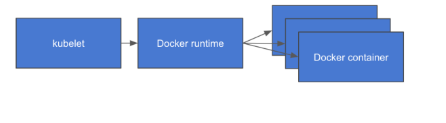
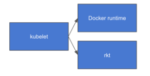
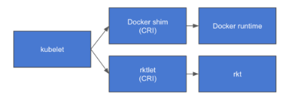

# Container Runtime

- Docker를 하면서 Container Runtime에 대해 많이 들어보았지만 그게 무엇인지 자세히 알지는 못했다.
- 이번에 Container Runtime에 대해 자세히 알아보자 .

---

## Container Runtime이란 ?

- 일반적인 Process의 관점에서 Runtime은 크게 2가지 의미를 갖는다.

```docker
1. 프로그램이 실행될 때의 수명주기 단계 중 하나 
2. 프로그램이 실행될 수 있도록 지원하는 특정 프로그래밍 언어로 구현된 실행 환
```

- 여기서 말하는 Container Runtime은 2번째 의미에 해당한다.
- Container를 사용하기 위해서는 `cgroup`이나 `namespace` 등의 제어가 필요하다. 그런데 매번 Container를 생성하고 관리하고 삭제할 때 마다 관련 기반 기술(cgroup, namespace 등 )을 수동으로 수행하는 것은 너무 귀찮고 불편한 일이다.
- 그렇기 때문에 이러한 작업들을 사용하기 쉽게 Bundle 형태로 제공하는 것이

     `Container Runtime`이다.

- 즉, Container Runtime은 **“Container를 생성하기 위해 필요한 기반 기술을 자동화해주는 라이브러리와 그 라이브러리가 실행될 수 있는 환경”** 이라고 볼 수 있다.

---

## OCI (Open Container Initiative)란 ?

- 위에서 이야기한 Container runtime을 이용하여 Container를 실제로 생성하기 위해서는 다음과 같은 기능들이 필요하다.

```docker
Container Image를 Build하고 공유하는 방법
Container Image를 관리하는 방법
Container Instance를 관리하는 방법
Container Instance를 실행하는 방법
```

- Container 기술이 널리 사용되면서 서로 다른 사용자, 플랫폼 공급자들이 Container 기술을 많이 사용하게 된다.
- Docker,Google,MS,IBM 같은 거대 Container 플랫폼 밴더들은 함께 `OCI` 라는 오픈 Goverment 프로젝트를 구성하게 된다.
- 그리고 이 OCI 표준에서 Container 기술을 구현하기 위해 맞춰야 하는 Cgroup, Namespace 등의 기술에 대한 표준을 정의하기도 하였다.
- OCI는 위에서 언급한 것과 같이 Container의 표준화를 위해 다양한 기업과 개발자들이 참여하는 Community로 구성되어있다.

```docker
OCI는 Container화된 Application들을 실행하기 위한 표준화된 Format과 Runtime을 정의하는 
															오픈 소스 프로젝트이다. 
```

---

## CRI (Container Runtime Interface)

- 기본적으로 Docker 기반의 Kubernetes는 다음과 같은 구조로 작동하였다.
- Docker Runtime을 통해서 Container를 생성하거나 삭제하는 구조를 가지고 있었다.




- 하지만 이후에 Docker 이외에도 여러가지 Container 기술이 나오면서 Kubernetes에서 이런 다양한 Container Runtime에 대한 지원 요건이 생기기 시작하였다.
- 또한, 다양한 Container Runtime을 지원하기 위해서 그때그때 Kubelet의 Code를 수정해하는 귀찮은 문제가 발생하였다.




- 그래서 Kubelet의 Code를 수정하지 않고 다양한 Container Runtime을 지원하기 위해서 Kubelet과 Container Runtime 사이의 인터페이스를 통일화 하는 기술이 등장하였는데 이것이 바로                     `CRI(Container Runtime Interface)`인것이다.



- 그래서 Container Runtime이 CRI 스펙에 맞춰서 구현이 되면, kubelet의 코드 변화가 없이 새로운 Container Runtime을 Plugin 구조로 추가할 수 있는 구조가 된 것이다.