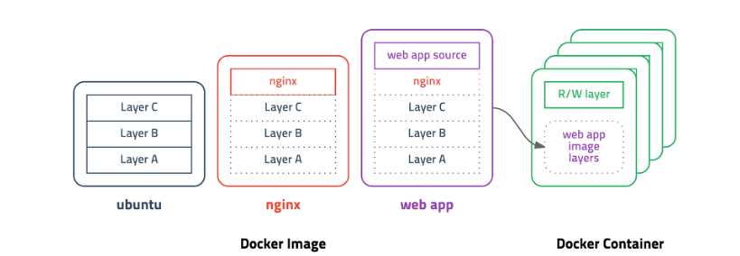
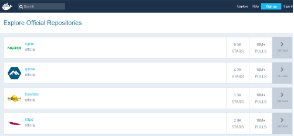
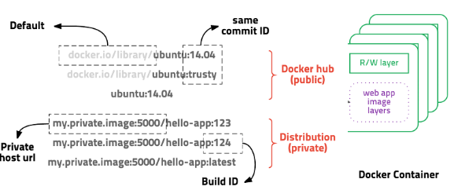
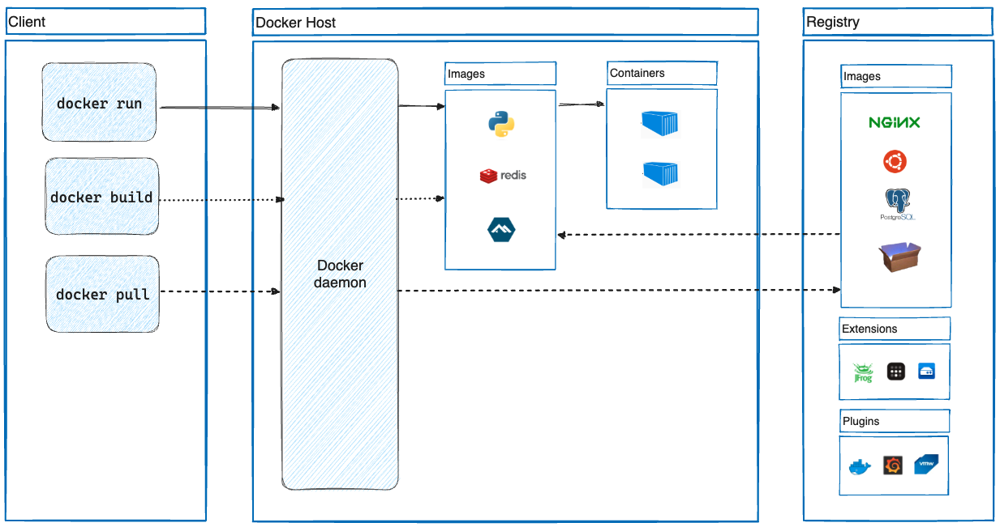

# Docker

- Docker란 Go언어로 작성된 Linux Container 기반으로 하는 Open Source 가상화 플랫폼이다.
- 현재 Docker v0.9 부터는 직접 개발한 libcontainer 컨테이너를 사용하고 있다.
- Container 문서에서 Container를 설명하였으므로 바로 Docker Image로 넘어가겠다.

## Docker Image

!


- Docker Image란 Container를 실행할 수 있는 실행파일, 설정 값 들을 가지고 있는 것이라고 생각 하면 된다 .
- 그림과 같이 Image를 Container에 담고 실행을 시킨다면 해당 process가 동작하게 되는 것이다.
- 그럼 Image는 어떻게 만들어질까 ?

## Docker Image (2)

!

- 다음 그림을 보면 ubuntu Image를 만들기 위해 Layer A,B,C가 들어간다.
- 그럼 Nginx Image를 만들기 위해서는 어떻게 될까 ?
- 이미 Layer A,B,C로 만들어진 ubuntu Image를 베이스 Image로 사용하여 베이스 Image에 nginx만 더하게 된다.
- 실질적으로는 `Layer A,B,C + Nginx` 이지만 과정은 `ubuntu + nginx` 인것이다.
- web app Image를 만들려고 할 때도 같은 방식이다. ubuntu Image에 nginx를 올리고 web app을 올리는 것이 아닌 `이미 만들어진 Base nginx Image 위에 web app을 올리는 것`이다.
- Image가 어떻게 만들어지는지 알았으니 실제로 Image를 만들어보는 Docker File에 대해 알아보겠다.

---

## Docker File

- 뒤에서도 설명을 하겠지만 Docker Image들을 저장하고 배포하는 `Docker Hub`는 정말 잘 활성화 되어있다.
- 이미 여러 기업 환경에서는 SW를 Docker Hub를 통해 배포하기 시작했고 우린 Docker Hub에서 Image를 pull하여 간단하게 Container에 넣어 사용할 수 있다.
- 하지만 배포판이 없다면? 배포판보다 더욱 보완하고 싶다면 ? 이때 `Docker File`을 사용하면 된다.
- **Docker File은 Image 생성 출발점으로 Image를 구성하기 위한 명령어들을 작성하여 Image를 구성할 수 있다.**
- 즉, Docker File을 읽을 수만 있다면 Docker Image가 어떻게 구성되어있는지도 알 수 있다는 의미이다.

```markdown
Docker File의 예시

* Docker File의 구성요소나 여러 설정 같은 경우 실습을 하면서 설명하거나 따로 포스팅 하겠다.

FROM jdk8:latest
    
WORKDIR /app

RUN mkdir /app/nexus-2.14.9-01
RUN mkdir /app/sonatype-work
RUN yum -y install httpd

ENV JAVA_HOME /usr/local/jdk1.8.0_181
ENV PATH=$JAVA_HOME/bin:$PATH
ENV CLASSPATH=.

EXPOSE 3411 
ADD run.sh /app/
           
CMD ["/app/run.sh"]
```

---

## Docker Hub & Docker Registry

!


- **Docker Hub에서는 Image를 저장하고 관리해준다.**
- 위에서도 많은 회사들이 Docker로 SW를 배포하기 시작했고 Image를 public으로 공개하여 공유할 수 있었다.
- Docker Hub를 이용하면 손쉽게 Image를 받아 Container에 적용시킬 수 있다.
    - 사실 Github이랑 동일하게 생각해도 무관함.
- 그렇다면  Docker Registry는 ?
- **Docker Registry는 Docker Hub처럼 공개된 방식이 아닌 Private로 격리된 저장소를 구축할 수 있다.**
- Docker 사설 저장소 구축 방법도 나중에 실습 하면서 설명하거나 따로 포스팅 하겠다.

!


```markdown
위의 그림은 Docker Image를 Pull 받기 위한 url이다.

* 그림과 같이 앞에있는 URL을 적지 않으면 default로 Docker Hub에서 Image를 Pull 받게 된다.
* 하지만 URL을 적어준다면 Private 저장소에서 Image를 받을 수 있다.
```

---

## Docker Architecture

!


### docker run

```markdown
이 명령어는 Image를 기반으로 새로운 Container를 생성하고 실행한다.

* 위의 사진처럼 docker run을 입력하면 docker daemon에서 image를 가지고 container를 생성 후 실행한다.
```

### docker build

```markdown
이 명령어는 Dockerfile을 기반으로 Docker Iamge를 빌드한다. 

* 위의 사진처럼 docker build를 입력하면 Dockerfile을 참조하여 이미지를 빌드(생)한다. 
```

### docker pull

```markdown
이 명령어는 Docker Hub 또는 Docker Repository에서 local System으로 가져온다.

* 위의 사진처럼 Registry에서 Image를 가져와 Container에 쉽게 적용할 수 있다.
```