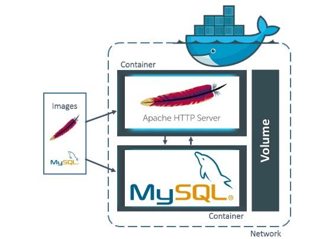

# Docker

- Docker란 Go언어로 작성된 Linux Container 기반으로 하는 Open Source 가상화 플랫폼이다.
- 현재 Docker v0.9 부터는 직접 개발한 libcontainer 컨테이너를 사용하고 있다.
- Container 문서에서 Container를 설명하였으므로 바로 Docker Image로 넘어가겠다.

## Docker Image

!


- Docker Image란 Container를 실행할 수 있는 실행파일, 설정 값 들을 가지고 있는 것이라고 생각 하면 된다 .
- 그림과 같이 Image를 Container에 담고 실행을 시킨다면 해당 process가 동작하게 되는 것이다.
- 그럼 Image는 어떻게 만들어질까 ?

## Docker Image (2)

!

- 다음 그림을 보면 ubuntu Image를 만들기 위해 Layer A,B,C가 들어간다.
- 그럼 Nginx Image를 만들기 위해서는 어떻게 될까 ?
- 이미 Layer A,B,C로 만들어진 ubuntu Image를 베이스 Image로 사용하여 베이스 Image에 nginx만 더하게 된다.
- 실질적으로는 `Layer A,B,C + Nginx` 이지만 과정은 `ubuntu + nginx` 인것이다.
- web app Image를 만들려고 할 때도 같은 방식이다. ubuntu Image에 nginx를 올리고 web app을 올리는 것이 아닌 `이미 만들어진 Base nginx Image 위에 web app을 올리는 것`이다.
- Image가 어떻게 만들어지는지 알았으니 실제로 Image를 만들어보는 Docker File에 대해 알아보겠다.

---

## Docker File

- 뒤에서도 설명을 하겠지만 Docker Image들을 저장하고 배포하는 `Docker Hub`는 정말 잘 활성화 되어있다.
- 이미 여러 기업 환경에서는 SW를 Docker Hub를 통해 배포하기 시작했고 우린 Docker Hub에서 Image를 pull하여 간단하게 Container에 넣어 사용할 수 있다.
- 하지만 배포판이 없다면? 배포판보다 더욱 보완하고 싶다면 ? 이때 `Docker File`을 사용하면 된다.
- **Docker File은 Image 생성 출발점으로 Image를 구성하기 위한 명령어들을 작성하여 Image를 구성할 수 있다.**
- 즉, Docker File을 읽을 수만 있다면 Docker Image가 어떻게 구성되어있는지도 알 수 있다는 의미이다.

```markdown
Docker File의 예시

* Docker File의 구성요소나 여러 설정 같은 경우 실습을 하면서 설명하거나 따로 포스팅 하겠다.

FROM jdk8:latest
    
WORKDIR /app

RUN mkdir /app/nexus-2.14.9-01
RUN mkdir /app/sonatype-work
RUN yum -y install httpd

ENV JAVA_HOME /usr/local/jdk1.8.0_181
ENV PATH=$JAVA_HOME/bin:$PATH
ENV CLASSPATH=.

EXPOSE 3411 
ADD run.sh /app/
           
CMD ["/app/run.sh"]
```

---

## Docker Hub & Docker Registry

!


- **Docker Hub에서는 Image를 저장하고 관리해준다.**
- 위에서도 많은 회사들이 Docker로 SW를 배포하기 시작했고 Image를 public으로 공개하여 공유할 수 있었다.
- Docker Hub를 이용하면 손쉽게 Image를 받아 Container에 적용시킬 수 있다.
    - 사실 Github이랑 동일하게 생각해도 무관함.
- 그렇다면  Docker Registry는 ?
- **Docker Registry는 Docker Hub처럼 공개된 방식이 아닌 Private로 격리된 저장소를 구축할 수 있다.**
- Docker 사설 저장소 구축 방법도 나중에 실습 하면서 설명하거나 따로 포스팅 하겠다.

!


```markdown
위의 그림은 Docker Image를 Pull 받기 위한 url이다.

* 그림과 같이 앞에있는 URL을 적지 않으면 default로 Docker Hub에서 Image를 Pull 받게 된다.
* 하지만 URL을 적어준다면 Private 저장소에서 Image를 받을 수 있다.
```

---

## Docker Architecture

!


## Docker CLI Command

- Docker Docs를 참고하여 설명하겠다.
- docker cli 명령어로 실행 시킬 수 있는 명령어와 옵션을 담았다.

### docker attach

```docker
docker attach [options] CONTAINER
```

- `docker attach` 명령어는 Process의 출력을 나타낸다.
- 진행 중인 상황을 Terminal에서 보는 것처럼 직접 보거나 대화식으로 제어할 수 있다.

```docker
Option

--detach-keys : Container 분리를 위한 Key Sequence 재 정의
--no-stdin : stdin을 첨부하지 않는다. 
--sig-proxy(기본값 True) : 수신된 모든 신호를 Process로 보낸다. 
```

### docker run

```markdown
docker run [options] IMAGE 
```

- `docker run` 명령어는 docker image로 부터 만든 새로운 Container에서 명령어를 실행 시키는 명령어이다.

```docker
Options 

-t : TTY 모드를 사용하는 것으로 쉘에 명령어를 작성할 수 있다. 
-d : Container를 Background에서 실행하도록 하는 Option이다. 
-e : 환경 변수를 추가하는 옵션이다. 여러 환경변수를 사용하고 싶으면 -e를 계속 사용해야한다.
-p : Host에 연결된 Container의 특정 포트를 외부와 통신하기 위해 노출할 때 사용된다. 
--rm : 명령어 수행 후 container가 삭제 되도록 하는 Option이다. Container를 일회성으로 사용할 때 주로 쓰인다.
--name : Container의 이름을 설정할 때 사용된다. 
```

### docker build

```markdown
docker build [options] PATH | URL 
```

- `docker build` 명령어는 Dockerfile에서 Docker Image를 Build 한다.
- docker build는 Path와 URL로 Build 할 수 있다.

```docker
Option 

--build-arg : Build 시간 변수를 설정한다. 
--cache-from : Cache 소스로 사용할 이미지를 지정한다. 
--cpu-period : CPU CFS 기간을 제한한다. 
--cpu-quota : CPU CFS 할당량을 제한한다. 
--file : Dockerfile의 이름을 지정한다.(기본값 PATH/Dockerfile)
--label : Image를 보충 설명하는 Metadata 설정 
--memory : Memory 한도 
--no-cache : Image를 Build 할 때 Cache를 사용하지 않는다.
--pull : 항상 최신 상태의 Image를 가져오도록 설정한다. 
```

### docker pull

```markdown
docker pull [options] NAME:TAG
```

- 이 명령어는 Docker Hub 또는 Docker Registry에서 local System으로 가져온다.
- 번외로 docker image에서 latest Tag는 Tag 값이 명시적으로 설정되지 않은 상태를 뜻한다.

```docker
Option 

-a : Repository의 Tag가 지정된 모든 이미지 다운로드
-q : 자세한 출력을 하지 않음 
```

### docker create

```docker
docker create [options] IMAGE
```

- 이 명령어는 docker container를 생성한다.
- 지정된 Image를 가지고 새 Container를 생성하는 것이다.

```docker
Options 

--cgroupns : 사용한 cgroup namesace에서 container를 실행한다. 
--cpus : cpu 수를 지정한다. 
--device : container에 host 장치를 추가할 수 있다. 
--dns : 사용자 정의 DNS 서버 설정 
--ip : ipv4 주소 
-v : Volume Bind Mount 
```

### docker start

```docker
docker start [option] CONTAINER
```

- 이 명령어는 docker container를 실행한다.
- 하나 이상의 중지된 Container를 시작하는 것이다.

```docker
Option 

--checkpoint : Checkpoint 설정
--i : Container의 STDIN 연결 
```

### docker commit

```docker
docker commit [OPTIONS] CONTAINER [REPOSITORY[:TAG]]
```

- commit을 한 상태 그대로 새로운 image를 생성한다.

```docker
Option 

-a : 작성자를 설명할 수 있다. (ex : Lee Hyeon Jun)
-c : 생성된 Image에 Dockerfile 명령을 적용한다. 
-m : commit Message
-p : commit을 하는동안 Container Pause 시키기
```

### docker ps

```docker
docker ps [options]
```

- Docker의 list들을 나타낸다.

```docker
Option 

-a : 모든 Container를 전부 보여준다. 
-f : 조건에 따라 필터링을 한다. 
-n : 마지막으로 생성된 n개의 Container를 표시한다. 
-l : 최근 생성된 Container를 표시한다. 
-q : Container ID만 표시한다. 
-s : 총 파일 크기를 표시한다. 
```

### docker rename

```docker
docker rename CONTAINER [NEW_NAME]
```

- 말 그대로 새로 이름을 정하는 것이다.

### docker rm

```docker
docker rm [optoins] CONTAINER
```

- 하나 또는 하나 이상의 Container를 삭제한다.

```docker
Option 

-f : 실행 중인 Container를 강제로 제거한다. (SIGKILL15 사용)
-l : 지정된 링크를 제거한다. 
-v : Container와 연결된 볼륨을 제거한다. 
```

### docker exec

```docker
docker exec [options] CONTAINER COMMAND
```

- 실행 중인 Container에서 명령을 실행한다.

```docker
Option

-d : Background에서 명령을 실행한다. 
-i : 연결되지 않은 경우에도 STDIN을 열어둔다. 
-t : TTY 모드를 사용하여 쉘에서 명령어를 입력할 수 있다.
```

### docker kill

```docker
docker kill [options] CONTAINER
```

- 하나 또는 하나 이상의 실행 중인 컨테이너를 종료한다.

```docker
Option 

-s : Container에 보내는 신호 
```

### docker tag

```docker
docker tag SOURCE_IMAGE[:TAG] TARGET_IMAGE[:TAG]
```

- SOURCE_IMAGE를 참조하는 TARGET_IMAGE TAG를 생성한다.
- latest는 아무 Tag도 붙여져 있지 않는 상태를 말한다.

```docker
예시 

docker tag 0e5574283393 fedora/httpd:version1.0
```

### Docker rmi

```docker
docker rmi [options]
```

- 하나 또는 하나 이상의 Docker image 파일을 삭제한다.

```docker
Option

-f : 강제적으로 삭제한다.
```

## Volume Mount & Bind Mount


- Docker Container에 사용된 File들은 Container가 삭제될 때 함께 삭제된다.
- Docker에서 많은 Application을 저장해서 계속적으로 사용할 수 있도록 해주는 option이 바로         `Volume과 Bind Mount`이다.
- 즉, Container가 host System에 파일을 저장할 수 있는 방법이다. 이 Option들은 Container가 중지가 되더라도 파일이 유지된다.

## Bind Mount

- Bind Mount는 Host System에 어느 곳에나 저장을 할 수 있고, Docker Container 내에서 언제든지 수정이 가능하다.
- 또한, Bind Mount를 사용하면 Host-System의 File 또는 Directory가 Container에 mount되며, Mount된 File 또는 Directory는 host의 전체 경로로 나타난다.
- Bind mount의 성능은 매우 우수하지만 Host File System에 의존하기 때문에 Volume에 비해 상대적으로 기능이 제한적이다. (왜 제한적인지는 아래에서 소개하겠다.)

```docker
만약 Mount 하고자 하는 Container Directory에 파일 내용이 들어있다면 Mount를 한 순간 기존에 존재한 내용은 전부 가려지게 된다.
```

## Volume

- 위에서 Volume보다 Bind Mount는 기능적인 부분에서 제한적이라고 언급하였다.
- 그럼 `Volume`이란 무엇일까 ?

## Volume(2)

- VOlume은 여러 Container에 동시에 탑재할 수 있고, 실행 중인  Container가 Volume을 사용하지 않더라도 Volume은 게속 Docker에서 사용할 수 있다.
- 만약 Volume을 생성하게 되면 `/var/lib/docker/volume/~` 에 볼륨이 생성된 것을 확인할 수 있을 것이다.
- 그리고 사진처럼 해당 Directory는 Host File System 중 Docker에서 관리하는 영역(Docker Area)에 저장되는 것이다.

---

## Volume이 더 좋은 이유

- Volume은 Bind Mount보다 Backup 또는 이동(Migration)이 더 쉽다.
- Docker CLI 명령 또는 Docker API를 사용하여 볼륨을 관리할 수 있다.
- Volume은 Linux  및 Windows Container 모두에서 동작한다.
- Volume Driver를 사용하면 볼륨의 내용을 암호화하는 등 다른 기능들을 추가 할 수 있다.