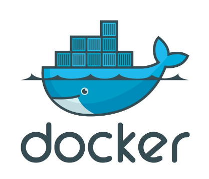
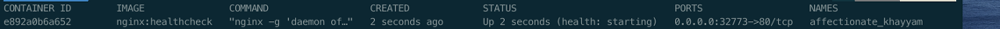

# Docker File

!


- Docker File이란, Docker Image를 만들기 위한 설정 파일이다.
- 여러가지 Command를 통해 Docker File을 작성하면 설정한 내용되로 Docker Image를 생성할 수 있다.
- Docker를 설명할 때 말을 했지만 Docker File을 읽을 줄 알면 해당 Image가 어떻게 구성 되어있는지 알 수 있다는 의미이다.

---

## Docker File 작성 예시

```markdown
$ vim Dockerfile

# 기반이 되는 Image

FROM ubuntu:14.04

   

# app 디렉토리 생성

RUN mkdir -p /app

#Docker 이미지 내부에서 RUN, CMD, ENTRYPOINT의 명령이 실행될 디렉터리를 설정합니다.

WORKDIR /app

   

# 현재 디렉터리에 있는 파일들을 이미지 내부 /app 디렉터리에 추가함
# 절대경로 사용 불가

ADD     . /app

 

RUN apt-get update

RUN apt-get install apache2

RUN service apache2 start

VOLUME ["/data", "/var/log/httpd"]

# 하기 포트를 외부로 노출합니다.

EXPOSE 80

      

# 쉘을 사용하지 않고 컨테이너가 시작되었을 때 logbackup 스크립트를 실행

CMD ["/app/log.backup.sh"]

:wq!
```

- Container에 담을 파일들을 DockerFile 하위 Directory에 있어야 하며 DockerFile 안에서 ADD시 `절대경로는 사용할 수 없다.`
- 이제 Command 하나하나 알아보자

---

## Docker Command

### FROM

- 기반이 되는 Image Layer이다.
- **<Image Name>:<Tag>** 형식으로 작성된다.

```markdown
예시

Ubuntu:14.04
```

### MAINTAINER

- 이 명령어는 Docker 이전 버전에서 사용되던 명령어이다.
- MAINTAINER보다 LABEL 명령어를 사용하는 것이 좋다.

### LABEL

- Image에 Metadata를 추가한다.
    - Metadata란, 다른 Data를 설명하는 데이터로, 정보를 분류하고 조직화 하며 이해하기 쉽게 만들어주는 정보이다.
- 이는 `docker inspect` 명령어를 통해 작성한 정보를 확인할 수 있다.

```docker
예시

FROM ubuntu:latest

LABEL maintainer="John Doe <johndoe@example.com>"
```

### RUN

- Docker Image가 생성되기 전에 수행할 Shell 명령어를 지정한다.

```docker
예시

RUN apt-get update
RUN apt-get install apache2
RUN service apache2 start
```

### VOLUME

- VOLUME은 Directory의 내용을 Container에 저장하지 않고 Host에 저장하도록 설정한다.
- 즉, Build된 Image로 Container를 생성했을 때 Host와 공유할 Container 내부의 Directory를 설정한다.
- []배열 형태이면 뒤로 쭉 나열해도 된다.

```docker
예시

RUN mkdir /home/volume

VOLUME /home/volume

[]배열 예시

RUN mkdir /home/volume
RUN mkdir /home/Hyeonjun

VOLUME ["/home/volume","/home/Hyeonjun"]
```

### EXPOSE

- Host와 통신할 port를 지정한다.

```docker
예시

EXPOSE 80
```

### CMD

- Container가 시작 되었을 때, 실행할 실행 명령어 또는 파일 및 Shell Script 이다.
- 해당 명령어는 DockerFile내 1회만 사용할 수 있다.

```docker
예시

CMD ["/app/log.backup.sh"]
```

### WORKDIR

- WORKDIR 명령어는 DockerFile에서 작업 Directory를 설정하는 데 사용된다.
- 작업 Directory란 Docker Image를 Bulid하거나 Container를 실행할 때 `명령을 실행할 기본 Directory`를 말한다.
- WORKDIR을 사용하면 이후의 명령어들이 해당 Direcotry에서 실행된다.

```docker
예시

WORKDIR /app
```

### ENV

- DockerFile에서 사용할 환경 변수를 설정한다.
- 설정한 환경 변수는 ${ENV_NAME} 또는 $ENV_NAME의 형태로 사용할 수 있다.
- 환경 변수는 주로 Container 내부의 Process에서 사용할 수 있는 동적인 값으로 주로 설정, 구성 및 특정 동작을 제어하기 위해 사용된다.

```docker
예시

ENV DB_HOST=db.example.com
ENV DB_PORT=5432
ENV DB_USER=myuser
ENV DB_PASSWORD=mypassword
```

### ARG

- Build 명령어를 실행할 때 추가 입력을 받아 Docker 내에서 사용될 변수의 값을 설정한다.
- build시에는 `—build-arg`를 통해 설정할 수 있다.
- 예시의 my_arg처럼 build할 때 입력 받을 수도 있고 my_arg2처럼 Dockerfile에 사전 정의 할 수 있다.

```docker
예시 

FROM ubuntu:14.04
ARG my_arg
ARG my_arg2=value2
RUN touch ${my_arg}/mytouch

build시에
docker build --build-arg my_arg=/home -t myarg:0.0 ./
```

### User

- User로 Container 내에서 사용될 사용자 계정의 이름이라 UID를 설정할 수 있다.
- UID나 이름을 설정하면 해당 계정의 권한으로 실행된다.
- 일반적으로 사용자의 그룹과 계정을 생성한 뒤 사용한다.
- Root 권한이 필요하지 않다면 USER를 사용하는 것이 좋다.

```docker
예시

RUN groupadd -r author && useradd -r -g author hyeonjun
USER hyeonjun

```

### ONBUILD

- Build된 Image를 기반으로 하는 다른 Image가 Dockerfile로 생성될 때 실행할 명령어를 추가한다.

```docker
예시

FROM ubuntu:14.04
RUN echo "this is onbuild test"!
ONBUILD RUN echo "onbuild!" >> /onbuild_file

# 이렇게 하면 ONBUILD 명령어가 실행되지 않는다. 왜냐하면 ubuntu 이미지는
#  Dockerfile을 참조하여 새로 빌드된 Image가 아니기 때문이다 하지만 ..

Dockerfile2 

FROM onbuild_test:0.0
RUN echo "this is child image!"

# 이렇게 하면 ONBUILD 명령어가 실행이 된다.
# 왜냐하면 onbuild_test Image는 dockerfile을 참조하여 새로 빌드된 이미지이기 때문이다.
```

### StopSignal

- Container가 정지될 때 사용될 System Call의 종류를 지정한다.
- 기본 Option은 SIGTERM으로 설정된다.

```docker
기본적으로 Container는 SIGTERM(15) 신호를 받으면 종료되지만, 종료 신호를 사용자가 정의할 때 StopSignal을 사용한다.

* StopSignal 명령어를 사용하면 Container를 graceful하게 종료할 수 있다.
* graceful : Process가 현재 진행 중인 작업을 완료하고 정상적으로 종료될 수 있도록 하는것.
* 즉, 종료 신호를 사용자가 정의하므로 process는 처리하는 작업을 모두 끝내고 Container를 종료 할 수 있다.
* StopSignal 명령어를 사용하지 않고 SIGTERM 신호를 받게 되면 처리하고 있든 말든 무조건 종료해야한다.

예시

FROM ubuntu:latest

# 사용자 정의 종료 신호 설정 (SIGUSR1)
STOPSIGNAL SIGUSR1
---------------------------------------------------------------
docker-compose up -d
# 컨테이너가 실행 중일 때, 사용자 정의 종료 신호 전송 (SIGUSR1)
docker kill --signal=SIGUSR1 <container_id>
```

### Healthcheck

- Image를 기반으로 생성된 Container에서 동작하는 Application의 상태를 Check하도록 설정한다.
- Container안의 Application이 동작하고 있지 않은 상태를 방지하기 위해 사용될 수 있다.

```docker
예시

FROM nginx
RUN apt-get update -y && apt-get install curl -y
HEALTHCHECK --interval=1m --timeout=3s --retries=3 CMD curl -f http:localhost || exit 1

# 위의 Dockerfile 내용은 1분마다 curl -f로 명령어를 보내 해당 Application이 잘 진행되고 있는지 확인하는 명령어이다.
# 1분마다 확인하고 응답이 3초내로 안오고 3번시도 끝에 실패하면 unhealty 상태가 된다.
```

- healthy 상태 확인하는 예시

!

### Shell

- Dockerfile에서 기본적으로 사용하는 쉘은 아래와
    - Linux : /bin/sh -c
    - Windows : cmd /S /C
- 아래는 node를 기본 Shell로 변경한다.
- SHELL 명령어 이후에 실행되는 명령어들은 전부 /usr/local/bin/node에서 실행된다.

```markdown
예시

FROM node
RUN echo hello, node!
SHELL ["/usr/local/bin/node"]
```

### Copy/ADD

- COPY는 Local Directory에서 읽어 들인 Context로부터 Image에 복사하는 역할을 한다.
- `Local의 File만 Image`에 추가하는 COPY와는 다르게 `ADD는 외부 URL, tar파일 에서도 파일을 추가`할 수 있다.
- 또한 ADD는 압축 파일의 자동 해제도 처리할 수 있다.

```docker
예시

copy의 예시

COPY test.html /home/
COPY ["test.html", "/home/"]

ADD의 예시

ADD http://example.com/file.txt /app/
```

### ENTRYPOINT

- CMD와 같이 Container가 시작할 때 수행할 명령어를 지정한다는 점에서는 같다.
- 하지만 ENTRYPOINT는 CMD 명령어를 인자로 받아 사용할 수 있는 스크립트의 역할을 할 수 있다.

```docker
예시 

# ENTRYPOINT : 없음 cmd : /bin/bash
docker run -it --name no_entrypoint ubuntu:14.04 /bin/bash 

# ENTRYPOINT : 있음 cmd : /bin/bash
docker run -it --entrypoint="echo" --name yes_entrypoint ubuntu:14.04 /bin/bash
```

- 첫 번째 경우는 ENTRYPOINT 옵션이 없으므로 CMD 명령어인 /bin/bash만 실행되었다.
- 두 번째 경우는 ENTRYPOINT 옵션을 echo로 사용하여 container를 만들어보면 첫 번째 처럼 /bin/bash가 실행되어 Shell로 들어가는 것이 아닌 출력물로 /bin/bash가 나오게 된다.

```docker
또한, 아래와 같이 명령어를 실행시킬 수 있을 뿐만 아니라 Script 파일을 실행시킬 수 있다.

docker run -it --name entrypoint_sh --entrypoint="/test.sh" ubuntu:14.04
```