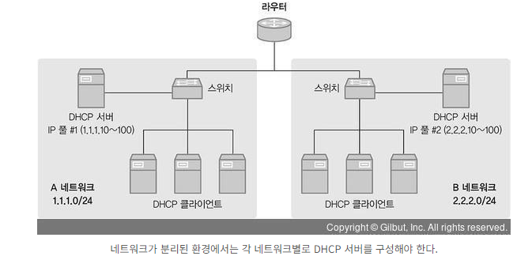
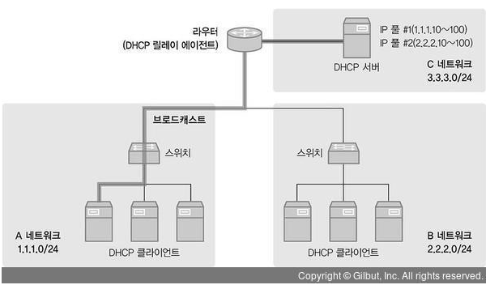

# DHCP Relay Agent

- DHCP Client가 DHCP Server를 찾기 위해 날리는 패킷은 `Broadcast`이다.
- 그러므로 DHCP Server가 DHCP Client와 다른 네트워크 상에 있다면 동작이 안됀다.
- 네트워크 대역이 하나로 운영되는 소규모 네트워크 환경이라면 상관이 없겠지만, 네트워크 영역이 여러개인 환경에서 DHCP를 이용한다면 DHCP 서버 배치 설계, 이중화 요소 등 고려해야 할 사항이 너무 많다.
- 아래와 같이 네트워크가 여러개로 나눈 경우에는 개별적으로 DHCP Server를 구축해야한다.

- 하지만 여러 네트워크를 가진 환경에서도 **DHCP Relay Agent 기능을 사용한다면 DHCP 서버 한 대로 여러 네트워크 대역에서 IP Pool을 관리할 수 있다.**
- DHCP Relay Agent가 DHCP Client와 DHCP Server가 서로 다른 대역에 있는 경우, DHCP Packet을 중간에서 `중계`하는 역할을 해주기 때문이다.
- 아래 예시를 보겠다.

- 예시에서 DHCP Server는 C Network(3.3.3.0/24)에 있고 DHCP Client는 A Network(1.1.1.10/24),    B Network(2.2.2.0/24)에 존재한다.
- DHCP Server와 DHCP Client가 서로 다른 네트워크 대역에 있기 때문에 중간 Router를 DHCP Relay Agent로 사용하고 있다.
- DHCP Relay Agent역할을 하는 Router가 중계를 할 수 있는 이유는 **BroadCast로 전달되는 DHCP Packet을 동일 네트워크 대역의 DHCP Relay Agent가 수신하게 되면 DHCP Server로 갈 수 있도록  DHCP Packet을 `BroadCast → Unicast`로 변환해주기 때문이다.**