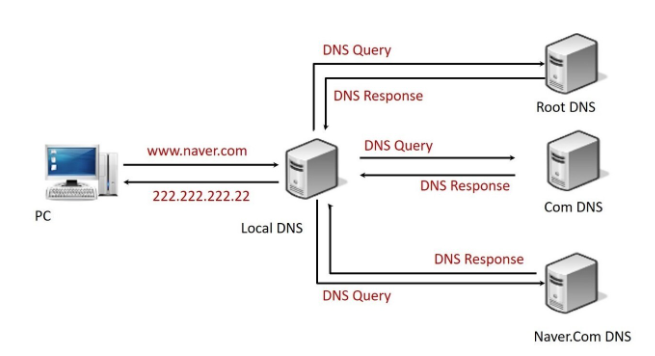
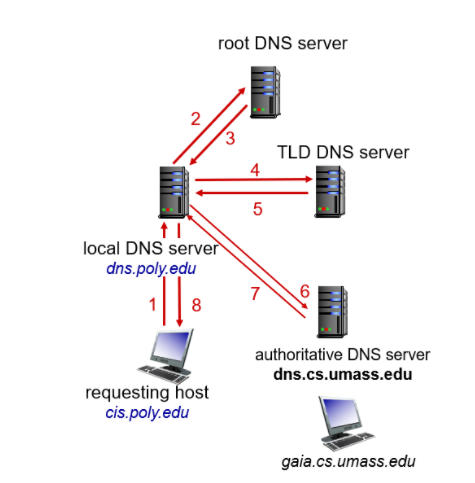

# DNS란 무엇인가요❓

## 그 전에 도메인(Domain)이란 ❔❓❔

- 원래 지정된 인터넷 접속 주소를 다른 이름으로 바꾸어 준 주소이다.
- EX) http://192.168.1.1 → www.hyunjunjjang.com
- www(호스팅 주소). + [이름.com](http://이름.com)(도메인) → 뒷 부분을 도메인이라고 한다.

```markdown
간단하게 말해서 원래의 ip 주소를 기억하기 쉬운 닉네임으로 바꾸는 개념
```

## DNS(Domain Name System)이란 ❓

- 위에서 말한 원래의 IP 주소를 기억하기 쉬운 도메인으로 바꾸거나, 도메인을 IP주소로 바꾸는       데이터베이스 시스템을 말한다.
- 연결되어있는 IP주소와 도메인이 저장된 곳이 DNS.
- 각 도메인들마다 DNS와 연결해주는 서버 역할을 하는 DNS 서버, 다른 말로 Name Server가 있다

## 도메인 연결방법 ❗❕

- A Record - IPv4의 IP 주소로 직접 연결한다.
- AAAA Record - 도메인을 IPv6의 IP 주소로 직접 연결한다.
- Root hints - DNS 루트 서버의 IP 주소를 포함하고 있는 파일

---

## DNS의 동작방식 (Iterative 방식이다)



### 0. Local Computer Cache 확인

- Cache가 있는데 질의를 하면 손해를 보는것이 당연하다.
- 이 Cache의 유지 시간은 300s 이다.

### 1. hosts 파일 확인

- hosts 파일에 자신이 원하는 IP 주소와 Domain name의 mapping이 있는지 확인한다.
- Linux Hosts 파일 경로 : vim /etc/hosts
- Windows Hosts 파일 경로 : C:\windows\system32\driver\etc\hosts
- 없다면 다음 단계.

### 2. DNS Query (from Web Browser to Local DNS)

- [www.naver.com](http://www.naver.com) - 제가 원하는 웹 사이트의 IP 주소를 알고 계신가요 Local DNS 서버님?

### 3. DNS Query (from Local DNS to Root DNS)

- Local DNS가 ROOT DNS한테 제가 원하는 웹 사이트의 IP 주소를 알고 계신가요 ??

### 4. DNS Response (from Root DNS to Local DNS)

- 저는 모르지만 .com 도메인을 관리하는 DNS Server의 이름과 IP주소를 알려드릴 테니 거기다가 물어보세요

### 5. DNS Query (from Local DNS to Com DNS)

- 안녕하세요 !! www.naver.com의 IP 주소를 알고 계신가요 ??

### 6. DNS Response (from Com DNS to Local DNS)

- 저는 모르지만 [naver.com](http://naver.com) 도메인을 관리하는 DNS Server의 이름과 IP 주소를 알려드릴 테니 거기다가 물어보세요

### 7. DNS Query (from Local DNS to [naver.com](http://naver.com) NS)

- 안녕하세요 ^^ 혹시 www.naver.com의 IP 주소를 알고 계실까요 ??

### 8. DNS Response (from [naver.](http://naver.com)com NS to Local DNS)

- 네네 www.naver.com의 IP 주소는 222.222.222.22입니다

### 9. DNS Response (from Local DNS to PC)

- 알아봤습니다 www.naver.com의 주소는 222.222.222.22입니다

---

# DNS 질의 종류 (Recursive vs Iterative)

## Recursive(재귀적 질의)란 무엇인가 ❓😁❓

1. Local DNs 서버에 Query를 보내면 Local DNS Server가 Root DNS Server에 Query를 보낸다.
2. Root 서버는 자신의 서버에 없다면 해당 TLD 서버에 직접 요청한다.
3. 이렇게 재귀적으로 실제 도메인 정보를 가지고 있는 서버까지 Query가 이동하여 IP 주소를 얻음.


## Iterative (반복적 질의)란 무엇인가 ❓😁❓

1. Local DNS 서버에 Query를 보내면 Local DNS 서버가 Root DNS Server에 Query를 보낸다.
2. 그리고 Root DNS는 해당 도메인에 속한 TLD 서버의 주소를 Local DNS Server에게 반환한다.
3. 이렇게 Local DNS가 DNS Server로부터 TLD Server에게 왔다 갔다 Query를 하는것이다.




## 둘의 차이가 무엇인가요 ❓❓

- Iterative 방식은  Local서버가 TLD의 IP 주소를 받아서 Local DNS Server가 직접 쿼리를 하여 알아내는 방식이다.
- Recursive 방식은 Local서버가 일일이 쿼리를 하는것이 아닌 재귀적으로 ROOT DNS server → TLD DNS Server →  TLD DNS Server 이렇게 안에서 Query를 이뤄서 완벽한 IP 를 찾은 후에 거슬러 올라오는 방식이다.

---

# DNS Root Hints란 ❓

- Root Hints는 DNS 시스템에서 사용되는 특정 파일 또는 데이터베이스이다.
- DNS 서버가 DNS 계층 구조에서 최상위 수준인 루트 DNS 서버를 찾는데 도움을 준다.
- Root Hints는 텍스트 파일일 뿐이다. Root DNS Server의 IP 주소와 해당 서버가 사용하는 Nameserver 주소등의 정보를 포함하고 있는 !!!!
- 루트 DNS 서버는 모든 질의의 시작점이다.
- 하지만 하위 DNS 서버는 루트 DNS 서버의 주소를 미리 알지 못하기 때문에 루트 DNS 서버를 찾는 과정이 필요하다.
- 이떄 Root hints 파일이 사용된다 !!
- DNS 서버가 시작될 떄 자동으로 Root hints 파일이 읽힌다. 이 정보를 기반으로 루트 DNS 서버에 질의를 보낼 수 있다 !!!!

---

# Cache DNS  Server란 ❔❓

- 이전에 질의한 DNS 정보를 저장하여 다음에 동일한 질의가 있을 때 빠르게 응답할 수 있게 해주는 DNS 서버이다.
- 이를 통해 네트워크 트래픽을 줄이고 DNS 질의의 응답 시간을 줄일 수 있다.
- 외부에 TTL(Time To Live : cache가 유효한 시간)이 지나게 되면 외부 서버와 쿼리를 하게 된다.
- 이 쿼리 내용을 cache에 저장해놓고 Cache 서버에 질의가 들어오게 되면 자신의 Cache에 저장되어 있는것을 넘겨주는 역할을 하는 Server이다.

### 꿀팁 !!

- 서버의 IP가 자주 바뀐다면 (실무적으로 구성 상 변경해야할 때, 서버이전, 서버 Relocation 등등) TTL을 작게 잡아 도메인에 대한 IP가 빨리 바뀌어 cache에 반영되도록 해야한다 !!!