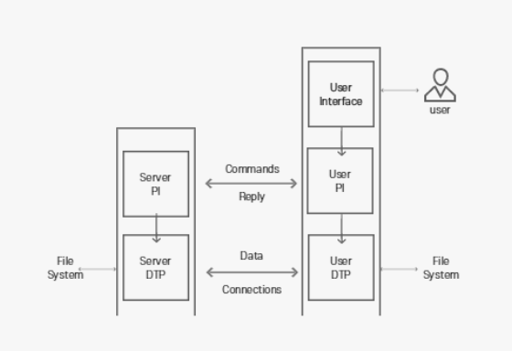
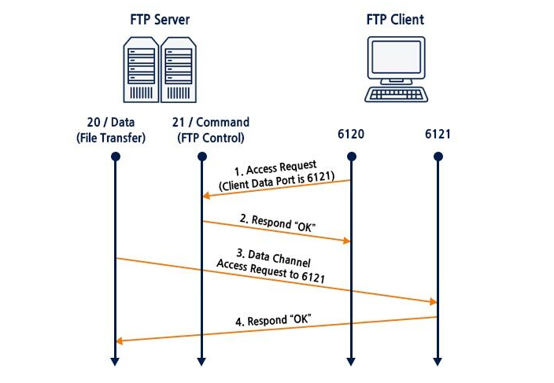
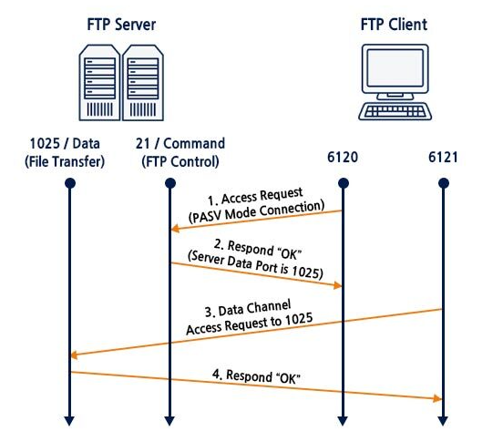

# FTP (Fille Transfer Protocol)

- FTP는 `File Transfer Protocol` 말 그대로 파일을 송,수신하는 통신 규약이다.
- FTP Server와 FTP Client간에 파일을 전송하기 위해 개발된 프로토콜이다.
- FTP 서버에 파일들을 업로드,다운로드 할 수 있고, 이는 FTP Server와 FTP Client 간에 통신에서 이루어진다.
- FTP는 TCP 20,21번 포트를 사용한다.
- 하지만 FTP는 파일을 빠르게 송수신하기 위한 목적으로 개발되었기 때문에 `보안성이 취약`하다.

---

## FTP의 보안 취약점

- FTP가 무슨 보안 취약점이 있는지 간단하게 알아보겠다.

### 1. tFTP Attack

- 아래에서 설명할 것이지만 tFTP는 UDP를 사용하므로 인증절차를 요구하지 않는다.
- 그렇기 때문에 누구나 해당 tFTP Server 접근하여 파일을 다운로드 할 수 있다.

### 2. Anonymous FTP

- 보안 절차를 거치지 않은 익명의 사용자에게 FTP 서버 접근을 허용한다.
- 만약 익명 사용자가 Server에 대한 쓰기 권한이 있을 때 악성코드 생성이 가능하다.

---

## FTP 종류

- 대표적인 FTP의 종류에 대해 알아보겠다.

### 1. FTP

- 기본적인 FTP로 TCP 프로토콜을 사용하여 ID,PW의 인증을 수행하고 사용자의 데이터를 송수신한다.
- 사용하는 Port Number는 20,21번을 사용한다.

### 2. tFTP

- FTP랑은 다르게 UDP를 사용하여 별다른 인증 없이 데이터를 빠르게 송수신한다.
- 사용하는 Port Number는 69번을 사용한다.
- 로그인 절차가 없다.

### 3. sFTP

- 기본적인 FTP에 SSL 암호화 방식을 사용하여 데이터의 기밀성을 제공하는 기술이다.
- FTP로 송수신되는 데이터들을 PlainText → Encryption으로 변환해준다.

---

## Port 20 & Port 21

- FTP는 `두 가지`의 Port를 사용할 수 있다.

### Port 20

- Port 20번은 `실질적인 데이터의 전송`을 위한 `Data Port`이다.
- File과 Directory같은 실질적인 전송 데이터가 Port 20번을 통해서 전송이 된다.

### Port 21

- Port 21번은 `Client - Server 사이에서 명령과 제어`를 하는 `Control Port`이다.
- 로그인, 디렉터리 목록 조회 등 모든 명령과 제어는 Port 21번에서 이루어진다.

---

## 간단한 FTP의 동작 Model

- PI : Protocol Interface
- DTP : Data Transfer Process

1. User PI가 Server PI에게 연결 여부를 묻는 Command를 전송한다.
2. Server PI는 Command에 대한 Reply를 전송한다.
3. 명령을 받은 Server는 Reply를 전송하면서 Data Connections를 생성한다. 
4. 생성된 Data Connection을 생성하여 User와 연결하면서 데이터를 주고받는다.
5. 데이터 송수신을 끝내면 Data Connection을 다시 제거한다.

- 이런 식으로 동작하기 때문에 Data를 주고받는 Port 20번은 Data를 주고 받을 때만 연결이 되고 Control Port인 21번은 첫 연결부터 Server과 Client간의 연결이 끊어질 때까지 연결이 되어있는다.

---

## Active Mode & Passive Mode

- FTP는 Port도 `두 가지`를 사용하지만 Mode도 `두 가지`를 사용할 수 있다.

### Active Mode

1. FTP Client는 FTP Server의 21번 포트에 대한 연결 요청을 Server로 전송한다.
    1. 이때 자신의 Data Port가 6121번 포트라고 패킷에 포함하여 전송한다.
2. FTP Server는 연결 요청에 대한 응답을 FTP Client에 보낸다.
3. 연결이 완료가 되었으면 FTP Server는 FTP Client로부터 받은 Client의 Data Port(6121)에 연결을 요청한다. 
4. FTP Client는 Server로부터 온 연결 요청에 대한 응답을 보낸다.
- 이렇게  FTP Active Mode는 `Server가 Client에게 연결`하는 방식으로 동작한다.

### Passive Mode

1. Client는 Server의 21번 Port에 Passive Mode로 연결할 것을 요청한다.
2. Server는 Client의 요청에 대한 응답을 전송할 때 자신의 Data Port인 1025번을 함께 보낸다.
3. Client는 Server의 Data Port인 1025번에 연결 요청을 보낸다.
4. Server는 Client의 요청에 대한 응답을 보낸다.
- 이렇게 Passive Mode는 `Client가 Server에 연결`하는 방식으로 동작된다.

---

## 각 Mode의 특징

### Active Mode

- 대부분의 경우에 Client 앞에 `방화벽 또는 방화벽 역할을 하는 NAT 장치`들이 존재한다.
- Server가 Client에게 접속을 하는 방식이 Active mode이다.
- 그렇기 때문에 방화벽에서 Port Forwarding이나 해당 포트를 열어주지 않으면 FTP 접속이 정상적으로 이루어지지 않는 상황이 발생한다.
- 또한, 연결은 되는데 데이터 송수신이 안되는 경우가 발생할 수 있다.

### Passive Mode

- 이러한 상황을 방지하기 위해서 Passive Mode를 사용하는 것이다.
- Passive Mode는 Client가 연결을 받아오는 것이 아닌 Client가 연결의 시작점이 되므로 Client측에 방화벽은 아무 상관이 없다.
- 하지만 Passive Mode도 Server측 Data Port가 열려있어야 연결이 가능하다.
- 왜냐하면 Client 측에서 Server로 연결하는 것이기 때문이다. 하지만 모든 포트 번호에 대해서 접근 요청을 허가하는것은 위험 부담이 크기 때문에, Server 측에서 Data Port의 범위를 지정해서 해당 범위만 접근 요청을 허가해주는 방법으로 해결할 수 있다.

---

## Dynamic Port Range

- Dynamic Port는 각 OS마다 다르다.
- 이 Dynamic Port Range는 Client의 동적 포트와 Passive Mode 일 때 사용된다.
- Passive Mode 일 때의 Server Data Port는 FTP 서버 설정에서 지정된 범위 내에서 사용하는 것이 일반적이다.

### Linux : 32768 ~ 60999

### Windows : 49152 ~ 65535

### macOS : 49152 ~ 65535