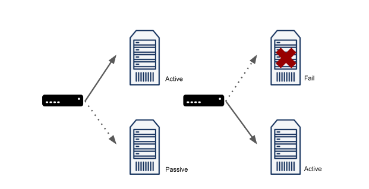
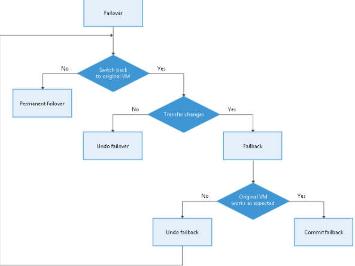

# Failover란 ?

- Failover는 `장애 대비 기능`을 말한다. 실패(fail)를 끝내는 것(over)이다.
- 하나의 System에서 장애가 생기면 다른 System으로 대체해서 운영하는 것이다.

## Failover의 정의

- `장애 극복 기능(Failover)`은 컴퓨터 서버, 시스템, 네트워크 등에서 이상이 생겼을 때 `예비 시스템으로 자동 전환`되는 기능을 의미한다.

## Failover Architecture

- A 장비 : Active 장비
- B 장비 : Passive 장비

```markdown
현재 운영되고 있는 장비를 **Active 장비**라고 한다.
같은 설정으로 구성된 대기하는 장비를 **Passive 장비** 라고 한다.
```



- 위와 같이 A 장비가 잘 동작하고 있다가 장애( 강제 Shutdown )가 발생하였다.
- 그럼 대기 중인 B 장비가 Active 장비로 변환되면서 서비스를 계속 운영는 것이다.
- 주로 Failover는 `높은 가용성`을 요구할 때 구성한다. 100%라는 시스템은 없기에, 장애를 반드시 대비해야 한다.
- 하지만 Failover를 구성하려면 `여분의 서버`, `네트워크 장비` 등의 추가 자원이 필요하다.

---

## FailBack

- Failover에 따라 전환된 운용 환경을 `장애 발생 전`으로 되돌리는 처리 기술

```markdown
예를 들어 cisco의 Standby Preempt 라는 Command를 예시로 들 수 있다.

* Active 장비가 장애가 발생했을 때 Passive가 그 역할을 이어받았다.
* 이 때, Active의 장애가 회복되면 원래 Active 였던 장비는 다시 Active로 동작하는것이다.
```




---

## Failover가 쓰이는 범위

- Web Server, Network 장비, DataBase 다양한 영역에서 사용된다.
- 또한, HW적인 장애 뿐만 아니라, SW를 포함한 서비스가 운영되지 않는 모든 장애에 대비한다.

## 비슷한 용어들

### 운영 중인 시스템

- Active
- Primary
- Master

### 대기 중인 시스템

- Passive
- Standby
- Secondary
- Slave
- Failover

---

## SwitchOver

- 이건 반대로 Active 장비를 Passive 상태로 바꾸는 기술을 말한다.