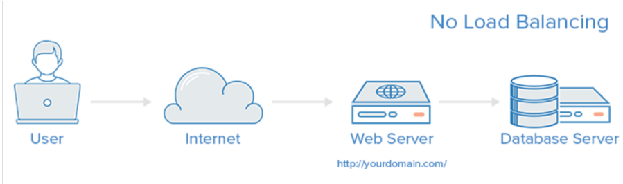
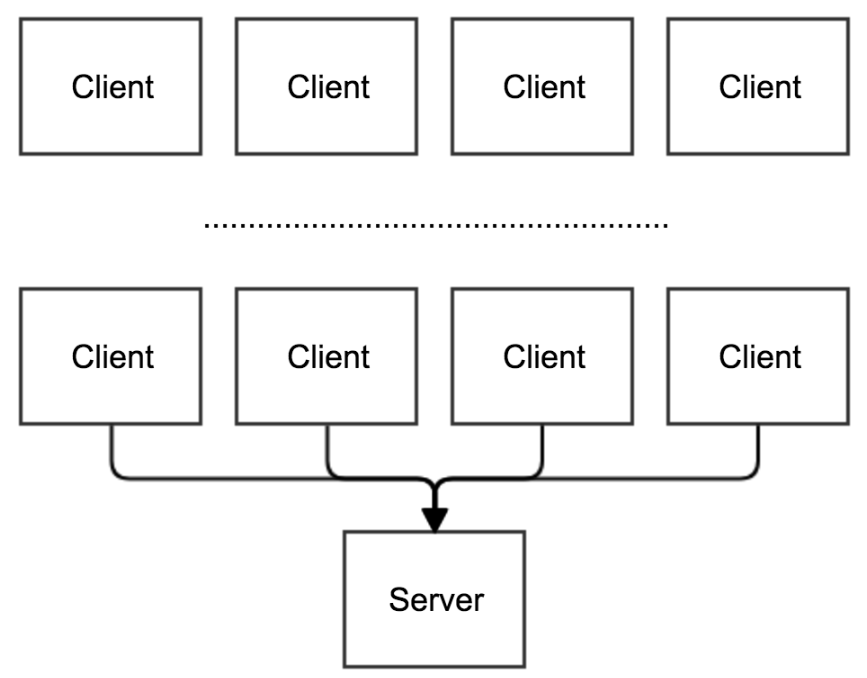
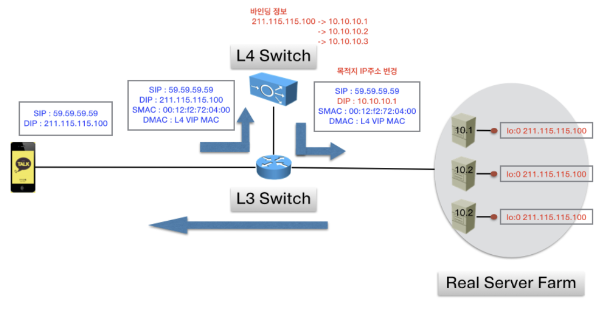
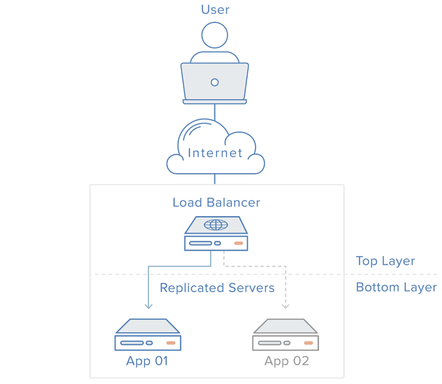
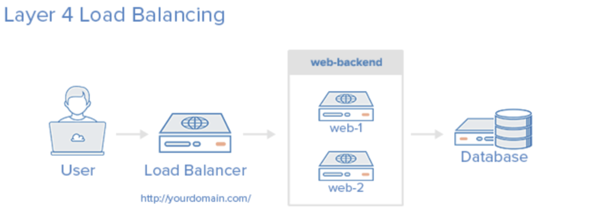
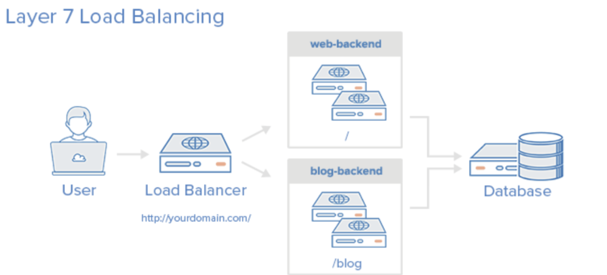

# Load Balancer

### Client가 한 두명인 경우에는 ??

- Server는 여유롭게 사용자가 원하는 결과를 응답 해줄 수 있다.
- Server가 요청을 보내는 주체가 적기 때문이다.

### Client가 수천만명인 경우에는?

- Server는 모든 사람들의 응답을 하려고 최대한 노력하지만…
- 결국에 부하가 심해져서 동작을 멈추게 된다.

---

## 이러한 문제를 해결하려면 ?

## **Scale-up**

- Server가 더 빠르게 동작하기 위해서 Server의 Hardware적인 기능을 높이는 법.

### 장점

- `성능 향상` : Server의 hardware 기능을 향상 시키는 것이므로, 더 많은 CPU와 메모리, 디스크 등을 추가함으로써 더 많은 트래픽을 처리할 수 있다.
- `확장성` : Scale-up은 시스템이 더 많은 트래픽을 처리할 수 있도록 확장성을 제공한다. 시스템에 더 많은 데이터나 사용자가 추가될 때 용이하다.
- `비율 효율성` : 초기에는 Scale-up이 더 효율적일 수 도 있다. 왜냐하면 새로운 서버를 구입하거나 추가 인프라를 구축하는 비용을 줄일 수 있기 때문이다. 이건 언제까지나 상대적이다.

### 단점

- `물리적 제약` : 서버에는 물리적인 한계가 있다.  Resource(Disk, Memory,SSD …)를 추가하는데 제한이 있을 수도 있다.
- `장애 조치` : 특정 서버에 장애가 발생하면 해당 서버에서 처리하던 Traffic을 다른 서버가 대신 처리해야한다. Scale-up 만으로는 이러한 장애 허용성을 충분히 확보할 수 없다.

## **Scale-out**

- 하나의 서버가 아닌 여러 대의 서버를 운영하는 법.
- Scale-out은 대규모 Web service, Cloud Computing 환경에서 널리 사용된다.

### 장점

- `성능 향상` : 새로운 서버를 추가함으로써 전체 시스템의 처리 능력이 증가한다. 이는 시스템이 더 많은 트래픽과 요청을 처리할 수 있도록 해준다.
- `고가용성` : 여러 대의 서버가 작업을 분산하므로 특정 서버가 고장난 경우에도 나머지 서버들이 작업을 계속 처리할 수 있다.
- `빠른 확장` : 새로운 서버를 추가하는 것은 상대적으로 빠르게 이루어질 수 있다. 당장 Cloud 컴퓨팅 환경에서는 몇 분 안에 서버를 Provisioning 할 수 있다.
- `성능 균형` : 서버를 분산시킴으로써 각 서버의 부하를 균등하게 분산시킬 수 있어 전체 시스템의 성능 균형을 유지할 수 있다.

### 단점

- `복잡성 증가` : Scale-out은 여러 서버 간의 작업을 분산시키는 것을 기반으로 하므로 구성이 복잡해 질 수 있다. 서버의 수가 증가함에 따라 네트워크 구성, 데이터 동기화 등이 복잡해진다.
- `자원의 낭비` : Scale-out은 필요 이상으로 많은 서버를 추가해버리면 자원의 낭비가 발생할 수 있다.
- `보안 문제` : 여러 서버간의 통신을 안전하게 유지하고 감시하는 것은 보안적인 측면에서 결코 쉬운일이 아니다.

- 이때 여러대의 Server에게 균등하게 Traffic을 분산시켜주는 역할을 하는것이 `Load Balancer`이다.

---

## Load Balancing

- 하나의 인터넷 서비스가 발생하는 트래픽이 많을 때 여러 대의 서버가 분산 처리하여 서버의 로드율 증가, 부하량, 속도저하 등을  고려하여 적절히 분산처리하여 해결해주는 기술이다.

---

## Load Balancing의 주요 기능

### 1. NAT

- 사설 IP 주소 → 공인 IP 주소로 변환.

### 2. Tunneling

- 인터넷 상에서 보이지 않는 경로를 만들어 통신할 수 있게 하는 개념.
- 데이터는 `캡슐화`해서 연결된 상호 간에만 캡슐화된 패킷을 구별해 캡슐화를 해제할 수 있음.

### 3. DSR(Dynamic Source Routing Protocol)

- Load Balancer 사용 시 서버에서 Client로 되돌아가는 경우 목적지 주소를 Network SW 주소 아닌 Client의 주소로 변환하여 Network SW를 거치지 않고 Direct로 바로 쏴주는 기술.
- 아래는 DSR의 예시이다.

## Load Balancing의 Architecture

- Load Balancing의 Architecture이다.

---

## 각 계층별 Load Balancing

### L2 Load Balancing

- MAC 주소를 바탕으로 Load Balancing을 한다.
- 주로 스위치나 라우터에서 이루어진다.

### L3 Load Balancing

- IP 주소를 바탕으로 Load Balancing을 한다.
- 라우팅 기능을 활용하여 네트워크 간의 트래픽을 분산한다.

### L4 Load Balancing

- TCP UDP 포트 번호를 기반으로 Load Balancing을 한다.

### L7 Load Balancing

- 응용 프로그램 자체의 로직을 기반으로 트래픽을 분산한다.
- HTTP 헤더, 쿠키, URI 등과 같은 응용 프로그램 계층의 정보를 기반으로 트래픽을 분산한다.

---

## Load Balancing 알고리즘

### Round Robin

- 서버로 들어온 요청을 `순서대로 돌아가서 배정`하는 방식
- Client의 요청을 순서대로 분배하기 때문에 `서버들이 동일한 스펙`을 가지고 있으면서, 서버와의 `연결이 오래 지속되지 않는 경우`에 적합하다.

### 가중치(Weighted) Round Robin

- 각각의 서버들에게 가중치를 매긴다.
- 주로 하나의 Server의 스펙이 더 좋을 때 사용.
- A 서버 가중치 : 3 / B 서버 가중치 : 5
- A에게 3개의 Request 할당 / B에게 5개의 Request 할당
- 이 Request 들은 순서대로 할당된다.

### 최소 연결 방식 (Least Connection)

- Request가 들어온 시점에 가장 적은 연결(세션) 상태를 보이는 서버에 우선적으로 트래픽을 할당
- `자주 세션이 길어지거나, 서버에 분배된 트래픽들이 일정하지 않은 경우`에 적합하다.

### 최소 응답 시간 방식 (Least Response Time)

- 서버의 현재 연결 상태와 응답 시간을 모두 고려하여, 가장 짧은 응답 시간을 보내는 서버로 트래픽을 할당하는 방식이다.
- 각 서버들의 가용한 리소스와 성능, 처리중인 데이터 등이 상이할 경우 적합.

### 대역폭 방식 (Bandwidth)

- 서버들간의 대역폭을 고려하여 서버에 트래픽을 할당한다.