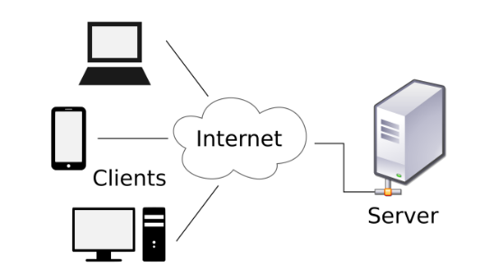
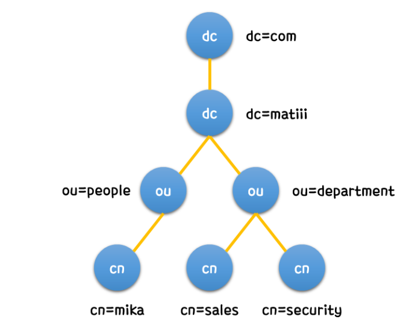

# LDAP

## LDAP (Lightwight Directory Access Protocol) 이란?

- 분산 디렉토리 서비스에서 사용자, 시스템, 네트워크, 서비스, 앱 등의 정보를 공유하기 위한 오픈 프로토콜이다.
- LDAP은 네트워크 상에서 사용자,시스템,네트워크,서비스 등의 정보를 쉽게 찾아볼 수 있게하는 소프트웨어 프로토콜이다.
- LDAP은 Client  - Server 구조를 하고 있다.

## LDAP의 구조

- LDAP은 Directory Service를 제공하는것이 주요 기능이다.
- 디렉터리 안에는 저장/공유할 무엇이든 넣을 수 있다.
- 삽입/수정 보다는 검색에 특화된 ‘계층적 구조’로 이루어져 있다.

- cn=mika는 matiii.com의 people이라는 ou에 존재하는 것이다.
- 이렇게 각 사용자나 개체는 고유한 DN (Distinguish Name)을 갖는데, 이는 끝 노드부터 역순으로 올라간다.

## LDAP의 기능

- 컴퓨터 관리, 사용자 인증 등의 정보를 중앙에서 관리할 수 있다.
- 관리 중인 정보를 읽거나 검색하는 것에 특화되어 있다.
- 하지만 트랜잭션, 롤백 등의 기능은 존재하지 않아 쓰기에는 적합하지 않다.
- 수많은 서버의 계정 관리, 접근 제어 등을 중앙에서 관리할 수 있어 보안적 결함 관리에도 효율적

---

## 대표적인 LDAP 서버

### 1. OpenLDAP

- LDAP Directory를 구축하고 관리할 수 있는 CLI 기반의 서버이다.
- LDAP이 개발되고 이를 활용하는 최초의 오픈소스 LDAP 서버로 지금까지 계속 활용중이다.
- OpnLDAP은 LDAP 기능만을 제공하고 있어 확장성이 매우 뛰어나다.

### 2. Apache Directory Server

- LDAP을 기반으로 자바로 작성된 LDAP 서버이다.
- Ecilps와 같은 자바 기반의 응용 프로그램에 쉽게 사용 할 수 있는 장점이 있다.
- LDAP 뿐만 아니라 DNS,Kerberos와 같은 다른 프로토콜들도 지원한다.

### 3. Active Directory

- LDAP뿐만 아니라 다양한 형태의 Directory 구조 및 여러 프로토콜을 제공하는 Solution이다.
- 기존 LDAP을 확장해 다양한 기술을 제공하고 GUI Service 및 Tools를 제공한다.
- Active Directory Solution은 Windows 환경에서만 지원한다.