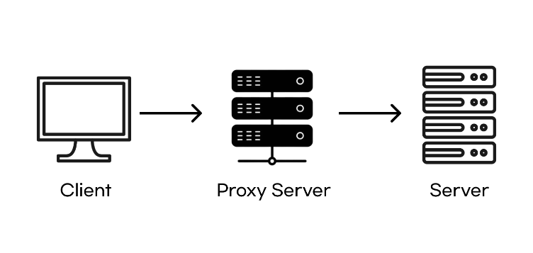
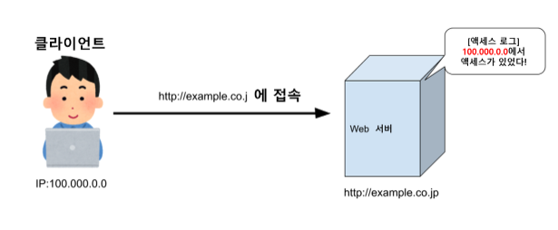
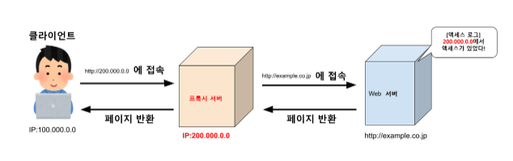
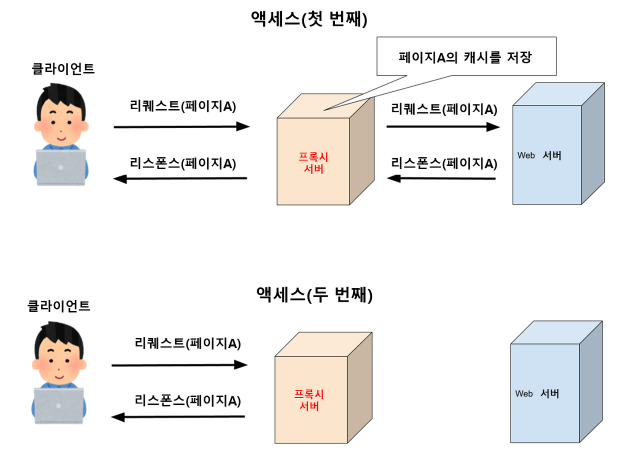
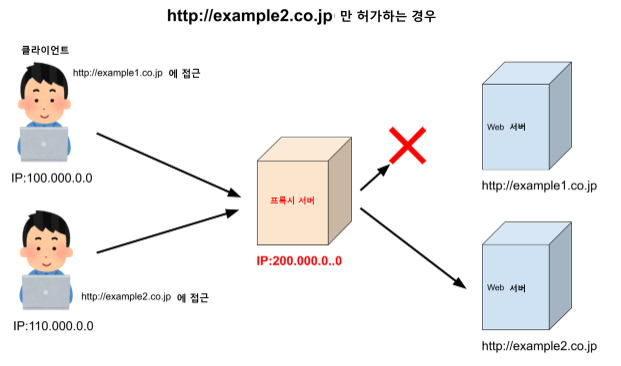
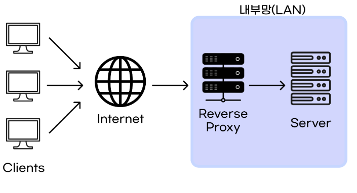
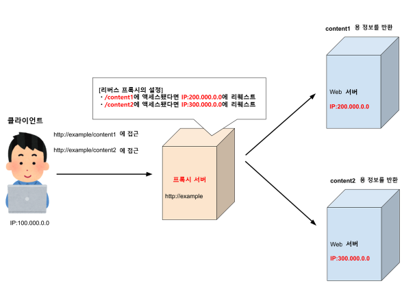
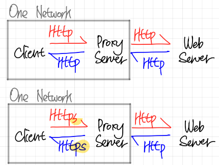
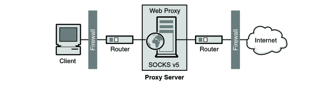

# Proxy

- Proxy는 “대리”의 의미로, 인터넷과 관련해서 쓰이는 경우, 프로토콜에 있어서는 대리 응답 등에서 사용하는 개념이다.



- Client와 Server 사이에 존재하며 중계기로서 대리로 통신을 수행하는 것을 `Proxy` 라고 하며, 그 중계 기능을 하는 주체를 `Proxy Server`라고 한다.
- Client와 Web Server의 중간에 위치하고 있어, 대신 통신을 받아 주는 것이 Proxy Server이다.
- 이러한 Proxy Server가 중간에 위치하면서, Client는 Proxy Server를 Server로 인식하고 Server는 Proxy Server를 Client로 인식한다.

---

# Proxy의 종류

- Proxy는 Server의 위치와 사용하는 Protocol에 따라 거의 나뉜다.

---

## Server의 위치

- Proxy는 Server의 위치에 따라 `Forward Proxy`와 `Reverse Proxy`로 나뉜다.

### Forward Proxy

- Client 대신 Proxy Server가 목적 Server에 통신을 해주는 구성을 **Forward Proxy**라고 한다.
- Proxy를 사용하지 않은 경우는 아래와 같다.

```markdown
Proxy를 사용하지 않은 경우에는 목적 Server(Web Server)가 Client의 IP를 알 수 있다.
보안성에서 매우 취약한 부분을 보인다. 
```




- 아래는 Foward Proxy를 사용한 경우이다.




```markdown
Forward Proxy를 사용하는 경우

* Forward Proxy를 사용하면 외부 Web Server와 통신을 하는 것은 Proxy Server이다. 
* 그러므로 Client는 Proxy Server만을 통해 정보를 얻게 된다. 
* 따라서 외부 Web Server 쪽에는 Proxy Server에 대한 Access Log가 남게되어 Client의 주소를 숨길 수 있다.
```

- 그리고 Forward Proxy의 경우 Client가 무슨 Proxy Server를 경유할 지는 Client 자체에서 설정할 수 있다.

```markdown
Windows 10 : [Windows 메뉴] -> [설정] -> [네트워크와 인터넷] -> [프록시]

Linux : 환경 변수로 설정
export http_proxy=http://proxy.example.com:8080
export https_proxy=http://proxy.example.com:8080
source ~/.bashrc : 환경변수를 수정한 후 적용
```

## Forward Proxy의 장점

### 1. Cache 저장( Access 고속화 )

- Proxy Server에 Cache를 저장할 수 있다.
- 다시 동일한 Web Page를 Request 했을 때, Proxy Server에 남아있는 Cache를 바로 반환하여 접근성을 높여준다.



### 2. URL Filtering

- 외부의 액세스는 Proxy Server를 경유하기 때문에 사용자 전체에 대한 URL Access를 필터링 할 수 있다.
- 아래는 예시이다.




```markdown
URL Filtering을 사용할 때

* 이 예시는 http://example2.co.jp만 허가하는 경우이다.
* Client가 http://example1.co.jp에 Access 하려고 해도 해당 Site로의 Request가 보내지지 않는다. 
* (Error용 페이지나 설정에 따른 화면이 표시된다.)
```

## Reverse Proxy

- Forward Proxy와 달리 Web Server쪽에 위치하여 Client의 접근을 최초로 받아 Request에 해당하는 Web Server에 분배해주는 역할을 한다.



- 아래는 Reverse Proxy를 구성한 예시이다.




```markdown
Reverse Proxy를 구성한 예시

* Client에서 Access를 Proxy Server로 하여금 URL에 따라 Request를 받을 Web 서버가 바뀌도록 설정하고 있다.
* 이렇게 되면 Client에 입장에 있어서는 Proxy Server가 Web 서버와 같은 동작을 하므로 Web Server가 여러 개 존재한다는 것을 은폐할 수 있다. 
```

## Reverse Proxy의 장점

### 1. 내부 Server 은폐

- 위에 예시에서 설명했듯이 내부의 Web server의 역할을 Proxy Server가 대신 하기 때문에 내부 Server를 은폐할 수 있다.

### 2. Cache 저장 ( Access 고속화 )

- Forward Proxy와 동일하게 동일한 데이터를 재 요청 할 시, Proxy Server가 저장했던 내용을 돌려준다.

### 3. Security

- Proxy Server 내에 Security 정책( URL Filtering, 특정 IP 차단  ) 등을 추가하여 Web Server로의 부정 액세스, 사용 등을 방지할 수 있다.

### 4. Load Balancing

- Client의 요청을 여러 Server로 Traffic을 분산처리하는 Load Balancing의 기능을 수행 할 수 있다.

```markdown
이건 모든 Proxy에 해당하는 장점이다.

* Proxy Server에는 모든 Access Log가 남기 때문에 Proxy Access Log를 소유할 수 있다.
```

---

## 사용하는 Protocol에 따른 구분




### HTTP  Proxy

- HTTP Proxy는 Web Server이면서 Web Client이다.
- Client로부터 Request를 받으면 이 Request를 목적 서버로 Request를 보낸 후 다시 Client에게 Response를 돌려줘야 하기 때문이다.

### HTTPS Proxy

- HTTP Proxy 에서 기반된 것으로, `SSL 연결을 지원` 한다.
- 주로 민감한 정보( 사용자 이름 / 비밀번호 등 )를 Proxy 하고 싶을 때 사용된다.
- HTTPS Proxy는 Client로부터 암호화된 데이터를 받아서 목적 서버로 보낸다.
- 이 때, 전송된 정보의 암호화 또는 복호화 처리는 하지 않는다.

### SOCKS (Socket Secure) Proxy



- SOCKS Proxy는 Proxy 서버를 통해 `Client와 Server간에 네트워크 패킷을 교환`하는 프로토콜이다.
- Server-Client 간에 TCP/UDP 통신을 Proxy Server를 거쳐 통신할 수 있게 해주는 프로토콜인 것이다.
- SOCKS Proxy에서 가장 많이 사용되는 방식이 `SOCKS5 Proxy`이다.
    - SOCKS5 Proxy는 네트워크 트래픽 유형을 구별할 수 없다. (SMTP인지 ? FTP인지 ?)
    - 그러므로 Web Traffic에 국한하지 않고 응용프로그램 수준에서도 동작한다. (FileZila 등등)
- IP 주소를 숨기고 뛰어난 성능을 제공하기에 P2P 등에 이상적이다.
- 또한 암호화가 없기 때문에 속도에 영향을 미치지 않으므로 VPN보다 속도가 빠르다.