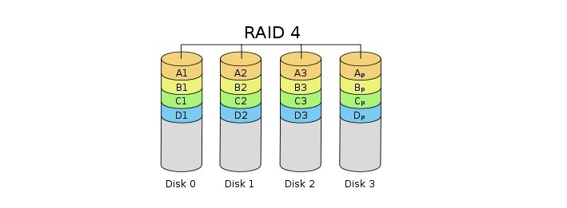

# RAID(Redundant Array of Independent)

- 쉽게 말해서 RAID는 여러 개의 디스크를 묶어 하나의 디스크처럼 사용하는 기술.

### RAID를 사용할 때의 기대 효과

- 대용량의 단일 볼륨을 사용하는 효과 ( 1 + 1 + 1 + 1 → 1111 )
- 디스크 I/O 병렬화로 인한 성능 향상

```bash
I/O 병렬화란? - 입출력 - Input/output

- 여러 디스크 I/O 작업을 동시에 실행하여 시스템 성능을 향상시키는 기술이다.
- I/O 작업이란 컴퓨터 시스템에서 데이터를 읽거나 쓰는 작업이다.

ex ) 네트워크 통신(브라우저가 서버로부터 웹 페이지를 Request 할 때 등등)
ex ) 키보드 및 마우스의 입력 
ex ) 디스크 작업 (하드 디스크 또는 SSD에서 데이터를 읽거나 쓰는 작업 ex )DB에서 record 읽기 ) 
```

- 데이터 복제로 인한 안정성 향상 ( 균형적인 자원의 분배)

---

# RAID의 구성방식

## RAID 0


- Striping이라고 불리는 방식이다.
- RAID 0을 구성하기 위해서는 최소 2개의 디스크가 필요하며 RAID를 구성하는 모든 디스크에 Data를 분할하여 저장한다.
- 전체 디스크를 모두 동시에 사용하기 때문에 성능은 단일 Disk의 N배이며, 용량 역시 N배이다.
- 하지만 하나의 디스크라도 문제가 발생할 경우 전체 RAID가 깨지는 일이 발생한다.
- 그리고 안정성은 1/N으로 줄어든다.

## RAID 1


- Mirroring이라고도 부르는 방식이다.
- RAID 1을 구성하기 위해서는 최소 2개의 디스크가 필요하며 RAID 1은 모든 디스크에 데이터를 복제하여 기록한다.
- 즉, 동일한 데이터를 N개로 복제하여 각 디스크에 저장하는 방식이다.
- 이 때문에 여러 개의 디스크로 RAID를 구성해도 실제 사용 가능한 용량을 단일 디스크의 용량과 동일하다.
- RAID 1의 최대 강점은 안정성이 높다. 하지만 비용 문제로 인해 거의 사용하지 않는다.

## RAID 4



- Error를 감지하기 위해 하나의 패리티 디스크를 사용한다.
- 용량 및 성능이 단일 디스크 대비 N-1배 증가하며 최소 3개의 디스크로 구성할 수 있다.
- Data 디스크들은 데이터를 저장하고 패리티 디스크들은 Data 디스크들에 저장된 데이터의 오류검출을 계산한다.
- 하지만 RAID 4는 읽기 작업에 대해서는 효율적이지만, 쓰기 작업에서는 성능 저하가 발생할 수 있다.
- 왜냐하면 패리티 Disk에 쓰기 작업을 같이 진행 해야 하기 때문이다.

## RAID 5


- RAID 5는 RAID 4와는 다르게 패리티 디스크를 여러 디스크에 분할하여 저장하는 구성방법이다.
- RAID 4의 단점을 개선한 것이라고 볼 수 있다.
- RAID 5는 비교적 안정적이고 효율적인 RAID 구성 중 하나로 널리 사용된다.

## RAID 6


- RAID 5에서 성능과 용량을 좀 더 줄이고 안정성을 좀 더 높인 방식이다.
- Error 감지를 위해서 패리티를 2개의 디스크에 저장한다.
- 또한, 패리티 저장은 고정된 디스크에 하지 않고, 매번 다른 디스크에 저장을 한다.

## RAID 10


- RAID 10은 RAID0과 RAID1을 합친 방식이다.
- RAID0의 Data Striping과 RAID1의 Data Mirroring을 도입한 기술이다.
- RAID10은 Data가 Mirroring 되므로 `데이터의 안정성`을 높인다. 왜냐하면 하나의 디스크가 고장나더라도 Mirroring된 데이터로 복구할 수 있기 떄문이다.
- RAID10은 Data Striping을 통해 `입출력 성능`을 높여준다. 왜냐하면 Striping이 되어있으면 여러 디스크에서 동시에 데이터를 읽거나 쓸 수 있기 때문이다.
- 또한 Data Striping을 통해서 여러 디스크에 Balancing하게 Data들이 분산이 되면 입출력 작업이 균형을 이루게 되면서 성능이 빨라진다.

```bash
Striping : 데이터를 분산해서 병렬화 시키는 작업.
Mirroring : 같은 데이터를 복제하는 작업. (Backup의 개념)
``` 

## Parity Bits

- RAID5와 RAID6에서 RAID를 구성할 때 Parity Bits가 자동으로 생성이 된다.
- RAID5와 RAID6은 Data와 Parity 정보를 조합해서 Data의 안정성과 회복성을 제공한다.
- 따라서 하나의 디스크가 터지더라도 그 디스크의 Parity Bits로 Data를 복구 할 수 있다.

---

### Hardware Raid

- 말 그대로 `Hardware`적으로 Raid를 구성하는 방법이다.
- 별도의 RAID 컨트롤러를 사용하여 구성하게 되며, RAID 컨트롤러에서 Disk 구성을 한 후 OS에게 전달하는 방식이다.
- 그러므로 OS는 해당 디스크가 RAID 구성의 유무를 알 수가 없다.
- OS가 RAID에 관여하지 않고 또, 별도의 Hardware가 RAID관련 설정을 하기 때문에 Software RAID보다 더 나은 성능을 기대할 수 있다.
- 단, RAID 컨트롤러를 이중화 하지 않을 경우, Controller의 손상만으로 DIsk 전체를 사용할 수 없게 된다.

### Software Raid

- RAID Controller가 담당하는 것이 아닌 `OS가 RAID를 담당`하는 설정이다.
- 별도의 RAID Controller가 없어서 비용적인 문제에서는 조금 더 나을수 있지만, Hardware RAID 방식에 비해 성능은 더 낮다.
- Windows : 동적디스크 사용
- Unix 계열 : LVM 사용
- (LVM을 사용하면 성능차이가 거의 없다고 하지만, Windows에서 Software Raid를 사용하면 성능도 차이날 뿐더러 복구시에 안정성도 낮다고 한다.)