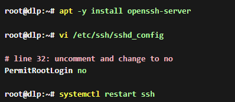
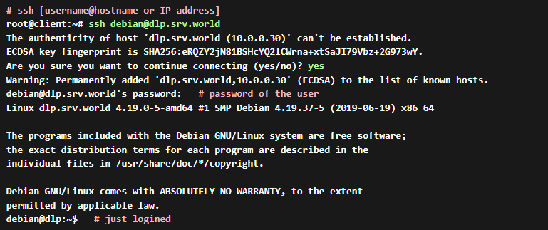
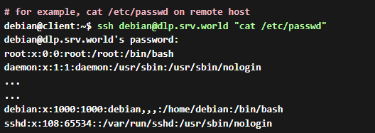

# DO IT!

## SSH 구현

---

### Step 1

- Debian의 Open SSH Server에 대한 비밀번호 인증은 기본적으로 활성화되어 있기 때문에 로그인이 기본적으로 가능하다.
- 또한, Root 계정에 대한 접속은 [PermitRootLogin prohibit-password]로 설정되어 있어 기본 설정을 사용하면 좋지만 더욱 강력한 보안을 설정하려면 no로 설정하는게 좋다.

### Step 2

- SSH로 접속을 시도할 Client에 openssh-client를 설치한다.

### Step 3

- SSH Server에 Common User [Debian User]로 접속을 한다.
- 아래 명령어의 debian@[dlp.srv.world](http://dlp.srv.world) 에서 debian = Username이고 dlp.srv.world가 접속할 SSH Server이다. 아마 SSH Server에서 vim /etc/hosts에 로컬 컴퓨터 주소가 dlp.srv.world로 설정되어있을 것이다.

### Step 4

- 또한, SSH 명령어에 Command를 추가하여 원격 컴퓨터에 명령어를 실행 시킬 수 있다.

