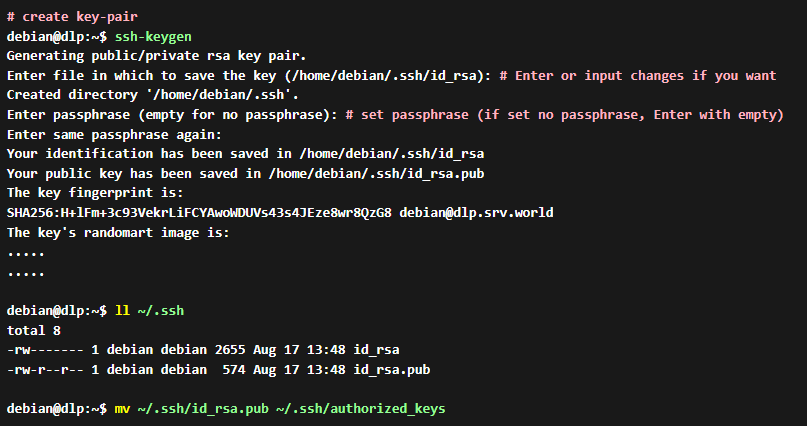
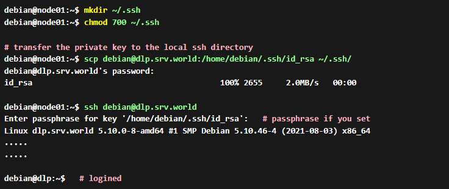

# DO IT !

- SSH Key를 생성하여 비밀번호를 요구받지 않고 Key 인증을 통해 접속하는 방법이다.
- Key Pair 인증을 통하여 로그인하도록 SSH 서버를 구축한다.
- 이를 설정하려면 Server 용 `Public Key`와 Client용 `Private Key`를 생성해야 한다.
- 이번 실습에서는 인증 방식을 대칭키 암호화 알고리즘으로 진행한다.

---

## Step 1

- 먼저 Key Pair(Public Key & Private Key)를 생성한다.
- ssh-keygen 명령어를 사용하면 기본적으로 .ssh 경로 밑에 저장이 된다.
- .pub가 Public Key를 뜻한다.
- 아래와 같이 작업해준다. (아래 mv 명령어는 그냥 식별하기 쉽게 이름만 바꾸는 용도.)

## Step 2

- 서버에서 생성된 Private Key를 Client로 전송한다.
- (~/.ssh 이 경로는 ssh 패키지를 설치하면 자동으로 생성된다.)
- ~는 사용자의 홈 디렉터리이다. 루트 사용자로 로그인 해놓고 기본계정 Home Directory 밑에 SSH Key를 가져오려고 하는 나같은 바보같은 짓은 하면 안된다.

- 이렇게 하면 SSH Key 인증을 통해서 Password를 요구하지 않고 자동으로 인증이 되는것을 확인할 수 있다.