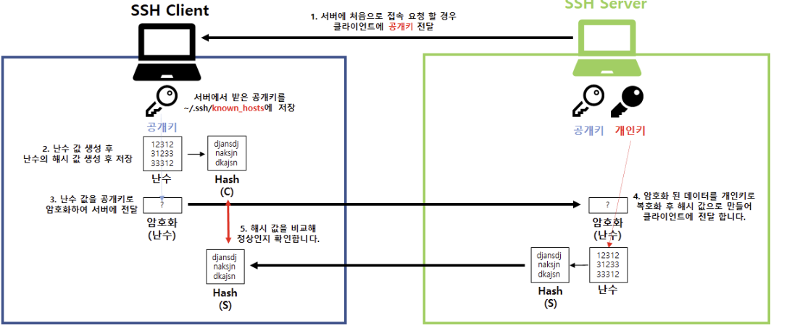
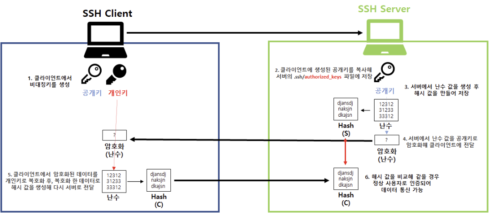

# SSH Key Authentication이란 ?

- SSH에서 제공하는 인증방식은 크게 두 가지가 있다.
    
    ```markdown
    1. Strong Password Authentication
    2. Public Key Authentication
    ```
    
- 여기서 소개할 것은 수준이 더 높고 보안성이 더 뛰어난 `Public Key Authentication`이다.

---

## SSH에서 Key란 무엇을 말하는 걸까 ?

- SSH에서의 Key는 SSH에서의 Credential이다.
- 우리가 무언가에 접속할 때 ID,Password를 입력하는 것과 같이, SSH Key를 사용하면 Password 대신에 SSH Key를 사용하여 서버에 접속할 수 있다.
- 참고로 SSH Key를 사용할 때가 Password를 사용하는 때 보다 보안수준이 더 높다.

```markdown
Key가 Password보다 보안 수준이 더 높은 이유

1. Password보다 복잡한 암호 메커니즘.
- Key는 Password보다 복잡하고 더 긴 문자열로 이루어져 있다.
2. 공개키 및 개인키의 사용
- 이건 아래에서 설명하겠다.
```

## Public Key & Private Key

- SSH Key는 공개키 암호화 방식(비대칭키)을 사용하기 때문에 Private Key와 Public Key 한 쌍으로 구성이 된다.
- `Private Key`는 단어에서 유추할 수 있듯이 `자신만이 가지고 있는 Key`를 의미한다. 이 Key는 절대 외부로 유출이 되면 안된다.
- Public Key는 누구에게나 공개가 가능한 Key이다.
- 이 공개키 암호화 방식은 사용 목적에 따라 Public Key로 Data를 암호화, Private Key로 Data를 암호화 하는 방식이 있다.

---

# SSH 접속 동작 방식

- SSH는 Server 인증과 Client 인증을 거쳐 접속한다.
- Client와 Server가 서로 인증되고 올바른 상태인지 확인하기 위해서 `비 대칭키 방식`을 사용한다.
- Client와 Server가 서로 인증이 된 후 Data를 주고 받을 때는 `대칭키 방식`을 사용한다.

## 1. `Server 인증`, Session Key 생성

- 접속하려는 Server가 올바른 Server인지 검증하고 이후의 데이터 통신을 안전하게 하기 위한 `Session Key`를 생성하는 과정이다.
- Server에서 생성된 Server의 Public Key를 Client에 저장한 후 다음 접속에서 Client에 저장되어있는 공개키와 Server의 공개키가 일치하는지 확인하는 과정이다.
- 서버에서 `Key Pair`를 생성한다

.



1. SSH Client가 처음으로 SSH  Server에 접속 요청을 할 경우에 Client에게 Public Key를 전달한다. SSH Client는 SSH Server로부터 받은 Public Key를 `~/.ssh/known_hosts`에 저장한다.

```markdown
* ~/.ssh/known_hosts 경로는 SSH Server의 Public Key를 저장하는 파일이다.
* 이후에 해당 Server에 접속할 때 마다 파일에 저장되어 있는 Public Key와 Server의 실제 
  Public Key를 비교하여 중간자 공격을 방지한다.
```

1. SSH Client는 난수 값을 생성하고 난수 값에 대한 Hash 값을 저장한다.
2. 위에서 생성했던 난수 값 (난수의 Hash값이 아님)을 Public Key로 암호화하여 SSH Server에 전달한다.
3. SSH Server에서 전달받은 난수 값을 Private Key로 복호화를 한 후 Hash 값으로 만들어서 SSH Client에게 전달한다. (SSH Server가 받은 Data를 Decryption 하면 난수 값이 나옴. 이걸 Hash 값으로 변경하는 거임.)
4. Client에서 난수 값을 Hash 값으로 변환한 값과 Client에서 Hash 값으로 변환한 값이 맞는지 비교한다.

## 2. Client 인증

- Client가 해당 SSH Server에 올바른 접근 권한을 가지 고 있는지 검증하는 과정이다.
- `Password 인증`과 `Key Pair 인증`방식이 있다.

### 2-1. Password 인증

- Client에서 SSH Server로 인증할 때 Password로 인증하는 방식이다.
- Client에서 입력한 Password를 위에서 만든 Session Key로 암호화 하여 SSH Server에게 보내고, SSH Server가 이를 검증하면 끝난다.
- 하지만, 보안상 권장하지 않는 방식이다.

```markdown
왜냐하면, Password는 무차별 대입 공격 등 취약점이 많기 때문이다.
```

### 2-2. SSH Key Pair 인증

- Client에서 `Public Key`와 `Private Key`를 생성한다.
- Server에 접속 할 때 Password 대신 Key를 제출하는 방식이다.
- 비밀번호보다 높은 수준의 보안성을 지니고 있다.




1. SSH Client에서 Private Key와 Public Key를 생성한다.
2. SSH Client의 Public Key를 SSH Server의 ~/.ssh/authorized_keys 파일에 저장한다.

```markdown
SSH Server는 ~/.ssh/authorized_keys의 있는 Client의 공개키를 항상 비교하여 인증한다.
```

1. Server에서 난수값을 생성하고 따로 Hash 값을 만들어 저장한다.
2. Server에서는 난수값을(Hash값 아님) Client의 공개키로 암호화하여 Client에게 전달한다.
3. Client는 자신의 Private Key로 이를 복호화하고 그 값을 Hash값으로 바꿔서 Server에게 다시 전달한다.
4. Server는 받은 Hash 값과 자신이 바꾼 Hash 값이 동일한지 확인하고 같을 경우 인증되어 Data 통신이 가능해진다.