# 암호화 알고리즘

- TCP/IP 통신을 할 때에는 Data를 암호화 한다고 했었다.
- 그럼 TLS는 어떻게 `암호화`를 하는 것일까?

### `TLS 는 보안과 성능상의 이슈로 두 가지의 암호화 방법을 혼용하여 사용한다.`

## 대칭키 암호화 알고리즘 vs 비 대칭키(공개키) 암호화 알고리즘

- 이 두 가지 알고리즘을 이해하기 전에 암호화와 복호화는 무엇인지 간략하게 설명하고 넘어가겠다.

---

### 암호화

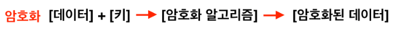

- 평문(Plain Text)을 암호문(Crypto Text)으로 변환하는 과정.
    - 평문 → 암호문
- 사용자가 입력한 데이터를 알아볼 수 없는 데이터로 변환하는 과정이다.
    - blue0494 → RHSJEN18275JS83NSUEB
- **암호화**를 하기 위해서는 일종의 `Key(키)가 필요`하다.
- 암호화는 그냥 하는 것이 아니라 **[Key]** + **[Data]**를 이용하여 **[암호화된 데이터]**를 만들어 내는 것이다.
- 따라서 Key가 단 한 글자라도 다르다면 암호화의 내용도 전혀 달라지게 된다.

### 복호화

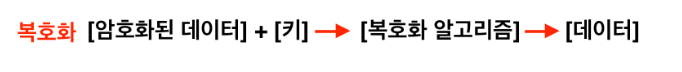

- 암호문(Crypto Text)을 평문(Plain Text)으로 변환하는 과정.
    - 암호문 → 평문
- 암호화된 데이터를 정상적인(사람이 알아볼 수 있는) 데이터로 변환하는 과정.
    - RHSJEN18275JS83NSUEB → blue0494
- 복호화를 하기 위해서도 Key는 꼭 필요하다.
- 복호화는 **[Key] + [Encryption Data]**를 사용하여 **[Data]**를 얻는 것이다.
- 따라서 Key를 모른다면 절대 복호화를 할 수 없다.

```markdown
이 때, 암호화&복호화에 사용하는 이 Key는 서로 동일 할 수도, 다를 수도 있다. 

Key가 서로 동일 -> 대칭키 
Key가 서로 다름 -> 비대칭키 
```

---

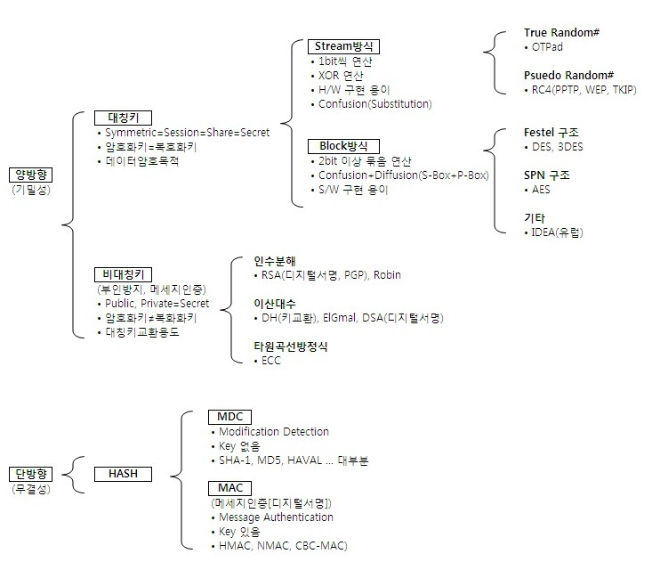

## 단방향 암호화 vs 양방향 암호화

- 우선, 가장 먼저 분류되는 방식은 `양방향과 단방향` 알고리즘이다.
- **양방향 알고리즘**은 `암호화된 암호문을 복호화`  시킬 수 있다.
- **단방향 알고리즘**은 `암호화된 암호문을 절대로 복호화 할 수 없다.`

---

# 단방향 암호화 알고리즘

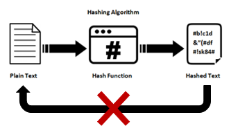


- 위에서 설명했던 것 그대로 한쪽 방향으로 암호화를 한다는 의미이다.
- 즉, `암호화만 가능하고 복호화는 할 수 없다`

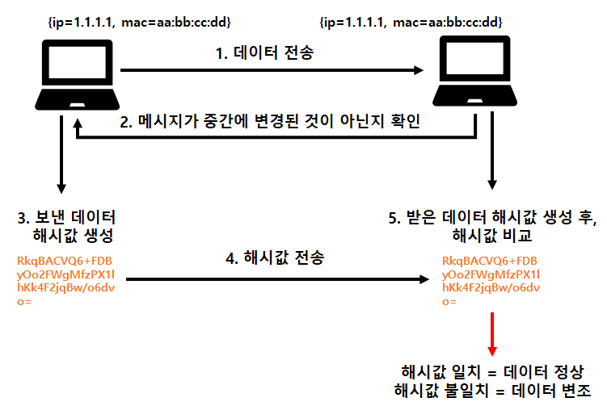


- 단방향 알고리즘은 위의 사진처럼 동작한다.
- 단방향 암호화에서 나온 Data는 원래 Data의 1bit만 바뀌어도 전혀 다른 값으로 변하기 때문에       보통 `Data의 무결성을 확인`하기 위해서 사용된다.

### 단방향 암호화 알고리즘의 `장점`

```markdown
1. 무결성 검증
* 주어진 입력 값에 대한 Hash 값을 계산하면 항상 동일한 결과를 얻을 수 있다.
* 이를 통해 Data의 무결성을 확인할 수 있다. 

2. 고속 처리 
* 대부분의 단방향 암호화 알고리즘은 계산이 빠르며 효율적이다. 
* 이는 대량의 Data에 대한 빠른 hashing이 가능하다는 것이다.

3. 고정된 출력 길이
* 입력의 크기에 상관없이 항상 고정된 길이의 출력을 생성한다. 
* 서로 다른 크기의 입력에 대해 항상 일관된 길이의 Hash를 얻을 수 있음을 의미한다.
```

### 단방향 암호화 알고리즘의 `단점`

```markdown
1. 역산 불가능
* Hash 값을 통해 원본 Data를 복원하는 것은 거의 불가능하다. 

2. 레인보우 테이블 공격
* Rainbow 테이블이란, 미리 계산된 Hash 값의 테이블이다.
* 이렇게 공격자가 원본 데이터를 빠르게 찾을 수 있다는 장점이 있다.

3. Hash 충돌 
* 두 개의 서로 다른 입력 Data가 같은 Hash 값을 가지는 hash 충돌이 발생할 수 있다.
* 안전한 단방향 알고리즘은 충돌을 최소화하려고 하지만, 일부 알고리즘에서는 이 문제가 발생할 수 있다.
```

- 단방향 암호로 잘 알려진 알고리즘은 Hash 알고리즘들이 있다.
- Hash 알고리즘은 암호화는 가능하지만, 복호화는 불가능하다는 점을 이용하여 Data의 무결성을 검증하기 위해 사용한다.

## Hash 함수 / 알고리즘

- Hash는 임의의 크기를 가진 Data를 고정된 데이터의 크기로 변환 시키는 함수이다.

```markdown
예시 (SHA-256사용)

원본 데이터: This is a sample data for hashing.
해시 값: c4c5549c7d495ead83101888a6a9efca47260d4c0376c60b4ce5a554e58bbdb3

(원본 데이터가 아무리 길어도 Hash 값은 256Bit로 나오게 된다.)
```

- `동일한 값`이 입력되면 언제나 `동일한 출력 값`을 보장한다.
- Hash도 여러 가지 알고리즘으로 나뉘는데 `SHA 시리즈`와 `MD5`로 나뉜다.

### MD5 알고리즘

- Message-Digest Algorithm 5
- 임의의 메시지를 입력 받아 128bit의 고정 길이 값을 출력한다.
- 입력 메시지의 길이 제한이 없다.
- 주로 프로그램이나 파일이 원본 그대로 인지를 확인하는 `무결성 검사` 등에 사용된다.

```markdown
하지만 현재 MD5 알고리즘은 보안 관련 용도로 권장하지 않는다.

왜 ?

1. 보안 취약성
* 다양한 보안 취약성이 MD5에서 발견되었다.
* 예를 들어, 무작위한 입력값을 만들어내는 것이 어렵다는 것이 밝혀졌으며, 이로 인해 예측 가능한 Hash 값을 생성하는데 활용 될 수 있다.

2. 속도 및 효율성
* MD5는 고속의 Hash 함수로 알려져 있어서 대규모 Data에 대한 빠른 Hashing 작업이 가능하다. 
* 그러나 이러한 특성은 공격자가 다양한 입력에 대한 Hash 값을 빠르게 만들어 놓고 해당 Hash 값과 일치하는 원본 데이터의 입력을 찾는데 사용될 수 있다.

3. 표준에서의 폐기
* MD5보다 더 강력하고 안전한 Hash 함수들이 권장되고 사용되고 있다.
```

### SHA 알고리즘

- Secure Hash Algorithm
- MD5의 취약성을 개선 및 대처하기 위해 미국 국가안보국(NSA)이 1993년에 처음 설계하였다.
    - 그 이후 미국 국가 표준으로 지정되었다.
- Hash 값의 Bit 수는 SHA 알고리즘에 따라오는 Bit 수만큼 달라지게 된다.
- Hash 함수의 Version은 SHA 0 ~ SHA 3까지 있으며, 현재는 SHA2가 사용 가능하고, SHA3가 권장되고 있으며, SHA0,1은 사용되지 않고 있다.

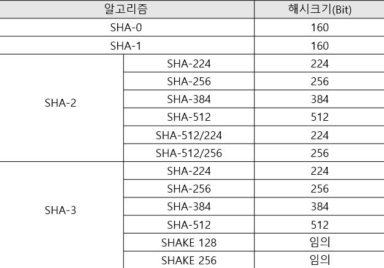

---

# 양방향 암호화 알고리즘

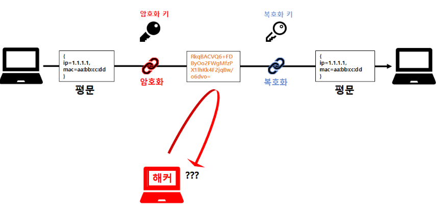


- 단방향 암호화 알고리즘 이랑은 다르게 암호화 된 암호문을 `복호화 할 수 있도록` 구현된 알고리즘을 말한다.
- 양방향 암호화 알고리즘은 데이터를 **인가된 사용자**만 볼 수 있도록 하기 위한 기술이다.
- 양방향 암호화 알고리즘은 주로 DES,3DES, AES, RSA가 잘 알려져 있다.
- 이 알고리즘은 Key의 성질에 따라 구분되는데 크게는 아래와 같다.

```markdown
1. 대칭키 암호화 알고리즘
2. 비대칭키 암호화 알고리즘
```

## 대칭키 암호화 알고리즘

- 이 알고리즘은 이름에서 알 수 있듯이 `암호화-복호화 할 때 사용하는 키가 동일`한 경우이다.
- 어떠한 정보가 대칭키를 통해 암호화 되었다면, 똑같은 Key를 가지고 있는 사용자가 아니면 해당 정보를 확인할 수 없다.
- 즉, 암호화 된 정보를 전달하고 확인하기 위해서는 송-수신자 둘 다 똑같은 Key를 가지고 있어야한다.
- 대표적인 알고리즘은  `DES,3DES,AES` 등이 있다.

```markdown
대칭키는 어떻게 이루어져있을까 ?

1. 길이
* 대칭키의 길이는 Key의 Bit 수를 나타낸다. Key의 길이가 길수록 보안성이 높아지지만
  동시에 암호화 및 복호화에 소요되는 계산 비용이 증가 할 수 있다. 일반적으로 사용되는 대칭키 길이는 128,192,256 Bit이다.

2. 키 생성
* 대칭키는 무작위 Bit열이여야만 하며, 안전한 난수 생성기를 사용하여 생성된다. 
* 예측 불가능한 Key를 생성하기 위해 안전한 난수 생성이 필요하다.
```

### 대칭키 암호화 알고리즘의 장점

```markdown
1. 암호화 및 복호화의 단순성
* 대칭키 알고리즘은 대칭키를 통해 동일한 키로 암호화와 복호화를 수행한다. 
* 그러므로 구현이 간단하며 성능이 우수하다. 

2. 속도와 효율성
* 대칭키 알고리즘은 대칭키를 통해 동일한 키로 암호화와 복호화를 수행한다. 
* 키의 길이와 알고리즘에 따라 다르지만, 대체로 비대칭키 암호화에 비해 빠르게 동작한다.

3. 간단함과 직관성
* 대칭키 알고리즘은 주로 간단하며 직관적으로 구현할 수 있다.
* 알고리즘이 단순하므로 구현이 쉽고 이해하기도 쉽다.
```

### 대칭키 암호화 알고리즘의 단점

```markdown
1. 안전한 키 교환
* 대칭키를 안전하게 교환하는 것이 어려울 수 있다.
* 두 사용자 간에 대칭키를 안전하게 공유하려면 다른 기술이 필요한데, 이를 구현하는 것이 어려울 수 있다.

2. 대칭키의 길이적 한계
* 대칭키의 Bit 길이가 한정되어 있기 때문에 일부 고급 알고리즘은 비대칭키를 사용하여 더 긴 키를 사용하는 경우가 많다.

3. 단일 키의 다중 사용
* 대칭키는 주로 단일 키를 사용하여 모든 작업을 수행하므로 Key가 한번 노출되면 해당 Key로 보호된 모든 통신이 위험에 노출될 수 있다.
```

### `여기서 대칭 Key 의 Key를 안전하게 교환하려면 어떻게 해야할까 ?`

- 바로 비 대칭 Key 암호화 알고리즘 (Diffie-Hellman)을 사용하면 된다 !
1. 송신자는 대칭키를 생성하고 수신자의 공개키를 사용하여 대칭키를 암호화한다. 
2. 그 후 암호화된 대칭 Key를 수신자에게 보내면 수신자는 자신의 개인 Key로 복호화를 하여 이후에는 대칭키를 사용하여 통신을 수행할 수 있다.

## 대칭키 주요 알고리즘

### DES 알고리즘

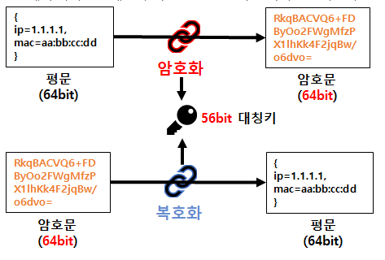


- Data Encryption Standard
- 원본 평문 Data를 64bit로 나누어서 56bit의 Key를 이용해 다시 64bit의 암호문을 만들어 내는 알고리즘이다.
- `블록 암호 기법`을 사용하고 16단계의 파이스텔 네트워크를 거쳐 암호화를 수행한다.

### 3DES 알고리즘

- DES 알고리즘을 **3중**으로 만들어 DES 암호를 보완한 암호 알고리즘이다.
- 암호화 - 암호화 - 암호화 가 아닌 `암호화 - 복호화 - 암호화` 방법으로 암호화를 한다.

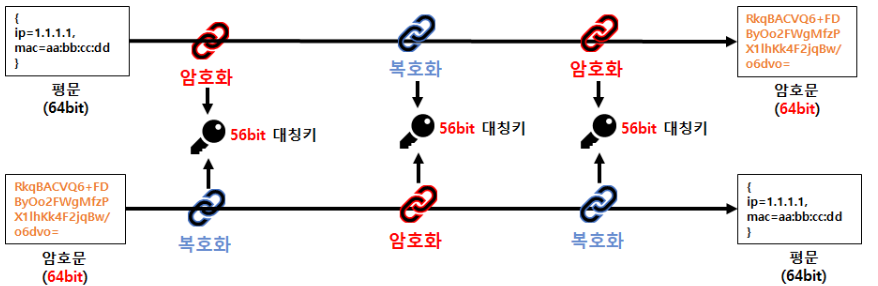


```markdown
이 때, 각각의 대칭키는 다른 대칭키이다. 

그러므로 원래의 56bit 였던 Key를 168bit까지 사용을 함으로써 더 안전해진다.
```

### AES 알고리즘

- 3DES 까지 개발이 되었는데 AES를 사용하는 이유는 뭘까 ?

```markdown
1. AES는 효율적이고 빠른 암호화 알고리즘이다. 
* 블록 크기가 128bit이고 128,192,256bit로 선택 가능하므로 다양한 보안 수준 및 요구에 맞게 사용할 수 있다.

2. 안전성
* 특히 AES는 더 긴 key 길이를 사용할 수 있고 더 복잡한 Key 구조를 가지고 있다.

3. 무결성 및 인증
* AES는 암호화 외에도 인증과 무결성 검증을 포함한 다양한 보안 기능을 수행할 수 있다.
```

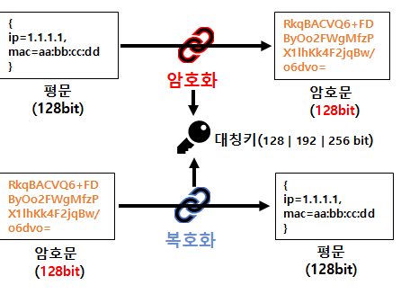

- 고급 암호화 표준(**A**dvanced **E**ncryption **S**tandard)라고 불리는 AES 암호 알고리즘은 DES를 대체한 암호 알고리즘이다.
- 다양한 키의 길이 (128/192/256bit)를 갖춘 대칭형 암호 알고리즘이다.
- 또한 128bit 암호화 블록이다.
- AES는 전체 bit를 암호화 하는 방식을 사용한다.
- 사용하는 Key에 따라 실행하는 라운드 수가 다르다.
    - 128bit : 10라운드
    - 192bit : 12라운드
    - 256bit : 14라운드

```markdown
라운드란 ?

- 암호화 또는 복호화의 반복된 단계를 의미한다. 각 라운드에서 데이터에 대한 변환이 반복되어 보안 강화가 이루어진다.
```

## 비대칭키 암호화 알고리즘

- 공개키 암호화 알고리즘으로도 불린다.
- 비대칭키 암호화 알고리즘은 암호화 할 때와 복호화 할 때의 Key가 서로 다른 Key를 의미한다.
- **공개키(Public Key)와 개인키(Private Key)**
- 이렇게 한 쌍의 Key가 존재한다.
    - Private Key는 절대 외부로 유출되면 안되는 Key이다.
    - Public Key는 누구나 가질 수 있는 공개키이다.

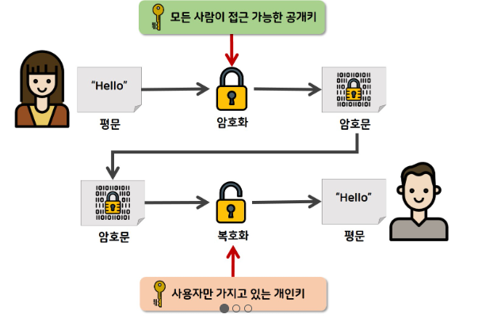

1. 수신자는 Key Pair를 생성하여 공개키를 송신자에게 전달한다. 
2. 송신자는 수신자로부터 받은 공개키로 Data를 암호화한다. 
3. 암호화한 Data를 수신자에게 보내면 수신자는 자기가 가지고 있는 Private Key로 복호화 한다.
- 대표 알고리즘으로는 RSA 알고리즘이 있다.

### 비대칭키 암호화 알고리즘의 장점

```markdown
1. 안전한 키 교환
* 공개키를 사용하면 메시지를 보낼 때에도 수신 측에게 공개키를 안전하게 전달할 수 있으므로 "키 교환 문제"를 해결하는데 도움이 된다.

2. Key의 안전한 관리
* 대칭키 암호화에서는 공유된 키 관리가 복잡하였지만, 비대칭키에서는 공개키의 공유가 자유롭다.

3. 키의 재사용 X
* 대칭키 암호화에서는 대칭키를 여러번 재사용할 때가 있다.
* 하지만 비대칭키에서는 공개키는 공개되어있어도 개인키는 소유자만이 알고 있으므로 재사용의 필요가 없다.
```

### 비대칭키 암호화 알고리즘의 단점

```markdown
1. 알고리즘의 복잡성
* 비대칭키 알고리즘은 대칭키 알고리즘보다 복잡하고 구현 및 분석이 어려울 수 있다.

2. 키의 안전한 저장 및 관리
* 개인키의 안전한 저장과 관리가 굉장히 중요하다.
* 개인키가 노출되면 해당 키로 암호화된 데이터를 모두 해독할 수 있기 때문이다. 

3. 키 길이 관리
* 키 쌍을 생성하고 관리하는 것이 복잡할 수 있다.
* Key의 길이와 생성에 필요한 자원이 증가하면서 관리의 어려움이 커지기 때문이다.
```

## 비대칭키 주요 알고리즘

### RSA 알고리즘

- RSA는 창시자들의 이름 앞 글자를 따서 지었다. (Ron **R**ivest, Adi **S**hamir, Leonard **A**dleman)
- 암호화 뿐만 아니라 `전자 서명`이 가능한 최초의 알고리즘이다.
- RSA는 큰 정수의 `소인수 분해의 난해함`에 기반하여, 공개키 만을 가지고는 개인키를 쉽게 짐작할 수 없도록 디자인 되어 있다.
- 하지만 양자 컴퓨터가 본격적으로 실용화되면 RSA 알고리즘은 무용지물이 될 것이다.