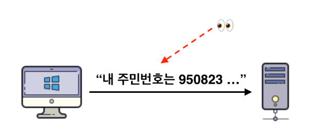
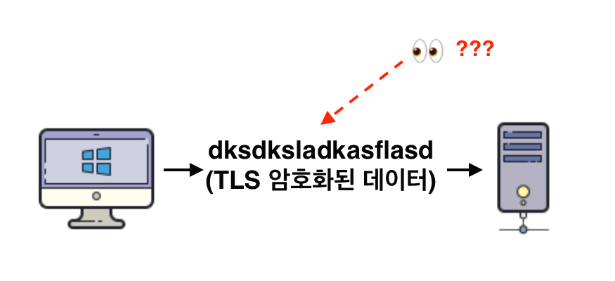

# SSL과 TLS

- 이번 글에서는 SSL과 TLS가 무엇인지 알아보겠다.
- 또한 각 Version 별로 무슨 차이점이 있는지 알아보겠다.

---

## SSL이란 ?

- `SSL(Secure Socket Layer)`은 암호화 기반 인터넷 보안 Protocol이다.
- Web Site와 Browser 혹은, 두 Server 사이에 전송되는 Data를 암호화하여 인터넷 연결 보안을 유지하는 표준 기술이다.
- **개인정보 보호, 서로 간의 인증, 데이터의 무결성을 보장**하기 위해 Netscape가 1995년 개발하였다.

```markdown
쉽게 말해, `네트워크 통신을 할 때 보안된 통신을 제공하기 위해 설계된 암호 규약`이다.
```

- TCP/IP 네트워크를 사용하는 통신에 적용된다. (Internet 환경)

## TLS란 ?

- `TLS(Transport Layer Socket)는` 사실 SSL과 같다.
- SSL은 TLS의 이전 버전인데, SSL은 1996년 이후 업데이트가 되지 않는다.
- 그래서 IETF(Internet Engineering Task Force)는 업데이트를 진행하면서 이름을 TLS로 변경한 것이다.
- **소유권 변경**이라고 볼 수 있다.

---

## SSL/TLS를 사용하는 이유

- 우리는 항상 생활 속에서 SSL/TLS를 사용하고 있었다.
- HTTP와 HTTPS는 SSL/TLS를 적용했나, 안했나의 차이인 것이다.

## HTTP vs HTTPS

### HTTP

- HTTP는 평소 Data를 주고 받을 때 암호화 되지 않는 Plain-Text로 Data를 주고받는다.




- 이렇게 되면 외부에서 통신 중인 Packet을 훔쳐보는 `Sniffing 공격`에 취약할 수 밖에 없다.

```markdown
WireShark 같은 Tool로 패킷을 확인하면 지나다니는 Data들이 무슨 정보를 가지고 있는지 
전부 알 수 있다는 것이다.
```

- 때문에 Server와 Client간에 통신하는 Data를 보호하기 위해선 `인증서를 통해 Packet을 Encryption한 후 전송`해야 한다.

### HTTPS

- HTTP 방식에서 인증서를 활용하여 Packet을 Encryption하여 전송하는 방식이 HTTPS이다.
- HTTP + Security 인것이다.




---

## SSL/TLS의 다양한 Version

### 1. SSL 1.0

- 처음 개발되었으나 공개되지 않았고 사용되지도 않은 Version이다.

### 2. SSL 2.0

- 1995년에 공개되었으나 많은 보안 취약성이 존재하므로 현재 사용되지 않는 Version이다.

### 3. SSL 3.0

- 1996년에 발표된 Version이다.
- 초기에는 안전성이 강조되었지만, 이후 `POODLE 공격` 등으로 인해 사용이 중단되고 현재는 안전하지 않은 Version으로 간주된다.

```markdown
POODLE 공격이란 

SSL 3.0에서의 패딩 취약점을 이용하여 중요한 정보를 탈취하는 공격이다.
```

### 4. TLS 1.0

- SSL 3.0을 기반으로 개발되었으며 1999년에 발표된 Version이다.
- 현재는 많은 보안 취약성으로 인해 권장되지 않는 방식이다.

```markdown
1. POODLE 공격
* POODLE은 SSL 3.0과 함께 TLS 1.0에서도 발생할 수 있는 취약성이다.
1. 암호화 강도 부족
* 현대의 컴퓨팅 성능에 비해 취약한 Key Length를 가지고 있다.
2. BEAST 공격
* 악의적인 공격자가 암호화된 쿠키를 해독할 수 있는 공격이다.
* 이로써 세션을 획득하고 사용자의 계정에 대한 접근을 얻을 수 있다.
```

### 5. TLS 1.1

- TLS 1.0의 보안 취약성을 해결하기 위해 2006년에 발표된 Version이다.
- 하지만 이 역시 현재는 안전하지 않은 Version으로 간주된다.

```markdown
1. 암호화 강도 부족
* 현대의 컴퓨팅 성능에 비해 취약한 Key Length를 가지고 있다.
2. BEAST 공격
* 악의적인 공격자가 암호화된 쿠키를 해독할 수 있는 공격이다.
* 이로써 세션을 획득하고 사용자의 계정에 대한 접근을 얻을 수 있다.
```

### 6. TLS 1.2

- 2008년에 발표된 Version이다.
- 현재 주로 사용되며, 많은 Web Browser 및 Server에서 지원한다.

### 7. TLS 1.3

- 2018년에 발표되었다.
- 현재의 최신 Version으로, 보안 및 성능 향상을 목적으로 설계되었다.
- 이전 Version들과 비교하여 더 강력한 보안을 제공하며, 지속적인 개선이 계속해서 이루어 지고 있다.

---