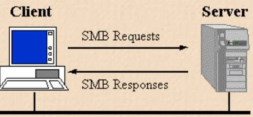
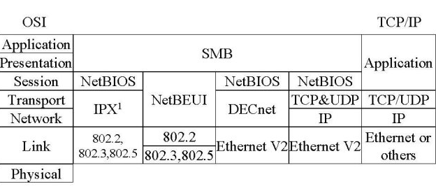
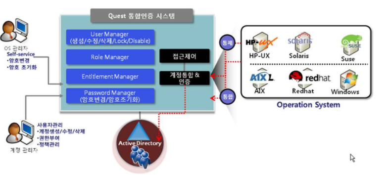

# What is SMB ?




- Samba는 쉽게 말해 OS가 다른, 즉 Windows와 Linux 사이의 `접근을 쉽게하기 위해 도와주는 프로그램`이다.
- Samba를 사용하게 되면 Windows에서 Linux Server에 탐색기처럼 접근하여 File을 쉽게 읽고 쓸 수 있다.

```markdown
예시

우리 회사의 Server는 Linux로 구성이 되어있을 때, 회사에서 일 열심히 하라면서 Windows 노트북을 줬다고 가정하겠다.
이 때 Linux Server에 업로드 해놓은 File을 Windows에서 사용하고 싶다. 
또한 반대로 Windows 컴퓨터에서 작업한걸 Linux에서 사용하고 싶어 할 수도 있다.
```

- 이렇게 Windows 시스템이 다른 시스템의 Disk 혹은 Printer 등의 자원을 공유 가능하게 끔 만든 프로토콜이 `SMB` 이다.
```markdown
Samba는 파일을 제외한 많은 Resource들을 공유할 수 있다.
 
- File 및 Directory 
- Printer (Windows에서 Linux 기반 프린터 사용 가능)
- Scaner (Linux에서 Scan된 문서를 Windows System에서 받을 수 있음)
- System Resource ( Disk 공간을 Windows Client와 공유할 수 있음)
- System 정보 및 로그 ( Samba Server의 Log를 Client와 공유할 수 있음 )
- 공유된 암호화 Directory ( Samba는 공유된 Directory를 암호화하여 공유할 수 있)
- SQL Database (Samba는 SQL DataBase Server와도 통합해서 Client와 공유할 수 있음)
- 응용 서비스 (FTP,Web,DNS,PRoxy 등 응용 서비스들을 Client와 공유 할 수 있음) 
- Cluster 서비스 (Samba를 사용하여 Cluster 서비스와 통합하여 작업을 분산하고 Client와 공유할 수 있음)
```

- 즉, Samba는 일종의 `공유 폴더`이다.

```markdown
예시

Linux 환경에서 Windows의 기술인 Active Directory를 사용하고 싶을 때 Samba를 사용할 수 있다.
하지만 이때는 DNS 엔진을 Linux의 엔진으로 사용해야하므로 Samba DNS에 관한 Database 파일을 Bind9 config 파일에 Include로 참조해야한다. 
```

- Samba Client는 Samba Server에게 TCP/IP를 사용하여 연결한다.
- 연결이 설정되면 Client는 Share된 자원에 Access 할 수 있다.
- 하지만 SMB는 네트워크를 통해 수행된다.

---

## Samba(2)




- Samba는 TCP/IP를 제외한 다른 프로토콜을 통해서도 실행될 수 있다.

---

## Samba NetBIOS

- 현재는 순수한 NetBIOS Interface는 사용되지 않지만 이전 Windows의 Network는 NetBIOS 기능을 이용하여 구현되었다.
- Windows OS의 내부에서는 NetBIOS 이름을 그대로 “컴퓨터 이름”으로 사용하고 있었다.
- SMB가 TCP/IP를 통해 사용되는 경우에는 NetBIOS 이름을 사용해야 한다.
- NetBIOS 이름은 `최대 15글자` 까지 가능하며 일반적으로는 SMB Server의 이름과 동일하다.

---

## Samba Port Number

- Samba는 TCP/IP 기반의 NetBIOS 프로토콜을 사용한다고 했다.
- Samba의 Server는 크게 2개(smbd,nmbd)의 Process로 나누어져 있다.
- 대부분의 처리는 smbd에서 한다. 하지만 Windows 사용자의 Computer 이름으로 접속하게 하려면 nmbd를 사용해야한다.

```markdown
nmbd : TCP-139 / UDP-137,UDP-138 사용 
```

---

## 여러 Samba Protocol Version

- 각 Version은 다양한 기능 개선과 보안 업데이트를 포함하고 있다.
- 아래는 주요한 Samba Version들이다.

### 1. Samba 1.0

- 1992년 처음 개발된 Samba의 초기 버전이다.
- 기본적인 파일 및 프린터 공유를 제공했다.

### 2. Samba 2.0

- 1999년에 도입된 Version이다.
- `Windows 도메인 인증을 지원`하는 중요한 업데이트를 포함하였다.

### 3. Samba 3.0

- 2003년에 개발된 Version이다.
- Active Directory와의 통합, Group Policy 지원, 파일 시스템 제약 사항 해결 등이 개선되었다.

### 4. Samba 3.5

- 2010년에 개발된 Version이다.
- SMB2 프로토콜의 일부 지원과 성능 향상이 추가되었다.

### 5. Samba 4.0

- 2012년에 개발된 Version이다.
- Active Directory 도메인 컨트롤러로서 기능하는 첫 번째 Version이다.
- 이로써 Samba는 Windows 도메인과의 통합을 완벽하게 지원하게 되었다.

### 6. Samba 4.x

- 2012년 이후에 개발된 Version이다.
- AD 통합 및 보안 업데이트와 같은 다양한 기능이 추가되었다.

## CIFS (Common Internet File System)

- 네트워크를 위한 SMB 파일 공유 프로토콜의 확장된 Version이다.
- NFS처럼 네트워크를 통해 Remote Computer 상의 파일이나 서비스를 이용하는 프로토콜이다.
- Windows와 Unix 환경을 `동시에 지원`하는 Internet 표준 파일 규약의 프로토콜이다.
- 즉, CIFS는 SMB에서 비롯되었다.

```markdown
* Windows NT, Windows 95/98, Workgroup for Windows 등의 Client들을 지원한다.
* File 공유 서비스 이외에도 Name Service, 인쇄, 메시징 등 다양한 기능을 수행한다.
* 또한, SMB 프로토콜 위에 DNS를 이용한 확장성, 느린 전화 접속 네트워킹을 위한 최적화 기능도 추가되었다.
```

- 한 가지 다른 점은, 이전의 폐쇄적인 SMB 프로토콜과는 달리 CIFS 규약 정의에 여러 UNIX 업체들이 참여하여 결정했다는 점이다.
- Samba도 Version이 올라감에 따라 samba 2.2v 이상부터는 CIFS 규약을 준수하고 있다고 한다.

---

## Linux와 AD의 통합 (Linux에서 AD를 ?)

- 현재 기업 환경에서는 Active Directory가 필수적으로 요구되는 사항 중 하나이다.
- Windows NT 4.0 시절부터 Unix,Linux를 Windows Domain에 Join 시키려는 시도는 많았다.
- 요즘엔 기술이 워낙 발전해서 AD의 Client로 동작하게 하는데 전혀 문제가 없을 정도로 발전했다

### 그런데… 문제점이 있다.

1. Samba는 오픈 소스라 문제가 발생할 경우 문제 해결이 어렵다.
    
    ```markdown
    단순한 기능적 장애가 아닌, Loggin이 불가능해진 경우, 정말 힘든 상황이 발생할 수 있음 ..
    ```
    
2. GPO가 안된다.
    
    ```markdown
    AD의 기능 중 가장 중요한 것이 GPO이지만 사용가능 Commend 조절,Login Server 제한 등의 GPO 적용이 정말 어려움..
    ```
    
- 솔직히 소규모 환경이 아니고서는 GPO 없이 AD를 관리하기는 매우 어렵고, 소규모 환경이라면 AD에 Join을 할 필요가 없을 것이다.



## 문제 해결법

- 그 문제의 해결법은 `유료 솔루션`이다.
- 국내에서는 Dell Software에서 제공하는 `Authentication Service`가 유일하다.

### 기능적 특징

1. Linux,Unix 대부분의 제품과 Version을 지원한다.
2. Kerberos를 지원하기 때문에 보안성이 높다.
3. Cached 로그인을 지원하므로 AD와 통신이 불가한 상태더라도 장애가 발생하지 않는다.
4. Linux와 Unix가 AD Client로 완벽하게 통합된다.
5. 계정 생성, 삭제, 권한 부여 감사 및 알림 기능을 지원한다.
6. Unix와 Linux에 정말 필수적인 `GPO 사용`이 가능하다.
    
    ```markdown
    - 사용자별 서버별 사용 Command를 제한시킨다.
    - 서버별로 사용자 Login을 제한 시킬 수 있다. 
    ```
    

## Linux와 AD를 통합하는 여러가지 방법들

### 1. Samba와 Winbind

- Winbind는 Samba의 구성 요소 중 하나로, Linux 시스템을 AD Domain의 사용자 및 그룹 정보와 통합할 수 있게 해준다.

### 2. SSSD (System Security Service Daemon)

- SSSD는 Linux 시스템에서 사용자 인증 및 권한 정보를 관리하는 데 사용된다.
- SSSD를 활용하여 AD와 사용자 인증, 그룹 정보등을 통합할 수 있다.

### 3. LDAP (Lightweight Directory Access Protocol)

- LDAP을 사용하여 AD와 통합할 수 있다.
- LDAP은 사용자 정보 및 권한 정보 등을 중앙 집중화하여 관리한다.
- LDAP을 구성하여서 Linux 시스템과 AD를 연결시킬 수 있다.

### 4. Kerberos Authentication

- Kerberos를 사용하여 Linux와 AD간 안전한 인증을 제공할 수 있다.
- Kerberos를 사용하면 Linux System이 AD의 신뢰할 수 있는 사용자로 인증되어 Resource에 접근할 수 있다.
