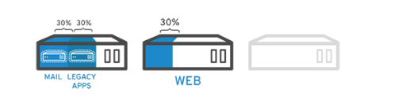
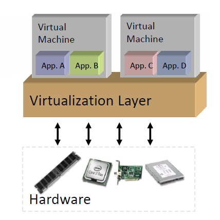

# 가상화(Virtualization)이란 ?

- 가상화란, 가상화를 관리하는 소프트웨어(주로 Hypervisor)를 사용하여 물리적 머신 에서 가상 머신(VM)을 만드는 `Process`이다.
- Hypervisor는 가상화 층을 구현하여 물리적 머신의 컴퓨팅 Resource로부터 독립적으로 VM을 분리하여 생성한다.


```markdown
VM은 물리적 머신과 같은 동작을 수행하지만 CPU,Memory 같은 VM Resource 들은 모두 물리적 머신의 Resource를 사용한다.
```

- Hypervisor는 필요에 따라 각 VM마다 이런 Resource들을 할당한다.
- 또한 가상화는 마치 `하나의 장치를 여러개처럼 동작하게 하는것`을 뜻하기도 한다. 그와 반대로 `여러 장치를 묶어 하나의 장치`처럼 즉, 사용자에게 공유 자원으로 제공할 수도 있다.


```markdown
!! 가상화 대상이 되는 Resource는 CPU,Memory,Storage,Network 등이 있으며, 이들로 구성된 서버나
   장치들을 가상화함으로써 높은 수준의 자원 사용률과 분산 처리 능력을 제공할 수 있다.
```

---

### Hypervisor란 ?

- Hypervisor는 VM을 생성하고 구동하는 SW이다.
- Hypervisor는 Hypervisor OS와 VM의 Resource를 분리하여 VM의 생성과 관리를 지원한다.
- Hypervisor는 할당되었던 물리 Resource를 각 VM에 제공하고, 물리 Resource에 대해 VM Resource에 얼마나 할당할지를  결정하기도 한다.

## Virtualization 예시

- 가상화를 이용하면 서버를 통합하고 서버의 자원을 최대한으로 사용할 수 있다. 그러므로 서버 급증 문제를 해결 할 수 있다.

```markdown
서버 급증 문제 

* Server가 자신이 처리할 수 있는 데이터 용량을 초과하여 과부하 상태에 빠지는 문제이다.
```

- 예를 들어, 아래와 같이 용도가 다른 물리적인 Server 3대가 있다고 가정하자.


- 여기서 내부 운영을 위해 내부 Legacy 서버가 계속 운영 되어야 한다고 가정할 때, 각 OS 위에 1개의 작업을 수행하도록 하는 것이 더 쉽고 안정적인 경우가 많다.
- 하지만 이러한 경우, 각각의 서버가 자원을 최대한으로 활용하지 않기 때문에 서버 운영,전력비가 비효율적으로 발생한다.
- 또한, 각각의 Server가 서로 다른 공간에 위치하므로 공간 대여 비용도 발생하는 등 각각의 서버를 최대한으로 활용하지 못하고 있다.

### 가상화를 사용한다면 ?

- 그러나 가상화를 사용한다면 기존의 Mail Server를 2개로 분리하여 1개의 Server로는 Mail을 처리하고 1개의 Server로는 Legacy App을 Migration 할 수 있다.



- 또한 Mail Server를 2개가 아닌 3개로 분리한다면, Mail Server의 자원을 최대한으로 활용하고, 남은 2개의 Server는 다른 작업을 처리하거나 사용을 중지하여 냉각 및 유지 관리 비용을 줄일 수 있다.

---

## 가상화의 장점

- 가상화를 사용할 때와 가상화를 사용하지 않을 때의 장단점은 무엇일까 ?

### Non-Virtualized System


- 1개의 OS가 모든 하드웨어 자원을 관리한다.
- 1개의 Machine에서 여러 개의 Application을 구동하는 것은 충돌 등의 문제를 발생 시킬 수 있다.
- 유연하지 못하여 인프라의 비용이 높아질 수 있다.

### Virtualized System



- 1개의 하드웨어 상에서 여러 개의 VM을 구동할 수 있다.
- 하드웨어와 무관하게 원하는 OS나 그에 맞는 Application을 실행할 수 있다.
- 어떠한 상황에서도 VM이 Provisioning 될 수 있다.

```markdown
Provisioning : 컴퓨팅 리소스를 할당하고 준비하는 과정

즉, 어떤 상황에서든 필요에 따라 가상머신을 생성하고 구성하여 컴퓨팅 리소스를 효과적으로 활용할 수 있다는 뜻.
```

## 가상화의 장점

### 1. Server Consolidation

- 물리적인 서버의 개수를 줄여 1개의 서버로 통합함으로써 서버의 전력 및 냉각 비용, 하드웨어 공간 비용 등을 줄일 수 있다.
- 위에서 설명한 예시가 Server Consolidation의 예시였다.

### 2. Isolation

- 기능에 맞게 여러 개의 독립적인 Machine으로 분리하여 장애 또는 `오류`나 `보안 취약점`에 대해 더욱 잘 대처할 수 있다.

### 3. Efficiency

- 물리적인 Computer의 Resource 활용을 `최대화` 할 수 있다.

### 4. Flexibility

- 한 Server의 Data를 Migration하기에 용이해진다.

```markdown
Migration : 한 시스템 -> 한 시스템으로 데이터,소프트웨어,Application 또는 가상머신을 이동시키는 과정이다.
```