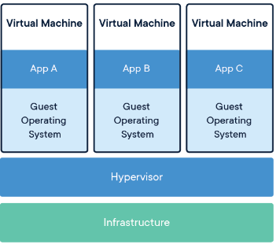
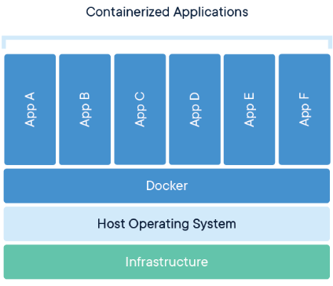

# VM vs Container

- 둘의 차이점을 알아보기 전에 각각이 무엇인지 자세히 알아보고 가겠다.

## 가상 머신 (Virtual Machine, VM)




- VM의 구현 방법에 따라 다르지만, 일반적으로 Hypervisor가 여러 개의 VM을 띄우고 실행한다.
- 이때 중요한 것은 각 VM 마다 `독립된 환경`을 가진다는 것이다.
- 즉 VM1와 VM2가 동일한 OS를 사용한다고 하더라도, Data는 물론이고 Code도 전혀 공유하여 사용하지 않는다.
- 이로 인해 각 VM마다 최소 GB 단위의 공간이 필요하며, VM 수에 비례해서 늘어난다.
- 또한 VM은 OverHead도 상당하다. 이게 Host 가상화, 전 가상화&반 가상화에 따라 다르긴 하지만 보통 부팅 시에도 상당한 시간이 소요된다.
- 전 가상화의 느린 속도를 보완하기 위해서 현재는 반 가상화 방식으로 많이 동작하지만 아직은 HOST OS와 상대적으로 느리다.

## 컨테이너 (Container)



- 무겁고 느린 가상화 방식을 해결하기 위해 Process를 격리하는 방안이 등장했다.
- Container화는 `Kernel 하나에 격리된 여러 사용자 공간 Instance가 포함될 수 있도록 Application 수준에서 이루어지는 가상화`의 일종이다.  Kernel 하나에 여러 개로 나누어져 있는 여러 사용자 공간 (Instance)가 Container이다.
- Container는 HW에 설치된 Kernel(운영 체제) 하나를 공유하여 사용한다.
- Docker의 Container는 독립된 실행 환경을 제공하지 않는다.
- 즉 OS의 많은 자원들을 Container들 끼리 공유한다. (높은 이동성)
- 덕분에 부팅 시간이 훨씬 짧고, Container 개수가 늘어나더라도 Disk 공간을 많이 차지하지 않는다.
- 또한, Container가 완전히 독립된 실행 환경을 제공하지 않고 공유를 한다고 하더라도 Container들의 Process들은 자신이 OS의 모든 자원을 독차지 하고 있다고 생각한다.

---

## VM과 Container

- Container는 일반적으로 크기가 MB단위이다. 또한 경량화 속성과 공유 운영 체제로 인해 여러 환경 간에 매우 쉽게 이동한다.
- VM은 일반적으로 크기가 GB단위이다. VM에서 사용할 수 있는 Resource가 늘어남에 따라 Resource를 많이 사용하는 집약적인 작업을 수행할 수 있다.

```markdown
예를 들어 ...

Database, 분할, 복제와 같은 Resource를 많이 요구하는 작업을 VM에서 사용할 수 있는 Resource가 늘어남에 따라 수행할 수 있다.
```

- 하지만 위에서 언급 했듯이 VM은 Hypervisor 위에 Guest OS가 올라가고 그 위에 Binary, 라이브러리 전부 구성해야 하기 때문에 무겁고 성능 저하가 발생한다. (OverHead)

---

## Container의 장점

### 1. 가벼움

- 위에서 언급 했듯이 VM은 기본적으로 GB단위이고 Container는 기본적으로 MB 단위이다.
- 또한, 부팅 시 몇 초 밖에 걸리지 않는다.

### 2. 탄력성

- Container는 물리적 Server의 Resource를 더 효율적이고 동적으로 사용한다.
- 다른 Container 하나의 수요가 감소하면 여분의 Resource를 다른 Container에서 사용할 수 있다.

### 3. 밀도

```markdown
밀도란, 물리적 Server 한 대에서 동시에 실행할 수 있는 개체 수를 의미한다.
```

- Container화를 사용하면 물리적 Server의 Resource를 완전히 이용하지만, 과다하게 이용하지 않는 `밀집된 환경`을 조성할 수 있다.
- Container는 전용 OS를 운영할 필요가 없으므로 가상화와 비교하면 보다 밀집한 환경이 가능하다.

### 4. 성능

- Resource 압박이 큰 경우 Application 성능은 Hypervisor를 사용하는 것보다 Container가 훨씬 우수하다.

```markdown
왜냐하면, VM에서는 Guest OS도 자체 Memory 요구사항을 충족해야하므로 Host OS에서 RAM을 가져와야한다.

Guest OS도 각 VM마다 Resource를 효율적으로 관리하고 다양한 작업을 수행하기 위해 Memory를 
요구하는데, 여기서 요구하는 Memory는 Host OS의 Memory를 가져와야한다.
```

### 5. 유지 관리 및 효율

- OS Kernel이 하나밖에 없기 때문에 OS 수준에서 업데이트 또는 패치 작업을 하면 변경사항이 모든 Container에 적용된다.
- 이를 통해 Server를 더 효율적으로 운영하고 관리한다.

## Container 단점

### 보안 Issue

- Container는 Kernel을 공유한다. 즉, 논리적으로는 격리한 개념인데 당연히 물리적으로 격리한 가상머신에 비해서는 보안이 취약할 수 밖에 없다.

---

## VM vs Container

- 본격적으로 차이점을 알아보겠다.

### 1. 시작 시간

```markdown
VM : 길다 (분 단위 )        # Host OS의 Resource를 가져오고 독립적인 OS를 실행하기 때문
Container : 짧다 (초 단위)  # Kernel을 공유하기 때문
```

### 2. 무게

```markdown
VM : 수 GB ~ 수백 GB       # OS + Application + Runtime Software
Container : ~ 수백 MG      # Application + Runtime Software
```

### 3. Guest OS

```markdown
VM : Windows/Linux 등 다양한 선택 가능   # 독립적이므로 상관이 없음
Container : Host OS와 동일한 OS          # Host OS와 Kernel을 공유하므로 같은 운영체제만
```

### 4. 성능

```markdown
VM : 각 VM마다 개별의 OS가 있기 때문에 메모리 사용량이 필요 이상으로 많아져 성능면에서 부족한 모습을 보인다.
Container : Container는 Host OS Memory에 가해지는 부담을 줄이기 위해 Kernel을 공유하므로 성능쪽에서는 좋은 모습을 보인다.
```

### 5. 유지 관리 및 업데이트

```markdown
VM : 독립적으로 OS가 구성되어 있으므로 하나하나 업데이트를 해야한다.
Container: Kernel을 공유하므로 Host OS 수준에서 업데이트를 해도 모든 Container에 적용된다.
```