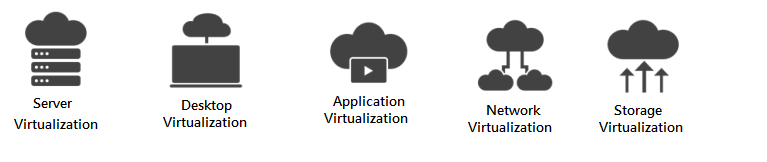
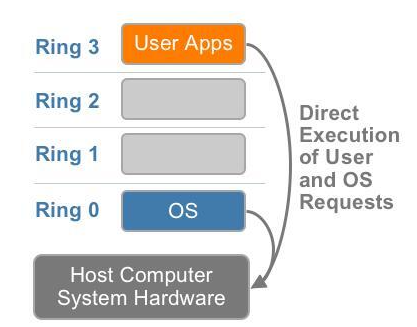
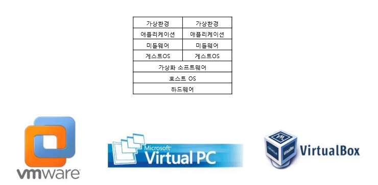
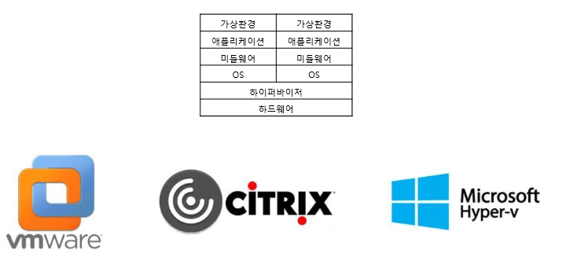

# Types of Virtualization




- 가상화의 종류는 크게 `3가지`로 나뉜다.

### `Host 가상화 & Hypervisor 가상화 & Container 가상화`

- 가상화의 종류를 설명하기 전에 해당 내용을 쉽게 이해하려면 **CPU의 동작 레벨**에 대해서 알고 있어야 한다.

---

## CPU의 동작 레벨

- CPU의 동작 레벨을 간단히 알아보겠다.



OS에서 구동 되는 SW는 보안을 위해 권한과 보호 수준에 따라 링(RING) 등급으로 나뉘어진다.

### Ring 0

- Privilege Level(특권 레벨)이라고 불리며 System 자원을 관리하는 OS Kernel이 동작한다.
- 이 Mode에서는 System의 모든 자원과 Hardware에 직접적으로 접근할 수 있다.
- OS의 핵심 기능이 Ring 0에서 실행되며, 보안 및 안전성을 유지하기 위해 특별한 권한이 필요함.

### Ring 1,2

- Ring 1,2는 예약된 상태로, 평상시에는 사용되지 않는다.
- 사용자 소프트웨어가 직접적으로 실행되는 권한 수준이다.
- System 자원에 직접적으로 접근할 수 없다.

### Ring 3

- 우리가 일반적으로 사용하는 응용프로그램들이 동작한다.
- System 자원에 직접적으로 접근할 수 없고 OS의 서비스를 사용하여 System 자원에 접근해야 한다.

---

# 가상화의 종류 3가지

## 1. Host 가상화



- Host 가상화는 Base가 되는 Host OS위에 Guest OS가 구동 되는 방식이다.
- 종류로는 `VM WorkStation, VMware Server, MS Virtual PC, VIrtual Box` 등이 있다.

### 장점

- 가상의 HW를 Emulating하기 때문에 HOST OS에 크게 제약 사항이 없다.

```markdown
Emulation : 하나의 컴퓨터 시스템이나 플랫폼을 다른 시스템이나 플랫폼으로 모방하여 동일한 기능을 수행하도록 하는 기술 또는 프로세스.
```

### 단점

- OS 위에 OS가 얹히는 방식이기 때문에 OverHead가 클 수 있다.

```markdown
OverHead : 어떤 작업을 수행할 때 추가적으로 필요한 Resource나 시간을 뜻한다.
 
즉, System이나 Process가 실제 작업을 수행하는데 소비되는 Resource와 비교하여 추가적으로 소비되는 Resource를 의미한다.
```

---

## 2. Hypervisor 가상화




- Hypervisor 가상화는 Host OS 없이 HW에 Hypervisor를 설치하여 사용하는 방식이다.
- 종류로는 `Xen, MS Hyper-v, KVM` 등이 있다.

### 장점

- 별도의 Host OS가 없기 때문에 OverHead가 적고, HW를 직접 제어하기 때문에 효율적으로 Resource를 사용할 수 있다.

### 단점

- 자체적으로 Machine에 대한 관리 기능이 없기 때문에 관리를 위한 Computer,Console이 필요함.

## 전 가상화 vs 반 가상화

- Hypervisor 가상화는 한번 더 `전 가상화 & 반 가상화`로 나뉘게 된다.

### Full-Virtualization - 전가상화

- 전 가상화는 HW를 `완전히 가상화`하는 방식으로 **Hardware Virtual Machine**이라고 불린다.
- Hypervisor를 구동하면 `DOM0`라는 관리용 VM이 실행되며, 모든 VM들의 하드웨어 접근이 `DOM0`을 통해서 이루어진다.
- 즉, 모든 명령에 대해서 DOM0이 개입을 하게되는 형태이다.
- 쉽게 말해 Hypervisor는 가상화된 OS가 무엇이든지 각 OS들이 내리는 명령어를 알아들을 수 있다.

```markdown
예를 들어  ...

Windows 에서 Add
Linux에서 ADD
MAC에서 ADD

라는 명령어를 내렸을 때 Hypervisor가 "더해라"라고 번역하여 명령어를 실행해주는 것이다.
"더해라" 라는 명령어는 DOM0을 통해 각 OS의 Kernel로 접근된다. 
```

- 또한 Hypervisor는 이러한 번역 역할 뿐만 아니라 가상화된 OS들에게 자원을 할당해주는 역할도 담당한다.

### 장점

- HW를 완전히 가상화하므로 Guest OS 운영체제의 별다른 수정이 필요가 없다.

### 단점

- Hypervisor가 모든 명령을 중재하기 때문에 성능이 비교적 느린편이다.

## 2. Para-Virtualization - 반 가상화

- 반 가상화는 전 가상화와 달리 HW를 완전히 가상화 하지 않는다.
- 전 가상화의 가장 큰 단점인 `성능저하`의 문제를 해결하기 위해 `Hyper-Call` 이라는 인터페이스를 통해 Hypervisor에게 직접 요청을 날릴 수 있다.

```markdown
전 가상화는 DOM0을 통해서면 Hypervisor와 명령을 주고받기 때문에 성능 쪽에서 아쉬운 부분을 보인다.
```

- 각각의 OS 별로 Hyper-Call Interface를 가지고 Hypervisor와 주고 받는 것이다.
- 즉, OS들이 각각 다른 번역기를 갖고 있는 것이다.

```markdown
예를 들어  ...

Windows 에서 Add
Linux에서 ADD
MAC에서 add

이렇게 서로 다른 명령어를 Hypervisor에게 전달할 때 각각 OS의 Hyper-Call 인터페이스를 통해 
전달하므로 Hypervisor는 "더해라" 라는 명령어를 번역해주는 것이다.
```

### 장점

- 모든 명령을 DOM0을 통해 Hypervisor에게 요청하는 전 가상화에 비해 성능이 빠르다.

### 단점

- Hypervisor에게 Hyper-Call 요청을 할 수 있도록 각 OS의 Kernel을 수정해야 하며 오픈소스 OS가 아니면 반 가상화를 이용하기가 쉽지가 않다.

## 3. Container 가상화


- HOST OS위에 Container 관리 SW를 설치하여, 논리적으로 Container를 나누어 사용한다.
- Container는 Application 동작을 위한 라이브러리와 Application으로 구성되기 때문에 `Container를 각각의 개별 서버처럼 사용 가능`하다.

### 장점

- Container 가상화는 OverHead가 적에 가볍고 빠른 장점이 있다.