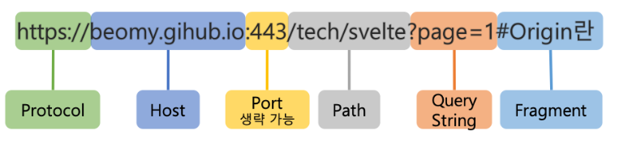
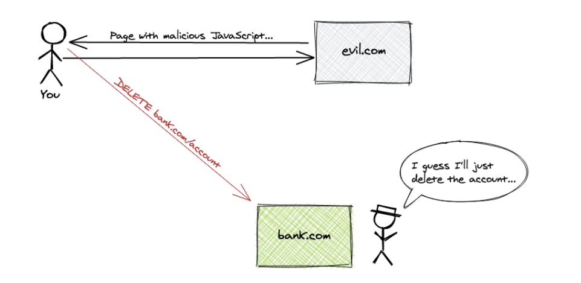

# CORS (Cross-Origin Resource Sharing)

- CORS에 대해 알아보겠다.

---

# CORS란 ?

- Web Browser에서는 기본적으로 `cross-origin` HTTP 요청을 제한한다.
- `cross-origin` 요청을 하려면 Server의 동의가 필요하다.
    - 만약 Server가 동의한다면 Browser에서 Request를 **허락**한다.
    - 만약 Server가 거절한다면 Browser에서 Request를 **거절**한다.

이런 **허락을 구하고 거절하는 메커니즘을 HTTP-Header를 통해서 가능한데, 이를 CORS라고 한다.**

즉, Browser에서 `cross-origin` 요청을 안전하게 할 수 있도록 하는 메커니즘이다.

---

## Cross-Origin

- `cross-origin`은 출처가 **서로 다른 URL에 Request를** 보내는 것을 뜻한다.
    - 이 말이 무엇이냐 ?

### 출처



위의 구성 요소에서 **Protocol + Host + Port** 3가지가 같으면 동일 출처 (Origin)이라고 한다. 

### 동일 출처 예시

| http://example.com:80
http://example.com | HTTP 기본 Port인 80번이 생략되었으므로 동일 출처이다.  |
| --- | --- |
| http://example.com/app1/index.html
http://example.com/app2/index.html | HOST + Port(생략) + Protocol이 같으며 Path부터 다르므로 동일 출처이다. |

### 다른 출처 예시

| http://example.com/app1
https://example.com/app1 | Protocol이 다르므로 다른 출처이다. |
| --- | --- |
| http://example.com
http://www.example.com
http://myapp.example.com | Host가 전부 다 다르기 때문에 다른 출처이다. |
| http://example.com
http://example.com:8080 | Port 번호가 다르기 때문에 다른 출처이다. |

- 이렇게 다른 출처 요청일 경우에는 CORS 정책에 준수하여 Request해야만 정상적으로 응답을 받는다.

### 다른 출처 요청의 위험성 !

, <script>, <frame>, <video>, <audio> 등이 Web에 등장하면서 Browser에서 이러한 하위 자원들을 가져올 수 있게 되었다.

**즉, 동일 출처, 다른 출처 모두 호출이 가능하게 된 것이다 !**

- CORS 정책이 없고 다른 출처를 호출 가능 한 경우이다.



1. Client는 evil.com에 접속하였다. 
    - evil.com은 굉장히 유용한 사이트이지만 <script>가 심어져 있었다.
    - 그 Script에는 [bank.com](http://bank.com) 즉, 은행 사이트에 Delete /account가 요청되어 있었다.
2. AJAX 호출로 은행 API를 호출하여 Client의 은행 계좌를 삭제해버리는 사고가 발생한다.

**따라서 이러한 다른 출처의 접근을 막기 위해 동일 출처 정책이 등장하였다.**

---

## 동일 출처 요청 vs 다른 출처 요청

Web에서는 크게 SOP(Same Origin Policy)와 CORS 정책으로 크게 두 가지로 나뉘게 된다. 

---

### SOP (Same Origin Policy)

위 예시와 같은 상황을 방지하기 위해 나온 정책이 바로 `SOP`이다.

SOP는 진짜 말 그대로 **자신과 동일한 출처만 Server로부터 요청 또는 응답을 할 수 있는 것**이다.

```markdown
예시

https://www.hyeonjun.com 으로 Resource 요청을 보내게 되면...
https://www.hyeonjun.com 으로만 응답을 보낼 수 있게 되는것이다. 
```

- 이처럼 SOP는 동일한 출처(URL, Origin)로만 응답을 허용한다.

Browser는 강제적으로 **SOP**를 기본 정책으로 삼는다.

SOP는 이러한 빡빡한 정책 기준 때문에 동일한 출처에서만 Resource를 가져올 수 있지만 

`XSS, CSRF`같은 보안 취약점에 대해서는 안전하다는 장점도 있다.

---

## CORS (Cross-Origin Resource Sharing)

**CORS는 기준을 좀 다르게 하여 다른 출처로부터 Resource를 가져올 수 있다.** 

- 즉, `다른 출처`에도 **요청을 보내고 응답을 받는 것**이 가능하다는 것이다.

이러한 CORS 정책에는 다시 두 가지로 나뉘게 된다.

1. **Simple Request**
2. **Prefilight Request**

## Simple Request

- 일단 다음과 같은 조건을 만족하면, Browser는 해당 CORS 요청을 **Simple Request**로 처리한다.

```markdown
1. HTTP Method가 GET, POST, HEAD 중 하나인 경우 
2. Header의 Content-Type이 다음 중 하나인 경우
  - application/x-www-form-urlencoded            
	- multipart/form-data
	- text/plain
3. CORS-safelisted request-header를 포함하는 경우(Fetch spec)
4. XMLHttpRequest.upload 에 이벤트 핸들러, 리스너가 등록되지 않은 경우
5. ReadableStream 객체가 포함되지 않은 경우  
```

### Simple Request의 동작 방식

1. 사용자가 Request Header에 자신의 Origin을 실어서 Server로 Response를 보낸다. 

```php
예시 

GET /about HTTP/1.1

Origin:https://www.manja.com
.
.
.
```

1. Server는 Client로부터 받은 Request의 Origin을 확인한다. 
2. Server는 Client가 보낸 Request가 CORS Simple Request를 만족한다면 Header에 
    
    `Access-Control-Allow-Origin`를 추가하여 Client에게 Response 해준다.
    
    - Access-Control-Allow-Origin이 Header에 없다면 Client는 Error를 반환한다.

```php
반환하는 예시

HTTP/1.1 200 OK
.
.
.

허용하는 예시

HTTP/1.1 200 OK

Access-Control-Allow-Origin:*
.
.
.
```

- 이처럼 Client는 Response Message Header의 Access-Control-Allow-Origin을 보고 허용 여부를 결정한다.

---

## Preflight Request

**Preflight Request**는 `OPTIONS Method`로 HTTP 요청을 먼저 보내서 실제 요청이 안전할지 확인한다.

```php
즉, 실제 요청을 보내기 전에 예비 요청을 보내서 안전할지 Test를 하는 Request 방식이다.
```

### Prefilght Request 포함 요소

**origin** : 어디서 요청을 했는지 즉, Client의 origin을 Server에게 알려줌.

**access-control-request-method** : 실제 Request가 보낼 HTTP Method

**access-control-request-headers** : 실제 Request에 포함된 Header

### Prefilight Response 포함 요소

**access-control-allow-origin** : Server가 허용하는 출처

**access-control-allow-methods** : Server가 허용하는 HTTP Method List

**access-control-allow-headers** : Server가 허용하는 header List

**acess-control-message-age** : Prefilight Request의 응답을 Cache에 저장하는 시간

## Prefilight 예시

`Browser`의 주소 : **https://www.site.com**

`Server`의 주소 : **https://www.api.com**

### 1. Prefilight Request

- 먼저 Client는 Server에게 자신이 본 요청에서 사용할 method, headers를 보낸다.

```php
OPTIONS https://www.api.com?q=test
access-control-request-method : GET
access-control-request-headers : custom-header,...
origin: https://www.site.com
```

### 2. Prefilight Response

- Server는 그를 확인하고 method와 Client의 Origin, header를 허용해준다.

```php
HTTP/1.1 204 No Content

access-control-allow-origin: https://www.site.com
access-control-allow-methods: GET
access-control-allow-headers: custom-header,accept,...
access-control-max-age: 6000
```

### 3. Request

- 허용 받은 것들을 Client는 본 요청에서 사용한다.

```php
GET https://www.api.com?q=test

origin:https://www.site.com
custom-header: test
```

### 4. Response

```php
HTTP/1.1 200 OK

access-control-allow-origin: https://www.site.com
```

이렇게 정상 요청과 응답이 가능하다는 Prefilight 덕분에 실제 요청과 응답을 문제 없이 할 수 있다.

---

### 신용 요청 (Credentialed Request)

**신용 요청**은 `Cookie, Authentication Header, TLS 인증서` 등의 신용 정보를 요청에 담아 전송한다.

- 기본적으로, **CORS 정책**은 다른 출처 요청에 **인증 정보 포함을 허용하지 않는다**.

Request에 인증을 포함하는 Flag가 있거나, **access-control-allow-credentials**가 true로 설정 한다면 요청할 수 있다.

```php
const xhr = new XMLHttpRequest();
const url = 'https://www.api.com?q=test';
xhr.open('GET', url);
xhr.withCredentials = true;                   ## 인증을 포함하는 Flag
xhr.send();
```