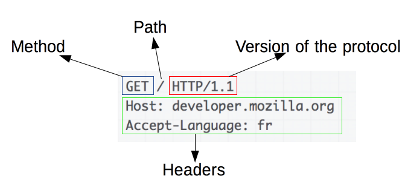
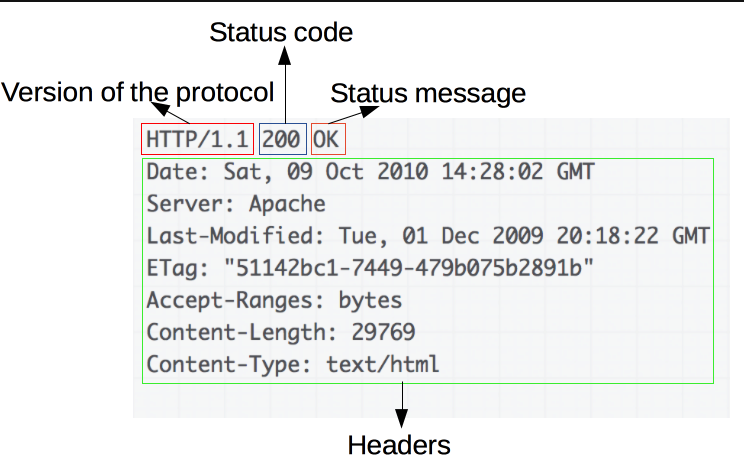

# HTTP Message란 ?

- HTTP Message는 크게 `Start Line, Header, Body`로 구성된다.
1. Header는 HTTP Message에 대한 정보를 포함하고 있다.
2. Body는 Message에 대한 실제 데이터를 포함한다. 
3. Start Line에는 요청이나 응답의 상태를 나타내고 항상 첫 번째 줄에 위치한다.
    - Reponse에서는 Status Line이라고 부른다.

---

# HTTP Message의 형식

## 1. HTTP Request Message - 요청 메시지

HTTP Request Message의 예시 )



### Request Message는 다음의 요소들로 구성이 된다.

1. **Method** : HTTP Method는 보통 Client가 수행하고자 하는 동작을 지칭한다. 

```markdown
Method는 따로 포스팅 할 것이다.
```

1. **Path** : 요청한 자원의 경로를 나타낸다. / 이므로 Root Directory의 자원을 요구한다. (http://)
2. **Version of the Protocol** : HTTP Protocol의 Version을 나타낸다.
3. **Headers** : Client가 Server에게 추가 정보를 전달하는 선택적 Header들.

## 2. HTTP Response Message - 응답 메시지




### Response Message는 다음의 요소들로 구성이 된다.

1. **Version of the Protocol** : HTTP Protocol의 Version을 나타낸다. 
2. **Status Code** : Request의 성공 여부와, 그 이유를 나타내는 상태 코드 .
3. **Status Message** : 아무 영향력이 없는, Status Code의 짧은 설명을 나타내는 상태 메시지.
4. **Headers** : Request Header와 비슷한, HTTP Header들이다. Server가 Client에게 보내는 추가 정보.

---

## HTTP Message의 Header

- Client와 Server 간에 전송되는 Message에 대한 정보를 담고 있다.
- 일반적으로 다음과 같은 정보를 포함한다.
    1. **Host** : 요청한 Client의 Domain 이름 또는 IP 주소를 나타낸다.
    2. **Accept-Language** : Client가 지원하는 언어 및 선호도를 나타낸다. (fr은 France)
    3. **User-Agent** : Client의 Software 식별자를 나타낸다.
    4. **Content-Type** : HTTP 요청 또는 응답의 Media Type을 나타낸다. (text/html, image/jpeg …)
    5. **Content-Length** : Body의 길이를 나타낸다.

---

## HTTP Message의 Body

- Body는 Request나 Response에 대한 실제 Data값이 들어간다.
- Body는 어떠한 형식으로든 Data를 전달 할 수 있다.
    - HTML, XML, JSON, 이미지 파일, 동영상 파일 등이 있다.
- 따라서 Body에 어떤 데이터 형식으로 보낼건지에 따라서 적절한 **Content-Type** 헤더 필드를 포함해야 한다.

아래는 Request의 HTTP Packet이다. 

```bash
Post /api/login HTTP/1.1      
HOST: www.exampleyunsu.com       
Content-Type: application/json 
																			//헤더와 본문을 구분하는 빈줄이 있습니다.
{
    "username": "Yunsu",
    "password": "Goodboy1234"
}

- Content-Type을 json으로 지정하니까 Body에 json 문법으로 들어갈 수 있는것이다.
```

아래는 Response HTTP Packet이다. 

```php
HTTP/1.1 200 OK
Content-Type: text/html

<!DOCTYPE html>
<html>
<head>
    <title>Example Page</title>
</head>
<body>
    <h1>Welcome to YUNSU Page!</h1>
</body>
</html>

- Content-Type이 text/html 이므로 Response Body는 HTML 형식으로 작성되어 있다.
```

---

## HTTP Message Status Code

- HTTP Response Status Code는 굉장히 중요한 역할을 한다.
- Status Code는 Server가 요청을 받아들였는지, 문제가 있는지 등의 상태를 나타내는 3개의 숫자로 이루어져 있다.

```php
200번대 : 성공적인 요청에 대한 Status Code를 의미한다.
400번대 : Client측에서 잘못된 Request를 보낸 경우에 대한 Status Code를 의미한다.
500번대 : Response를 주는 Server에서 오류가 발생한 경우에 대한 Status Code를 요청한다. 
```

### 아래는 자주 사용되는 Status Code이다.

- **200 OK** : 요청이 성공적으로 처리되었다.
- **400 Bad Request** : Client 측에서 보낸 요청이 잘못되었다.
- **401 Unauthorizaed** : 인증되지 않은 사용자가 보호된 Resource에 접근하려고 시도하였다.
- **404 Not Found** : Client가 요청한 Resource를 찾을 수 없다.
- **500 Internel Server Error** : 응답을 받고 싶은 Server에서 오류가 발생하였다.