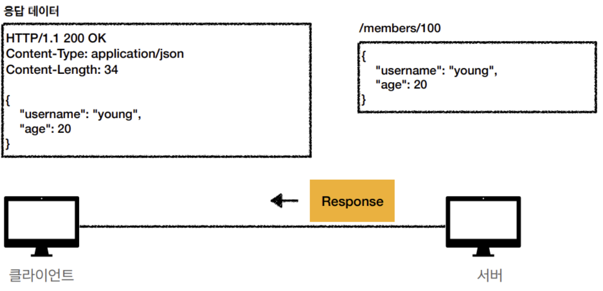
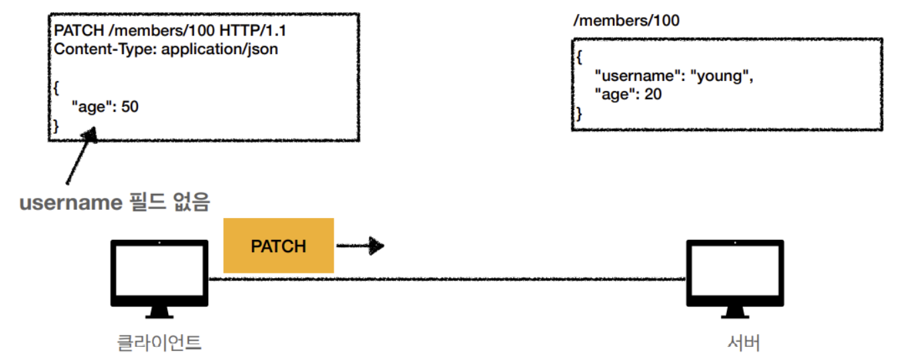

# HTTP Method

- HTTP Method란 Client와 Server사이에 이루어지는 Request와 Response Data를 전송하는 방식을 말한다.
- 쉽게 말하면, **Server가 수행해야 하는 동작을 지정하는 요청을 보내는 방법**이다.

HTTP Method에는 **9가지** 종류가 있고 주로 사용되는 Method는 **5가지** 정도이다.`

### 주요 Method

- **GET** : Resource 조회
- **POST** : 요청 데이터 처리, 주로 등록에 사용
- **PUT** : Resource 대체(덮어쓰기), 해당 Resource가 없다면 생성
- **PATCH** : Resource 부분 변경 (PUT은 전체 변경, PATCH는 부분 변경)
- **DELETE** : Resource 삭제

### 기타 Method

- **HEAD** : GET과 동일하지만 Body를 제외하고, Status Line과 Header만 반환
- **OPTIONS** : 대상 Resource에 대한 Method를 설명 (주로 CORS에서 사용)
- **CONNECT** : 대상 Resource로 식별 되는 Server에 대한 Tunnel을 설정
- **TRACE** : 대상 Resource에 대한 경로를 따라 Message Loopback Test를 수행한다.

---

## HTTP Method - `Get`

- `Resource 조회` Method이다.
- **Get**을 사용하는 Request는 오직 **Data를 받기**만 한다.
- 받고 싶은 Data의 정보는 Query String을 통해서 전달한다.
    - **GET /members/100?username=inpa&height=200**

```markdown
Query String 외에 Body를 사용해서 Data를 요청할 수 있지만 Server에서 따로 구성해야 하므로 잘 사용되지는 않는
```

- 조회할 때 POST를 사용할 수 있지만 **GET** 에는 `캐싱 기능`이 있기 때문에 GET을 사용하는 것이 더 효율적이다.

### Get 정적 Data 조회 과정

```markdown
주로 web browser -> web server (요청 -> 응답)일 때 사용된다.
```

1. Client에서 /members/100 으로 100번 Member를 조회해서 정보를 달라고 Request 함.


1. Server에서는 Request Message를 분석해서 내부의 User 정보를 조회한 뒤 Response Message를 만든다. 


1. Server에서 Client로 Response Message를 생성한다. Client는 받으면 200 OK Status Code를 가지게 되고, 100번 Member의 정보를 받을 수 있다.




### Get 동적 Data 조회 과정

```markdown
주로 게시판, 검색 등에서 검색어로 사용된다. 
주식 검색도 동적 Data 조회 과정 !
```

- Query Parameter를 사용하여 Data를 전달한다.
- Query Parameter는 `key1=value&key2=value` 구조로 되어있다.

1. Request URL 뒤에 **`?q=hello&hl=ko`**를 추가하여 상세한 조회 데이터를 얻는다. 


1. Server는 Query Parameter를 기반으로 결과를 동적으로 생성하여 Client에게 보내준다. 

### HTML Form Data 조회 과정

- HTML Form 태그 문서로 사용자와 UI로 상호 작용하여 통신할 수 있다.
- HTML Form 전송은 `GET,POST`만 지원한다.

1. Web 문서에서 Form 입력 칸에 Data를 적고 전송한다.  


1. 지정한 GET Method 동작에 따라 Form Input에 있던 data 값이 Query String으로 변환되어 Server로 전송된다. 


---

## HTTP Method - `POST`

- 전달한 데이터 처리 / **생성 요청** Method `(Create의 개념)`
- Message의 **Body**를 통해 Server로 Request Data를 전달하면 Server는 Request Data를 처리하여 Update 한다.

```markdown
주로 신규 Resource 등록, Process 처리에 사용한다. 
```

### JSON Data 처리 과정

1. Client는 Body에 등록할 회원 정보를 JSON 형태로 만들어 담고 Server로 전송한다. 


1. Server에서는 받은 Message를 분석하여 로직 대로 처리한다. 
    1. ex) DataBase에 등록하고 신규 ID를 생성한다. 


1. 신규 회원에 대한 정보를 Body에 담아 Client에게 응답한다.
    1. 새로운 Resource가 생성될 때는 200,201로 응답을 보낸다.
    2. **Location**은 새로운 Resource가 생성된 URL을 나타낸다. 


### HTML Form Data 전송 과정

- HTML Form 태그 문서로 사용자와 UI로 상호 작용하여 서버와 통신한다.

```markdown
주로 회원 가입, 상품 주문, 데이터 변경 등에 사용된다. 
```

1. Web 문서 Form에 데이터를 입력하고 전송한다. 


1. 지정한 POST Method 동작에 따라 input Tag 안에 들어간 값이 Query String으로 변경되어 Server에게 전달된다.


```markdown
[Header의 Content-Type 종류]

# application/x-www-form-urlencoded
- Form의 내용을 HTTP Message Body를 통해서 전송한다. (key=value,Query Parameter 형식)
- 전송 데이터를 url encoding 처리한다. ex) abc김 -> abc%EA%B9%80

# multipart/form-data
- 파일 업로드 같은 Binary 데이터 전송 시 사용된다. 
- 다른 종류의 여러 파일과 Form의 내용을 함께 전송 가능 하다. (그래서 multipart이다. )

# application/json
- TEXT,XML,JSON Data 전송 시 사용된다. 
```

### 파일 Data 전송 과정

- enctype을 `multipart/form-data`로 지정하여 해당 Form에 File이 있다는 것을 표시한다.
- Binary Data를 전송할 때 사용된다.
- **multipart/form-data** 형식이라면 HTTP Message에 구분자 `———XXX`가 Form 데이터 간에 구분을 지어준다.
    - 끝에는 `——XXX—` 이다.
- 아래 사진과 같이 여러 개의 Content-type에 대한 Data를 보낼 수 있다.


---

## HTTP Method - `PUT`

- Resource를 `대체, 수정` 하는 Method이다. **(Update)**
- 만일 Request Message에 있는 Data가 **이미 존재한다면 덮어쓰고**, **없으면 새로 생성한다.**
    - /members/100 → Data가 존재하면 기존 값을 완전히 덮어씀.
    - /members/100 → Data가 없으면 대체 할게 없으므로 새로 생성한다.
- Data를 대체 해야 하니, Client가 Resource의 구체적인 경로를 지정해주어야 한다.
    - POST /member : Member를 새로 추가
    - PUT /member/100 : 100번째 Member를 수정 또는 추가.

### PUT 요청에 Resource가 존재하는 경우

1. 100번 Member의 Resource를 교체하겠다는 Request을 보낸다. 


1. Server에 기존 Data가 있다면 완전히 덮어 씌워진다.


### PUT 요청에 Resource가 없는 경우

1. 100번 User의 Resource를 교체하겠다는 요청을 보낸다. 


1. Server에 기존에 Data가 없다면 POST와 같이 새로 생성한다.


### PUT 요청에 일부 Resource만 변경하기를 원하는 경우

1. age만 50으로 변경하려고 PUT으로 전달한다. 


1. 하지만 `기존 Data가 완전히 대체되어버린다`. (이 경우에는 PATCH를 사용해야 함.)


---

## HTTP Method - PATCH

- Resource의 **일부분을 변경**할 때 사용하는 Method (Update)
- 만약에 PATCH를 지원하지 않는 경우에는 POST를 사용할 수 있다.

1. age만 50으로 변경하려고 해당 Data를 PATCH로 전달한다.




1. PUT과는 다르게 회원 정보에서 age만 변경된다.


---

## HTTP Method - DELETE

- **Resource를 제거**하는 Method이다.
- Status Code는 대부분 200을 사용하고 상황에 따라 204를 사용한다.

1. 100번째 Member를 지우기 위해 DELETE로 전달한다. 


1. Server에서 Cilent의 Delete Message를 받고 DataBase에서 Resource를 삭제한다. 


---

## HTTP Method - `HEAD`

- Get과 동일하지만 Server에서 Body를 Return하지 않는다.
- Response의 Status Code만 확인할 때와 같이 Resource를 받지 않고 오직 찾기만 할 때 사용
    - 일종의 검사 용도이다.
- Server의 Response Header를 봄으로써 Resource가 수정되었는지 확인 가능하다.


---

## HTTP Method - `TRACE`

- 이 Method도 일종의 검사용 이다.
- Request가 Server에 도달 했을 때 `최종 Packet 내용`을 **응답** 받을 수 있다.

```markdown
Client의 Request Packet이 방화벽, Gateway, Proxy Server 등을 거치면서 변조 될 가능성이 있다.
그러므로 TRACE Method를 통해 요청했던 Packet의 내용과 Server가 응답받은 Packet의 내용을 비교하여 변조의 유무를 확인할 수 있다.
```


---

## HTTP Method - OPTION

- 사전 요청에 사용되는 HTTP Method이다.
    - 사전 요청 : 본 요청을 하기 전 안전한지 미리 검사하는 요청이다.
- Server가 지원할 수 있는 Method를 확인하고 CORS 정책을 검사하기 위한 요청이다.


```markdown
CORS는 따로 포스팅 하겠다.
```