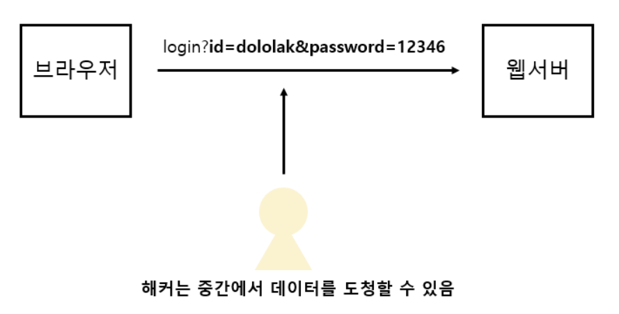
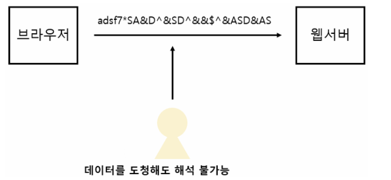
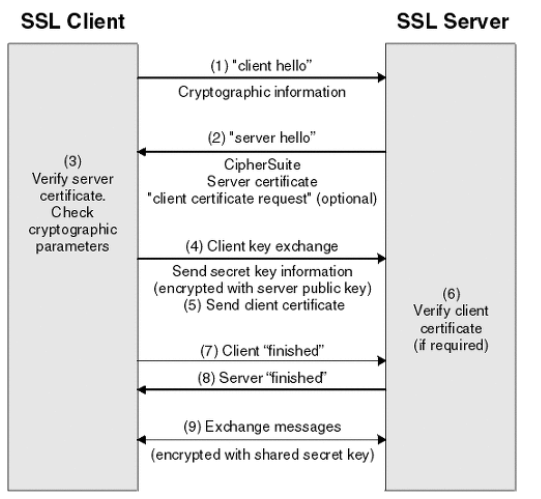
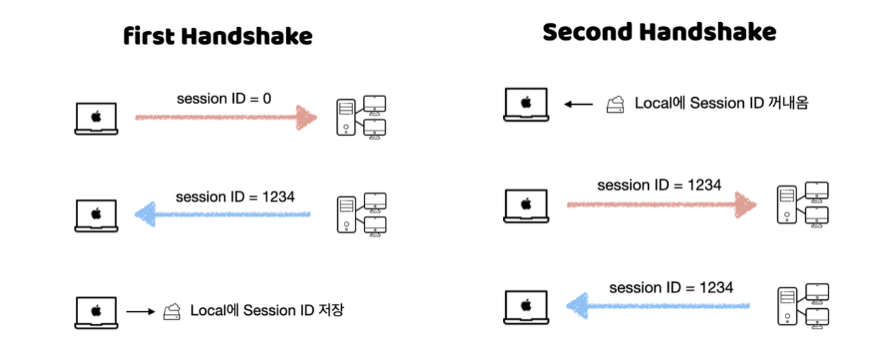

# HTTPS

- HTTP가 있는데 HTTPS가 개발된 이유는 무엇일까 ?

## HTTP의 취약점

- HTTP는 Web을 지탱하는 대표적인 Protocol이다.
- 하지만 HTTP는 Web Browser와 Web Server가 통신할 때 Data가 `Plain Text`로 전송 된다.
    - 그렇게 되면 공격자는 중간에서 Data를 탈취할 수도 있다.



## HTTPS의 등장

- HTTPS는 HTTP의 취약점을 보완하기 위해 **HTTP에 SSL 이라는 기술을 더한 것**이다.
- HTTPS는 Plain Text로 전달되면 Data를 Encryption하여 보내게 된다.




## HTTPS 통신 과정 (1)

- Web Browser는 CA의 목록들을 이미 가지고 있다.
    - Browser를 개발하는 기업에서 개발 시 인증 기관의 목록을 미리 넣어두기 때문이다.
    - Chrome,Firefox 등에는 CA 목록이 이미 들어있는 것이다.
- 따라서 Web Browser는 Web Server와 통신하기 전에 CA 목록을 확인해서 무슨 CA에 자신이 통신하고 싶은 Server의 인증서가 있는지 확인한다.

## SSL/TLS Handshaking

- Web Browser에서 SSL/TLS를 사용하는 HTTPS Site에 접속하려고 할 때, 제일 먼저

      **SSL/TLS Handshaking**이 이루어진다.

- Client는 Server의 인증서를 받아 Server의 무결성을 확인한다.
- 또한 Client가 믿을 수 있는 Server라면 통신할 때 사용되는 대칭 키를 Server의 공개 키로 암호화를 해서 보내게 된다.

```markdown
데이터를 주고 받기 전, Server의 무결성을 확인하고 대칭키를 전달하는 과정이 바로

TLS HandShaking이다. 
```

### 과정




1. **Client가 Server에게 Client Hello Packet을 보낸다.** 
- Hello Packet 안에는 다음과 같은 정보가 들어가 있다.
    - TLS Version
    - Client가 지원하는 암호화 Algorithm
    - Client Random Data( Client의 난수로 대칭키를 만들 때 사용하는 Data)
    - Session ID

### Session ID

- 잠깐 알아보고 가자.
- Browser와 Server가 매번 연결할 때 마다 HandShaking 과정을 진행하는 것은 비 효율적이므로 최초로 딱 한번, 전체 Handshaking 과정을 거치고 Session ID를 가진다.
- 그 후에는 이 Session ID를 사용해서 Handshaking 과정을 반복하지 않는다.




```markdown
최초 Handshake 과정에서는 Session ID가 0이다. 
하지만 그 이후 연결을 하게 되면 Server로부터 Session ID를 받게 된다.
그 값을 Local에서 저장을 해 두었다가 다시 Server와 Handshake를 맺을 경우가 생긴다면 Session ID를 포함한 Packet을 전송한다.
Server는 Session ID가 유효하다면, 동일한 Session ID를 반환한다. 

이러한 동작으로 최초 Handshake 과정을 줄일 수 있다.
```

---

1. **Server는 Client Hello Packet의 응답인 Server Hello Packet을 보낸다.**
- Server Hello Packet에는 다음과 같은 정보가 들어가 있다.
    - Server의 SSL 인증서
    - 암호화 방식 (Client가 보낸 암호화 방식 중에서 자신이 지원하는 암호화 방식)
    - Server Random data (Server에서 생성한 난수, 대칭키를 만들 때 사용된다.)

---

1. **Client는 Server로부터 받은 SSL 인증서가 유효한지 CA를 통해 검사한다.**
    
    `CA : 이건 제가 발급한 SSL 인증서가 맞습니다.` 라고 응답을 하면, SSL 인증서가 유효한것이다.
    

---

1. 확인이 완료되면, Client는 `The premaster secret` 이라고 불리는 무작위 Byte 문자열을 공개키로 암호화한다. 
    1. 이 때, 공개키는 SSL 인증서 안에 내장되어있는 Server의 공개 키 이다.
    
    ```markdown
    The Premaster Secret
    
    - 위 과정에서 주고 받았던 Client Random Data와 Server Random Data, 그리고 TLS Version을 조합하여 생성한다.
    - 즉, 주고 받았던 난수와 TLS Version이 섞인 **대칭키** 이다.
    ```
    

---

1. Server가 Client 로부터 받은 대칭 키를 자신의 개인 키로 복호화 한다. 

---

1. Client는 Client Random Data, Server Random Data, The Premaster Secret을 이용하여 앞으로 통신하는데 사용할 Session Key를 생성한다.
- 그 후 Finished Packet을 Session Key로 암호화하여 전송한다.

---

1. Server는 Client로부터 받은 Session Key를 복호화 하고 Client와 똑같은 방식으로 Session Key를 생성한다.
- 그 후 똑같이 Finished Pakcet을 Session Key로 암호화하여 전송한다.

---

1. 이 후 진행되는 모든 데이터 통신은 Session Key를 통해 진행될 것이다.

## Session Key

- Session Key는 TLS Handshaking이 끝나고 TLS를 통한 통신 양측에서 필요한 Key이다.
- TLS는 각각의 고유한 Session 마다 서로 다른 Session Key를 생성한다.

```markdown
즉, 두 당사자간에 전송되는 Data를 암호화하고 복호화하는데 딱 한번만 사용되는 임시 Key이다.

Session이 유지되어있는 동안은 Session Key를 재사용하지만, Session이 끊어지면 새로운 Session Key를 생성해서 통신한다. 
```

## Session 이란 ?

- `Session`은 쉽게 말해 **두 당사자 사이의 단일 대화**이다.
- Session은 Network를 통해 이루어지며, 두 장치가 서로를 인식하고 연결을 열 때 생성된다.

```markdown
서로 간에서 필요한 Data를 얻은 후 '닫기_알림' 메시지를 보낸다.
마치 두 매체 간에 문자를 주고 받는 것처럼 연결을 종료하고 "나중에 연락하자!" 라고 말하며 대화를 닫는다.
```

- Session은 설정된 기간일 수 있고, 두 당사자가 통신하는 동안 일 수도 있다.

---

- 이렇게 TLS HandShake로 서로 간에 Session를 생성하면 Data를 Session Key로 암호화된다.
- 하지만 서로에게 Session Key가 전부 존재하므로 Key를 이동 시키거나 하지 않아도 된다 ㅋ