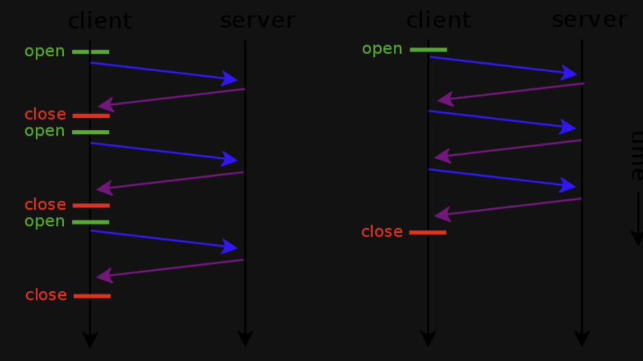
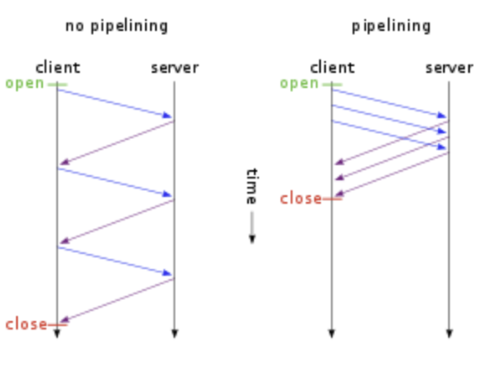
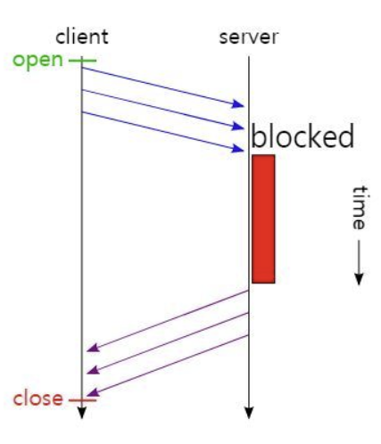
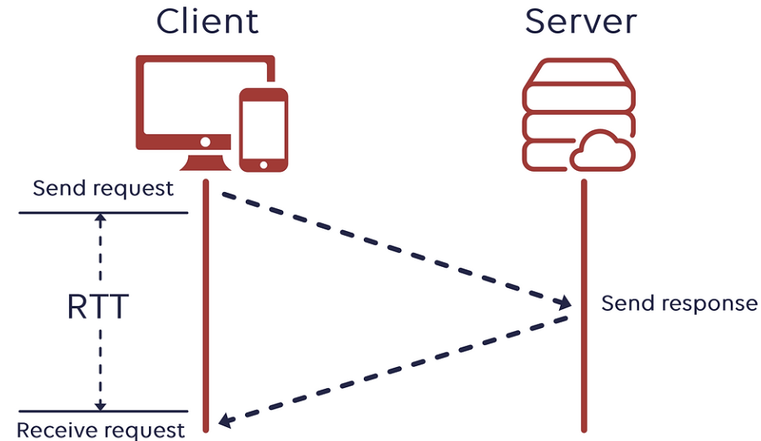
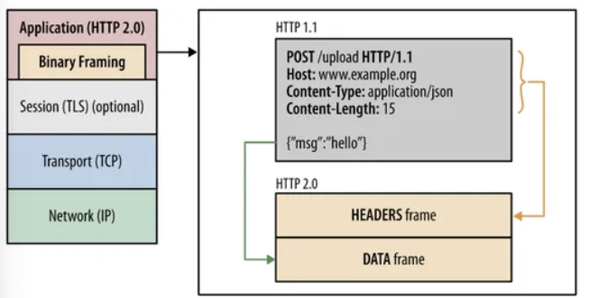
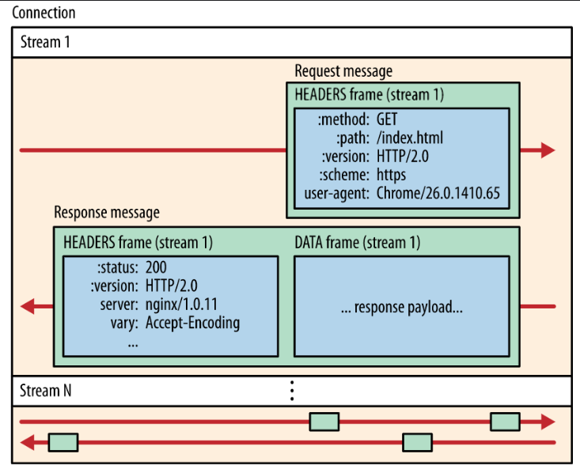
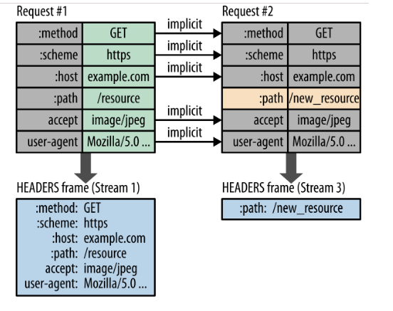

# HTTP Version

- HTTP는 인터넷 상에서 가장 많이 사용되고 적용되어있는 `Application Protocol` 중 하나 이다.
- HTTP가 개발된 역사에 대해 알아보고 Version에 따라 자세히 알아보겠다.

```markdown
1. HTTP 0.9 - 1991년
2. HTTP 1.0 - 1996년
3. HTTP 1.1 - 1997년 (가장 많이 사용중)
4. HTTP 2.0 - 2015년
5. HTTP/3   - 현재 진행중
```

---

## HTTP 0.9

- HTTP 0.9는 1991년에 개발되었다.
- HTTP 초기에는 HTTP Version이 존재하지 않았다.
    - 추후 개발된 Version들과 구분하기 위해 Version을 붙였다.
- **팀 버너스 리**에 의해 제안된 초기의 HTTP는 `단순함을 염두`해두고 디자인 되었다.
- 또한 가능한 Method는 `Get`이 유일했으며, **Request - Response**가 굉장히 단순하였다.
- 또한 Status Code도 존재하지 않았으므로 정상적인 응답을 받지 못한 경우에는 **특정 HTML 파일을 오류에 대한 설명과 함께 따로 보내졌었다.**

```php
Request # Get Method 만을 사용하였다.
GET /mypage.html

Response # Body만이 전부였음.
<HTML>
	A very simple HTML page
</HTML>
```

- HTTP는 비교적 단순한 형태로 개발되었고 이후 빠르게 개발되고 개선되었다.

```markdown
HTTP 0.9 요약

1. Client-Server 요청-응답 Protocol
2. TCP/IP 링크 위에서 동작하는 ASCII Protocol
3. HTML을 전송하기 위해서 디자인 되었다.
4. Server와 Client가 Data를 주고받으면 연결이 닫힌다.
```

---

## HTTP 1.0

- HTTP 1.0부터는 `여러 Meta정보` 즉, **Header**가 포함되기 시작하였다.
- Version 정보가 Get Line에 붙은 형태로 전송되기 시작했다.
- 또한, **Status Code**가 `응답의 시작 부분`에 붙기 시작했다.
- HTTP 0.9와 다르게 Get을 제외한 여러 Method를 지원하기 시작했다.
- Header의 개념이 도입되었으므로 다양한 형태로 Data를 보낼 수 있었다.
    - Content-type 덕분에 가능한 일 !
- 하지만 여전히 Stateless한 Protocol이다.

```php
Request                 # Header의 개념이 추가되었다.
GET / HTTP/1.0
Host: www.example.com
Connection: close

Response                # Status Code가 Response의 시작에 같이 붙어 전송된다.
HTTP/1.0 200 OK
Date: Mon, 14 Nov 2023 12:00:00 GMT
Server: Apache
Content-Length: 123
Content-Type: text/html
Connection: close

<!DOCTYPE html>
<html>
<head>
  <title>Example Page</title>
</head>
<body>
  <h1>Hello, World!</h1>
</body>
</html>
```

- HTTP 1.0은 Header의 개념이 처음 나온 Version이다.

```markdown
HTTP 1.0 요약

1. 다양한 Method를 지원한다. 
2. HTTP Header에 대한 개념을 처음 사용하였다.
3. Status Code를 Response에 달아서 전송하므로 다양한 Server Error를 알 수 있다.
```

---

## HTTP 1.1

- HTTP 1.1은 HTTP 1.0에서 존재하던 모호함을 제거하고 몇 가지 Critical한 성능 개선을 도입하였다.
- HTTP 1.0과 HTTP 1.1의 가장 큰 차이는 아래와 같다.
1. **`Connection 재사용(Keep Alive)`**  
2. **`파이프라이닝(Pipe Lining)`** 
3. `**Caching 매커니즘**`
4. **`다양한 Method 지원`**

## Keep Alive

- 하나의 Data를 보낼 때마다 한번의 TCP HandShake를 해야 하는 문제점을 해결하기 위해 모색되었다.
- 이미 연결된 Connection을 재활용하며 TCP handshake로 발생하는 비용을 줄일 수 있다.
- 지정한 Timeout 동안 Connection을 닫지 않는다.
    - 기본적으로 Keep-Alive이며, 사용하지 않고 싶을 때만 `Header에 내용을 추가`하여 사용하지 않도록 할 수 있다. (아래를 추가하여 사용하지 않도록 설정 가능)
    - Header → Connection: close



## PipeLining

- PipeLining은 Client와 Server간에서 발생하는 Request와 Response의 효율성을 개선하기 위해 만들어졌다.
- 하나의 Connection에서 Response를 기다리지 않고 순차적인 여러 Request를 그 순서에 맞춰 응답하여 지연 시간을 줄일 수 있다.



```markdown
하지만 Pipelining을 사용할 때, 1번째 Request에 문제가 발생하면 2,3번도 전달이 안되는 문제점이 있다.
```

## HTTP 1.1의 문제점

## HOL(Head of Line) Blocking

- HTTP 1.1은 하나의 연결 당 하나의 데이터를 주고 받기 위해 PipeLining을 사용한다.
- PipeLining을 사용하여 다수의 File을 주고 받을 수 있다.
- 하지만 특정 3개의 Image가 있다고 가정해보자.

```markdown
첫번째 : 10초 소요
두번째 : 0.2초 소요
세번째 : 0.1초 소요
```

- 순서대로 처리하기 때문에 첫 번째 Image를 처리하고 두 번째에 대한 응답을 보내게 된다.
- 그렇게 되면 처리 시간이 짧은 2,3번째 Image 들은 1번이 처리 될 때 까지 기다려야 한다는 단점이 있다.
- 이러한 문제점을 HOL이라고 부르며 Pipelining의 단점이라고 볼 수 있다.




## RTT(Round Trip Time) 증가

- TCP를 활용하여 특정 요청을 처리하므로 3 way handshaking 과정을 계속 거쳐야 한다.
- 즉, 매 요청 응답마다 `연결 및 종료`가 일어난다는 의미이다.




- 이러한 불필요한 RTT가 증가하므로 네트워크 성능이 저하되는 문제가 생긴다.
- 예전에는 Contents가 지금처럼 많지 않았기 때문에 3 way handshaking TCP 연결이 부담스럽지 않았지만 이제는 Contents가 너무 많아지면서 연결이 부담스러워 졌다.

```markdown
RTT 증가 문제점을 해결하기위해 Keep-Alive가 개발되었다.
```

---

## HTTP 2.0

## `1.  HTTP Message 전송 방식의 전환`

```php
기존 : 일반 Text 형식으로 전송되었다. 
```



- HTTP 1.X는 Plain Text를 사용했지만, HTTP 2.0부터는 Binary Format으로 인코딩 된 Message,Frame으로 전달된다.
- 즉, `Binary`로 전달한다는 것이다.

```php
장점

Binary는 컴퓨터가 더 이해하기 쉬우므로 Parsing, 전송 속도가 더 빨라졌다.
```

## `2. Multiplex Streaming`

```php
기존 : HTTP 1.1의 PipeLining으로 하나의 Connection에 여러 Request가 있었지만 동시에 여러 요청을 처리할 수는 없었음.
```




- HTTP 2.0은 HTTP Header가 압축되어 한 개 이상의 Frame에 담겨 통신이 이루어진다.
- 이 때 Frame에 담긴 요청과 응답은 **Stream**을 통해 이동한다.
- HTTP 2.0은 하나의 Connection 위에 여러 Stream이 올라 갈 수 있어 **여러 개의 응답과 응답을 동시에 처리**하는 것이 가능해졌다.

```php
또한 Stream에 대한 흐름 제어와 Priority 부여 기능도 제공한다.
```

### Stream Prioritization

- Resource간 우선순위를 설정하는 기능이다.
- Stream에 우선순위를 부여해서 중요한 데이터들을 먼저 처리하는 것이 가능하다.

## `3. Server Push`

- Server Push는 Client가 요청을 보내지 않아도 Server에서 Client가 필요한 Resource라고 생각되면 **능동적으로 Server가 자동으로 Resource를 보내주는 것**이다.
- 또한 Client에서 Server에게 능동적으로 받은 Resource를 원하지 않는다면 거절할 수 있다.

## `4. 헤더 압축 (Header Compression)`

```php
기존 : HTTP/1.X에서는 각각의 HTTP 요청과 응답에 Header가 포함되어있었다. 
       이 Header에는 다양한 Data가 포함되어있고 중복되는 Data가 있는 경우가 많았다.

예시 : 인증 Header, 쿠키, 사용자 Client의 정보 등등 
```



- Header 압축은 크게 두 가지 방식으로 이루어진다.

### 1. Static Table (정적 테이블)

- 일반적으로 사용되는 Header Filed와 값의 목록이 미리 정의된 Static Table에 저장되어있다.
- Client와 Server는 서로 서로 Static Table을 참조하며 공통으로 사용되는 Header 정보를 Index 번호를 붙여서 전송한다.
- 이렇게 하면 중복 Data의 전송을 피하고 압축 효과를 얻을 수 있다.

### 2. Dynamic Table (동적 테이블)

- Static Table 처럼 미리 저장해두지 않고 통신 중에 생성되는 Header Field와 값의 쌍을 저장한다.
- 이 Dynamic Table을 참조하여 통신 중에 중복된 데이터를 보내는 상황을 막을 수 있다.

```php
HPACK 이란 ?

HPACK은 HTTP/2에서 사용되는 Header Field의 압축 및 인코딩을 위한 Protocol이다.

HPACK의 역할

1. Static Table : 위에서 설명한 Static Table임.
2. Dynamic Table : 위에서 설명한 Dynamic Table임.
3. Indexing : 위에서 설명한 Static Table에서 사용하는 index 번호를 부여하는 역할을 한다. 
4. Huffman 인코딩 : 자주 사용되는 문자열을 짧은 Bit로 표현하여 Data를 효과적으로 압춗하는 기술이다. 
```

### HTTP 2.0의 한계

- HTTP 2.0도 TCP 고유의 HOL Blocking이 걸릴 수 밖에 없다.
    - 왜냐하면, 서로 다른 Stream이 전송되고 있을 때, **하나의 Stream에서 유실이 발생하거나 문제가 생긴다면** `다른 Stream도 문제가 해결될 때 까지 지연되는 현상`이 발생하기 때문이다.
    - 이러한 태생적인 `HOL Blocking`을 해결하기 위해 `HTTP/3 , QUIC`이 등장하였다.

---