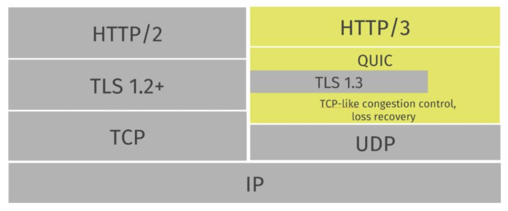

# HTTP/3 & QUIC

- HTTP는 항상 TCP로 통신하는 줄 알았건만, UDP로 통신하는 HTTP? 이건 공부해야겠다.
- 이번 기회에 HTTP/3와 기반을 이루는 QUIC Protocol에 대해서 정리를 해보려고 한다.

```markdown
우선, HTTP/3와 QUIC은 이번 새로운 표준 프로토콜에서 한 세트라고 생각하면 된다. 
굳이 둘이 구분하자면 QUIC 때문에 HTTP/3가 등장하였으니 QUIC이 HTTP/3의 형 정도 ?
```

## What is QUIC?

**QUIC** : Quick UDP Internet Connection 

- QUIC을 간단하게 설명하자면 다음과 같다.

```markdown
UDP를 Base로 한 Multiflex와 보안을 지원하는 Protocol ( 발음은 퀵 )
```

- **구글에서 처음 개발한 프로토콜**이며, 우리는 현재도 많이 사용하고 있는 상태이다.


- 위 사진과 같이 구글에서는 HTTP/3 = h3로 사용 중 이다.
- QUIC과 HTTP/3가 무슨 기술이길래 HTTP/2를 제대로 사용된지 얼마 되지도 않은 시점에서 대체를 하려는 걸까 ?

---

## 기존 HTTP와의 차이점




위 사진은 HTTP/2와 QUIC을 사용하는 HTTP/3를 비교한 사진이다. 

- **공통점**은 제공하는 것이 거의 비슷하다는 것이다.
    - HTTP/2에서 제공하던 것은 HTTP/3에서도 기본적으로 모두 지원된다는 것이다.
- 차이점은 HTTP/3는 중간이 QUIC이 거의 전부를 차지하고 있다는 걸 볼 수 있다.
    - HTTP/2의 Stream 까지 QUIC에서 처리한다.
    - 또한 TLS가 하나의 Layer가 아닌 QUIC의 기본 스택에 들어가 있는 것을 볼 수 있다.
    - 즉, 암호화가 Protocol의 일부 기능으로 추가되었다는 것이다.
    
    

    

---

## HTTP/3 - QUIC의 특징

## 1. 개선된 Multiflexing

기존의 HTTP/2의 Multiflexing은 아래와 같다. 


- 기존의 HTTP/2의 Multiflexing 방식은 하나의 연결 상에서 여러 Stream을 보낸다.
- 하지만 중간 Stream이 오류가 나거나 유실이 되면 같은 연결 상에 있던 Stream도 영향을 받게 되는 `HOLB(Head of Line Blocking) 문제점`이 또 발생한다는 것이다.

아래는 HTTP/3 QUIC을 사용한 Multiflexing이다. 


- QUIC은 사진과 같은 방식으로 처리하기 때문에 HOLB 문제점을 해결할 수 있다.
    - 하나의 연결에서 독립적으로 Stream을 처리하게 된다.
    - 그렇게 되면 하나의 Stream에 문제가 생겨도 다른 Stream에 영향을 미치지 않는다.

## 2. HandShake 시간 감소

TCP를 사용하지 않으니 자연스럽게 QUIC에서는 3 way handshaking도 해결할 수 있었다.

아래 사진을 보면 TCP+TLS를 포함한 방식에서 벗어나 더 빠른 방식으로 해결하였다.


- 기존 HTTP 에서는 `TCP Handshake`와 `TLS HandShake`까지 하느라 **N번**의 RTT를 겪어야 했다.
- `어차피 여러 번 보낼 거 그냥 한번에 보내자 !  → QUIC`
    - QUIC은 단 1 RTT로 끝낼 뿐 아니라, Handshake가 다 끝나기도 전에 Data를 보내버린다 ㅋ
    - 위에서 언급 했듯이 QUIC안에는 암호화 기능이 기본적인 기능이기 때문에 TLS HandShaking 과정까지 한번에 보낼 수 있는 것이다 !
    - 또한 QUIC은 이렇게 맺어둔 연결을 Caching하고 있으므로 추후 다시 요청이 들어 왔을 때는 HandShaking 없이 0 RTT로 통신한다

## 3. QPACK

QPACK? 어디서 많이 들어본 이름인데 ?

- HTTP/2의 장점인 Header 압축 즉, HPACK의 특징은 공통된 Header Data를 제외하여 EndPoint에 도달하는 Data의 양을 줄여주는 것이다.
- HPACK의 동적 테이블은 인코더(요청이나 응답을 보낸 쪽)와 디코더(받는 쪽)가 서로 일치해야 한다.
    - HTTP/2 같은 경우에는 하나의 연결에서 연속적으로 Stream을 보내므로 동기화가 명확했었다.
    - 하지만 QUIC같은 경우는 서로 독립적인 Stream 구조를 가지고 있기 때문에 각각의 Stream에 순서가 보장되지 않는다. (Stream 내의 Data의 순서는 보장 된다.)
- 그러한 문제를 해결하기 위해 QPACK은 각 Peer 사이에 추가로 단 방향 Stream을 만들었다.
    - 하나는 QPACK 동적 테이블 업데이트 정보를 보내기 위한 용도.
    - 하나는 QPACK 동적 테이블 업데이트 정보를 받았다고 알려주기 위한 정보.
- 이렇게 하면 QPACK 인코더는 디코더가 동적 테이블을 업데이트 했음을 알 수 있다.

---

## Q&A

## Q . HTTP3를 사용하다가 중간에 Packet이 유실된다면?

- QUIC은 Packet 손실을 감지한다면 재 전송을 수행한다.
    - ACK Packet으로 손실을 감지한다. (수신 측에서는 송신 측으로 ACK Packet을 날림.)
    - Timeout 기능을 활용하여 손실을 감지한다.
        - Timeout 시간은 주로 RTT의 N배로 동적으로 설정된다.