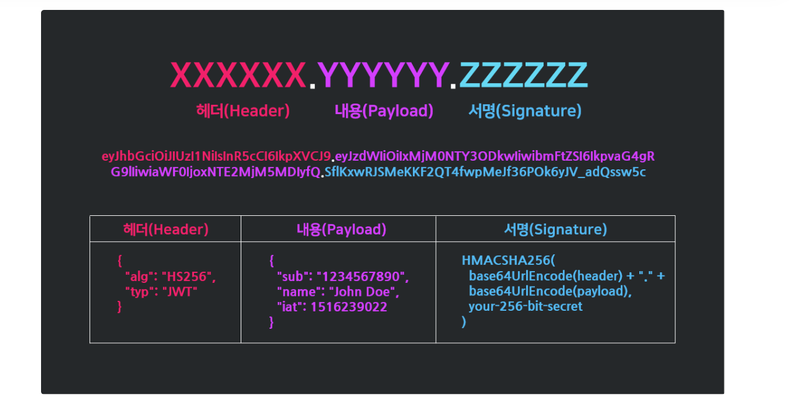
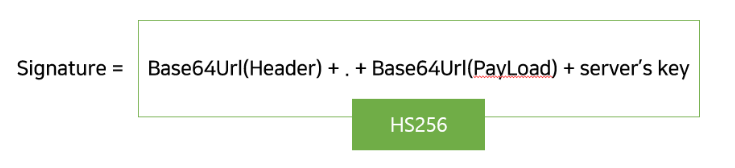
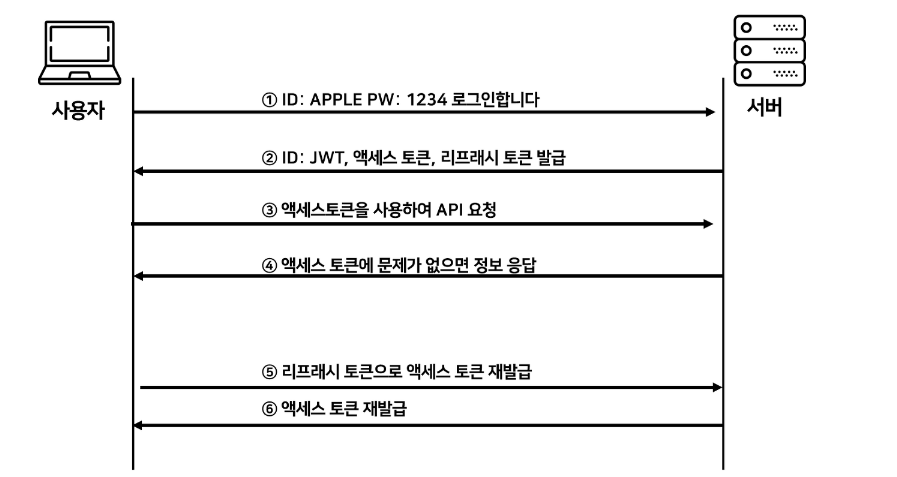

# JWT (Json Web Token)


---

## JWT란 ?

- JWT (JSON Web Token)는 `인증에 필요한 정보들을 암호화 시킨 JSON 형식의 Token`이다.
- JWT 토큰을 HTTP Header에 실어 Server가 Client를 식별할 수 있는 방식이다.
- JWT는 JSON Data를 Base64를 통해 인코딩하여 직렬화 한 것이다.
    - 또한 Token 내부에는 위-변조 방지를 위해 개인키를 통한 `전자서명`도 들어있다.

---

## JWT 구조




**Header** : JWT에서 사용할 Type과 Hash 알고리즘에 종류가 담겨있다. 

**PayLoad** : 서버에서 첨부한 사용자 권한 정보와 Data가 담겨있다.

- 외부에 공개되어도 큰 영향이 없는 정보들만 담아야 한다. (암호화 X)

**Signature** : Header + Payload + Server’s Secret key를 합치고 Header에서 정의한 알고리즘 암호화 

---

## `Header`

```json
{
"alg" : "HS256",
"typ" : "JWT"
}
```

**alg** : 서명 암호화 알고리즘을 나타낸다. 

- Signature를 암호화 할 때 어떤 알고리즘으로 암호화 할 것인가 ?
- 다음과 같은 알고리즘이 들어갈 수 있다.
    1. HS256 : **HMAC(Hash-based Message Authentication Code)** + **SHA256** 
    2. RS256 : **RSA** + **SHA256**
    3. ES256 : **ECDSA**+ **P-256 및 SHA256** 

typ : 

---

## `Payload`

- Token에서 사용할 정보의 조각들인 Claim이 담겨있다.
    - 실제 JWT를 통해서 알 수 있는 Data들을 **Claim**이라고 한다.
    - Claim은 `key-value` 형식으로 이루어진 한 쌍의 정보를 **Claim**이라고 칭한다.
- 하지만 Payload는 암호화가 되지 않으므로 너무 중요한 정보를 담으면 안됌 !
    - User ID, 해당 User를 특정할 수 있는 정보 등을 담을 수 있다.

```json
{
 "sub" : "1234567890",
 "name" : "John Doe",
 "iat" : 1516239022
}
```

- Payload는 대표적으로 세 가지로 나뉜다.

**Registerd Claims** : 미리 정의된 Claim.

- **iss** (issuer) : 발행자
- **exp** (expireation time) : 만료 시간
- **sub** (subject) : 제목
- **iat** (issued At) : 발행 시간
- **jti** (JWT ID)

**Public claims** : 사용자가 정의할 수 있는 Claim 공개용 정보 전달을 위해 사용.

**Private claims** : 해당하는 당사자 들 간에 정보를 공유하기 위한 사용자 지정 Claim.

- 즉, 외부에 공개 되어도 문제가 되진 않지만 해당 User를 특정할 수 있는 정보들을 담는다.

```json
{
	"jti" : "1000",                              // Registered Claim
	"exp" : "152143000000",                      // Registered Claim  
	"https://hyeonjun.tistory.com": true,        // Public Claim
  "username" : "kevin"                         // Private Claim
}
```

---

## `Signature`

- Signature에서 사용하는 Algorithm은 Header에서 `alg`로 지정한 방식을 활용한다.
    - **Signature = alg Algorithm{(Header + Payload + Servers’s Secret Key)}**
    
    ```json
    HMACSHA256 (
    	base64UrlEncode(header) + "." +               // base64 Incoding Header
    	base64UrlEncode(payload),                     // base64 Incoding Payload
      your-256-bit-secret                           // Server's Secret Key
    )
    ```
    




```json
Header와 Payload는 단순히 Base64로 인코딩된 값이기 때문에 언제든지 제 3자가 복호화 할 수 있다.

하지만 Signature는 Server 측에서 관리하는 Secret Key가 유출되지 않는 이상 복호화 할 수 없다.
```

## Q. 왜 HS256을 사용 해야 할까 ? SHA256으로 가능하지 않을까 ?

Header와 Payload는 Base64로 인코딩 되어있기 때문에 누구나 복호화 하여 확인할 수 있다.

### 문제점

- SHA를 사용하는 경우 Secret Key를 사용하지 않는다.
- 그럼 Attacker가 Client 쪽의 Token Payload를 수정해버리면 Server에서 잘못된 인증이라고 받아들여 지는 것이다.
- 즉, 한번 인증이 된 Client여도 다시 Request를 할 때 잘못된 인증 정보라고 Server에서 받아들이지 않는다.

---

## Access Token & Refresh Token

하지만 JWT도 외부인 에게 Token 탈취의 위험성이 있기 때문에, 그대로 사용하는 것이 아니다. 

- **Access Token / Refresh Token**으로 나누어 인증을 하는 방식을 현업 에서 추천한다.

`Access Token과 Refresh Token은 둘 다 똑같은 JWT이다.  다만 각각의 사용 차이가 있을 뿐이다.`

### Access Token

- Client가 가지고 있는 실제로 User의 정보가 담겨 있는 Token이다.
- 실질적으로 Server가 발급해준 Token으로써, 인증을 할 때 사용된다.

### Refresh Token

- Refresh Token은 Access Token과 똑같은 형태의 JWT이다.
- Access Token이 만료가 되지 않기 위해서는 계속하여 로그인을 해야 하므로 불편하다.
    - 하지만 유효 기간을 늘리자면, Token을 탈취 당했을 때 보안에 더 취약해지게 된다.

### `유효기간을 짧게 하면서 좋은 방법이 있지 않을까 ? → **Refresh Token !**`

---

## JWT를 이용한 인증 과정




1. 사용자가 ID,PW를 사용하여 Server에 Login 한다. 
2. Server에서 Client로부터 인증 요청을 받으면 **Header, Payload, Signature**를 정의한다.
    - Header + Payload + Signature를 Base64로 한번 더 암호화하여 JWT를 생성한다.
        - 이 때 만들어지는 Token은 `Access Token`이다.
    - 같은 방식으로 하나의 JWT를 더 생성한다.
        - 이 때 만들어지는 Token은 `Refresh Token`이다.
3. Client는 Server에게 받은 JWT를 Local Storage에 저장한다. 
    - 그 후 Client가 Server에게 Data를 요청할 때는 Header에 **Access Token**을 담아서 보낸다.
4. Server는 Client Header에 있는 Access Token이 자신이 발행해준 Token과 일치 한지 검사한다. 
    - 확인하여 일치한다면 인증을 통과시킨다.
    - 확인하여 일치하지 않다면 통과 시키지 않는다.
5. Client가 Server에 요청을 했는데, Access Token의 시간이 만료 되었다면 ?
    - Refresh Token을 활용하여 Access Token 재발급을 신청한다.
6. Server에서 Client로부터 받은 Refresh Token을 확인 후 자신이 발급한 JWT와 같다면 Access Token을 재발급 해준다. 

---

### JWT의 장점

1. Header와 PayLoad를 가지고 Signature를 생성하므로 데이터의 위변조를 막는다.
2. 인증 정보에 대한 별도의 저장 공간이 필요가 없다. 
3. Client 인증 정보를 저장하는 Stateful한 Session 과는 다르게 JWT는 Stateless한 상태이다.

### JWT의 단점

1. 토큰 길이
    - Token의 Payload에는 3개의 Claim이 들어가므로 정보가 많아질수록 Token의 길이가 늘어나 Network에 부하를 줄 수 있다.
2. Payload에 중요한 Data 담지 않기 !
    - Payload는 Base64로 인코딩 되어있으므로 언제든지 복호화를 할 수 있다.
    - 그러므로 Payload에는 중요한 Data를 담으면 안된다.
3. Token 탈취 대처
    - Stateless 적인 특징을 가지고 있으므로 Token 자체를 탈취 당하면 대처하기가 힘들다.