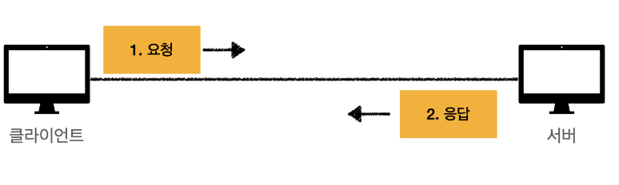
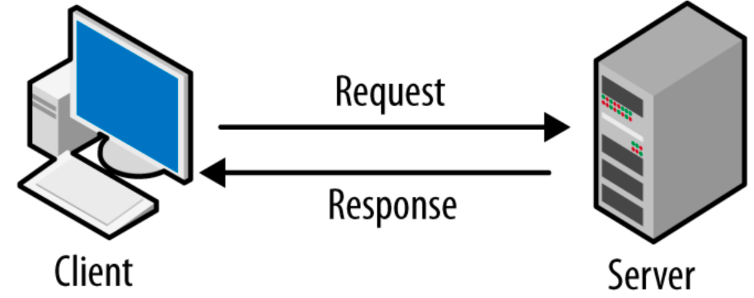
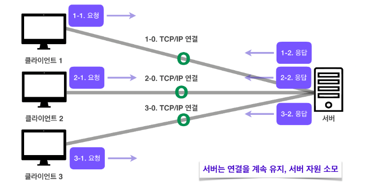
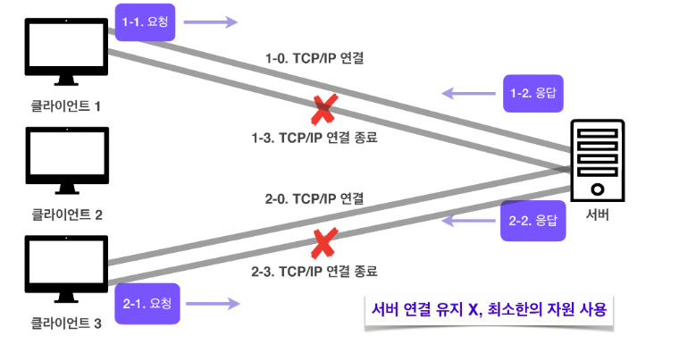
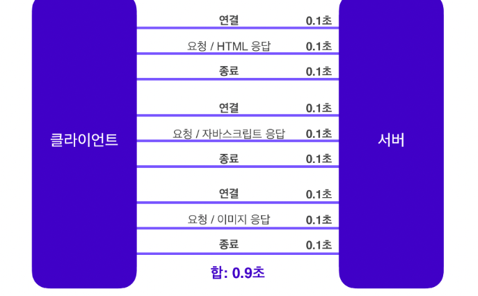

# HTTP

# HTTP (HyperText Transfer Protocol)이란 ?

- Text 기반의 통신 규약으로 `인터넷 환경에서 Data를 주고받을 수 있는 Protocol`이다.
- `HTTP`라는 규약을 정해두었기 때문에 모든 프로그램이 이 규약에 맞춰 개발하므로 서로 정보를 쉽게 교환할 수 있다.

---

## HTTP의 기본 동작




- Client 즉, 사용자가 Browser를 통해서 어떠한 서비스를 `URL`을 통하거나 다른 것을 통해서 `Web Server에 Request`(요청)를 하면 Server는 해당 요청 사항에 맞는 결과를 찾아서 `사용자에게 응답(Response)`하는 형태로 동작한다.

```markdown
요청 : Client -> Server
응답 : Server -> Client
```

- `HTML 문서`만이 `HTTP 통신`을 위한 유일한 정보 문서는 아니다.
- Plain Text로 `JSON` 데이터 및 `XML`과 같은 형태의 정보도 주고 받을 수 있으며, 보통은 Client가 Data를 HTML 형태로 받고 싶은지 JSON 형태로 받고 싶은지 Client에서 명시해주는 경우가 대부분이다.

```markdown
HTTP Message에 담아서 전송할 수 있는 것.

* HTML,TEXT
* Image,File,음성,영상
* JSON,XML

- 사실 거의 모든 데이터를 주고 받을 수 있다.
- 서버 간에 데이터를 주고받을 때도 HTTP를 사용한다.
```

---

## HTTP의 특징

### 1. Client - Server 구조




- HTTP Message는 `HTTP Server - HTTP Client`에 의해 해석이 된다.
- Client가 Server에 Request(요청)을 보내면 Server는 그에 맞는 Response(응답)를 보내주는 `Client-Server` 구조이다.

### 2. 무 상태 프로토콜 (Stateless Protocol)

- HTTP에서는 Server가 Client의 상태를 보존하지 않는다.
    - 여기서 말하는 State란 Client와 Server가 주고받는 모든 Data를 말한다.

```markdown
이게 무슨 말이냐?

* 각각의 Client 요청이 Server에 도착할 때마다 Server는 그 요청을 이전 요청과 별개로 처리한다는 것이다.
* 잘 이해가 안될 수 있으니 예시를 들어보겠다.

예시

1. 장바구니 예시

Stateless 
- Client가 장바구니에 상품을 추가하면 Server는 그 요청에 대한 응답으로 "이 상품은 장바구니에 추가되었습니다!" 라고 알려준다.
- 하지만 Stateless는 다른 상품을 장바구니에 추가하려면 이전에 장바구니에 추가하였던 상품을 다시 알려줘야한다.
- 이렇게 이전 요청과는 아예 독립적으로 처리되는 것이 Stateless이다.

Stateful
- Client가 장바구니에 상품을 추가하면 Server는 그 요청에 대한 응답으로 "이 상품은 장바구니에 추가되었습니다!" 라고 알려준다.
- Stateful은 추가한 상품의 정보를 Server 측에서 기억하고 있는다.
- 그러므로 Client는 다른 상품을 장바구니에 추가할 때 Server 측은 이전 요청을 기억하고 있으므로 이전 상품을 알려주지 않아도 된다.
```

- 장점 : 서버 확장성이 높다.
    - 응답 Server를 쉽게 변경 할 수 있으므로 무한한 서버 증설이 가능하다. (Scale-out)
- 단점 : Client가 추가 데이터를 전송해야 한다.
    - 위에 예시로 들었던 상황 같은 상황에서 추가 데이터를 전송해야 한다는 단점이 있다.

```markdown
Stateless의 한계

* Login과 같은 User의 상태를 유지해야 하는 서비스라면, Stateless 하나만 사용해서는 부적합하다고 볼 수 있다.
* 그러므로 브라우저 쿠키, Server Session Token 등을 이용해 상태를 유지해야 한다.
```

### 3. 비 연결성 (Connectionless)

### Connection Oriented (연결을 유지하는 모델)




- TCP/IP는 기본적으로 연결을 유지한다.
- 연결을 유지하는 모델에서는 Client가 요청을 보내지 않더라도 계속 연결을 유지해야한다.

→ 이 경우, 연결을 유지하는 `서버의 자원이 계속 소모`된다는 단점이 있다.

### Connectionless (연결을 유지하지 않는 모델)




- HTTP는 TCP를 사용함에도 불구하고 실제 요청을 주고받을 때만 연결을 유지하고                     `응답을 주고 받고 나면 TCP/IP 연결을 끊어버린다.`

→ 이를 통해 최소한의 자원으로 서버를 유지할 수 있다.

- Traffic이 많지 않고, 빠른 응답을 제공할 수 있는 환경에서는 효율적으로 작동한다.
- 하지만 Traffic이 많고, 큰 규모의 서비스를 운영할 때는 `비연결성은 한계를 보인다`

### 비연결성의 한계

- 요청을 주고 받을 때마다 TCP/IP 연결을 새로 맺어야 하므로 **3-way handshake 시간이 추가된다**.
- Web Browser로 사이트를 요청하면 HTML,CSS,JavaScript, 추가 이미지 등 많은 자원이 함께 다운로드 된다.
- 이러한 자원들을 각각 보낼 때마다 끊고 다시 연결하고 이 작업을 반복하면 굉장히 비 효율적이다.



- HTTP 1.0에서는 각각의 자원을 다운로드 하기 위해 연결과 종료를 반복해야 했다.
- 하지만 HTTP1.1부터는 지속 연결이 가능해졌다.