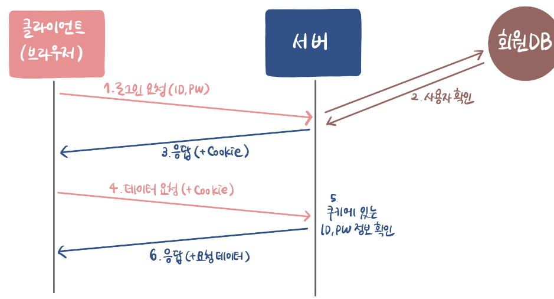
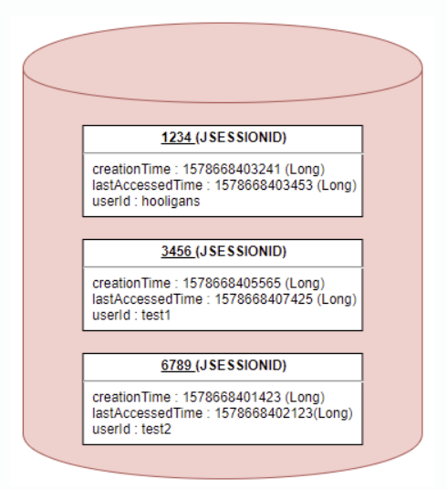
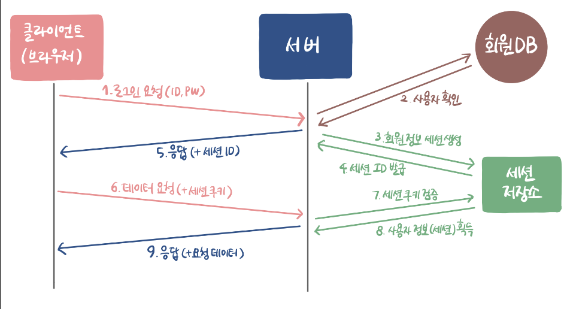
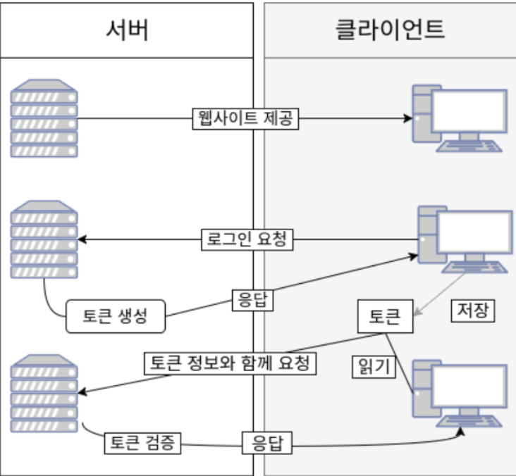

# Web Authentication

### Cookie vs Session vs Token

- 보통 Server가 Client를 인증하는 방식으로는 크게 3가지가 있다.
    
    **Cookie & Session & Token**
    

---

## Cookie 인증

- **Cookie**는 Client Browser에 저장될 목적으로 생성되는 `Key-Value`의 형식의 문자열 덩어리이다.

### Cookie 인증 방식




1. Client는 Server로 Login 요청을 한다. 
2. Server는 DataBase에서 Request가 들어온 User가 존재하는지 확인한다. 

```markdown
그 후, Response Message를 만들면서 Client에 저장 시키고 싶은 Data를 Header의 Set-Cookie에 저장한다.
예를 들어, ID와 PW를 Set-Cookie에 저장할 수 있다.
```

1. 사용자가 다시 Login을 하거나 Data를 요청할 때마다 Request Message Header에 Cookie 값을 항상 실어서 보낸다. 
2. Server는 Cookie에 있는 ID와 PW를 확인하고 Response를 해준다. 

### Cookie 인증 방식의 장점

- 기존 Login 정보를 계속 사용하기 때문에 인증을 위한 추가 데이터 작업이 필요 없다.
    - Client 쪽에서 Data를 저장하기 때문.

### Cookie 인증 방식의 단점

- 사용자의 중요한 Data를 Request Header에 담아 보내기 때문에 보안 적으로 매우 취약하다.
- Cookie는 Client에서 쉽게 변경 및 삭제가 가능하고 요청 중 가로채기의 위험성이 있다.
- Cookie의 사이즈가 커질 수록 Network 적인 부하가 심해진다.

---

## Session 인증

- Cookie 인증 방식은 정보를 Client에 저장하므로 Request Message에 담아서 전송되므로 보안 적으로 매우 취약하다.
- 그래서 ID,PW와 같은 민감한 정보들을 Server 측에 저장하는 Session 인증이 개발되게 된것이다.
    - Server의 Memory에 저장하기도 하고 DataBase에 저장하기도 한다.
- Session 인증은 Session ID를 통해 인증하는 방식이다.

### Session 객체는 어떻게 이루어져 있을까 ?

- Session 객체는 Key에 해당하는 Session ID와 이에 대응하는 Value로 구성 되어있다.
- Value에는 Session 생성 시간, 마지막 접근 시간, User 정보 등이 들어가 있을 수 있다.




### Session 인증 방식




1. Client는 Server에게 Login 요청을 한다. 
2. Server는 Client로부터 받은 User 정보가 자신의 DB에 있는지 확읺나다. 
3. 확인이 되었다면 그 요청 정보에 맞는 **Session**을 Server의 **Session 저장소**에 생성한다.
4. Session 저장소에서는 생성한 Session의 Session **ID**를 Server에게 발급한다.
    - 여기서 Session ID는 사용자의 주요 정보가 아닌 말 그대로 인 `식별자`이다.

 5. Response Message와 함께 Server는 Client Browser의 Cookie에 Session ID도 같이 담아 보낸다.

1. Client는 Request를 할 때 **Session Cookie**를 항상 같이 보낸다. 
2. Server는 Session Cookie를 받으면 Session ID값이 일치 한지 검사한다.
3. 일치 하다면 Server는 Session ID에 맞는 Session 정보를 얻게 된다.
4. Server는 Client에게 Response를 준다. 

### Session 인증 방식의 장점

- Client의 민감한 정보를 주고 받지 않으므로 상대적으로 안전하다고 볼 수 있다.
- 사용자마다 고유한 Session ID가 주어지기 때문에 Request가 들어와도 일일이 DB에서 찾아볼 필요가 없다.

### Session 인증 방식의 단점

- Cookie를 포함한 Request가 노출이 되더라도 Session ID는 식별 역할만 하므로 문제가 되지 않는다.
    - 하지만 Session ID를 탈취한다면 ?
    - Attacker가 Client인척 위장하여 정보를 채갈 수도 있다는 한계 존재한다.
        - 이는 Server에서 Client의 특정 IP를 지정하여 해결할 수는 있다.
- Server에서 Session 저장소를 사용하기 때문에 요청이 많아지면 그만큼 부하도 심해지게 된다.

---

## Token 인증

- Token 기반 인증은 말 그대로 Token을 사용하여 인증하는 것이다.
- Client가 Server에 접속하면 Server는 Client에게 인증되었다는 의미로 `Token`을 발급해준다.
    - 이 Token은 유일하며, Token을 발급 받은 Client는 Server에게 다시 요청을 보낼 때 Header에 Token을 같이 실어서 보낸다.
    - 그럼 Server에서는 Client에게 발급해준 Token과 일치 여부를 확인하는 식으로 인증한다.

### Token Authentication vs Session Authentication

**Session Authentication**

- Server의 Session을 사용하여 인증을 하므로 Server 측에서 (Database, RAM) 사용자의 인증 정보를 관리한다.
- 즉, Client로부터 요청을 받으면 그 정보를 전부 기억 해야 한다. (Stateful)
- 이는 Client가 증가함에 따라 부하는 배로 증가하게 된다.

**Token Authentication**

- 인증 받은 Client에게 Token만 발급해주면 Client가 Token을 Header에 담아 전달한다.
- 이는 Session 방식과 달리 Stateless이므로 부하가 증가하지 않는다.

### Token 인증 방식




1. Client가 ID,PW로 Server에 로그인을 한다. 
2. Server의 User DB에서 Client의 User 정보를 확인한다. 
3. 만약 존재하는 User라면 Token을 생성하여 Client에게 Response와 함께 보내준다. 
4. Client는 Server로부터 받은 Token을  Storage에 저장해두고, Server에게 요청을 할 때마다 Header에 Token을 실어 보낸다. 
5. Server는 Client가 가지고 있는 Token을 자신이 발급한 Token과 같은 것인지 검증한다.
    - Token에는 요청한 Client의 정보가 Payload에 담겨있기 때문에 DB를 조회하지 않고 누가    요청했는지 바로 알 수 있다.

### Token 방식의 장점

- Token 자체의 길이가 길기 때문에 인증 요청이 많아질수록 네트워크 부하가 심해질 수 있다.
- Payload 자체는 암호화가 되지 않기 때문에 User의 중요한 정보는 담을 수 없다.
- Token을 탈취 당하면 대처하기 어렵다. (따라서 사용 기간을 제한하는 것으로 극복한다. )