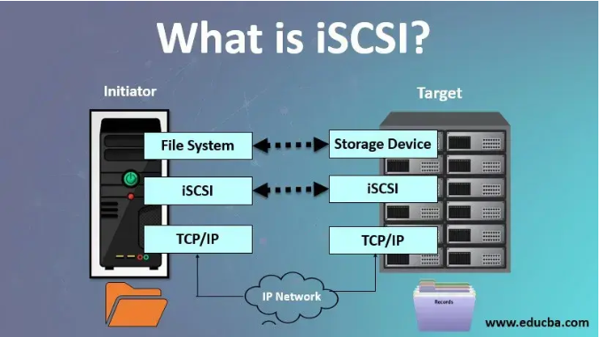

# iSCSI(Internet Small Computer System Interface)

- iSCSI는 `IP 기반으로 블록 디바이스를 공유`할 때 사용된다.




- 기존에 IDC(Internet Data Center)에서는 SAN Switch로 광 케이블을 연결하고 Joning 작업을 통해 LUN을 제공해서 Storage를 공유하는 작업을 많이 했었다.
- 하지만 이 SAN(Storage Area Network) Switch는 너무 비용이 비싸다는 단점이 있었다.
- 대규모 네트워크 환경에서는 SAN Switch를 사용하는게 더 좋을 수도 있지만 `규모가 작은 기업 환경에서는 서버용  Disk에 IP를 이용해서 SCSI 저장소를 공유하는 iSCSI가 효율적`이다.

```markdown
LUN이란?

- RAID의 모든 공간 또는 일부(Partition)을 뜻한다.
- 즉, 서버에서 하나의 스토리지 공간으로 인식하는 단위를 LUN이라고 한다.
```

## iSCSI란 ?

- IP 기반 스토리지 네트워킹 표준 기술이다.
- 즉, 인터넷을 통해서 블록 디바이스의 자원을 연결하여 공유할 수 있는 기술이다.

---

## iSCSI의 장점 & 단점

### 장점

- 위에서 언급했듯이, 규모가 작은 네트워크 환경에서는 비용을 줄일 수 있다.
- iSCSI는 가상화를 지원하기 때문에 가상환경에서 Storage를 공유하고 이동하는데 매우 효과적이다.
- iSCSI는 인터넷을 통해서 블록 디바이스를 공유하기 때문에 물리적인 거리적 한계를 극복할 수 있다.

### 단점

- 데이터(블록 디바이스의 자원)가 네트워크를 통해서 전송되므로 Data적 보안이 굉장히 중요한 부분이다.
- iSCSI는 TCP/IP 프로토콜을 사용하기 때문에 높은 Bandwidth가 요구되는 응용 프로그램에는 적합하지 않을 수도 있다.

---

## iSCSI 관련 용어

### `iSCSI Target`

- SCSI 저장소를 제공하는 iSCSI 서버이다.
- windows : fs-iscsitarget-server ( 설치 필요 )
- Linux : targetcli ( 설치 필요 )

### `iSCSI Initiator`

- iSCSI Target에 연결하여 SCSI 스토리지를 제공받는 Client이다.
- windows : fs-iscsitarget-server ( 설치 필요 )
- Linux : iscsi-initiator-utils ( 설치 필요 )

### IQN (iSCSI Qualified Name)

- `iSCSI Target/Initiator의 고유 이름 포맷` 중 하나이다.
- 포맷 형태 : Type.Date.Naming_Auth:String_defined_by_example.com_Naming_authority
    - Type : iqn (iqn 으로 고정)
    - Date : YYYY-MM
    - Naming_Auth : 도메인의 역순 형태 ex) com.isp
    - String_defined_by_example.com_Naming_authorith : 기타 설명

### Targetcli

- LinuxIO를 위한 general Management 플랫폼.

### iSCSI LUN (Logical Unit Number)

- iSCSI LUN은 Storage 장치에서 논리적으로 구분된 Disk 자원을 뜻한다.
- LUN은 고유한 식별자를 가지며, 이는 iSCSI Initiator에게 제공되는 자원이다.

### iSCSI Portal

- iSCSI Portal은 iSCSI Target Server의 IP 주소와 Port Number를 나타낸다.
- Portal 주소는 Initiator가 타겟에게 연결할 때 사용된다.