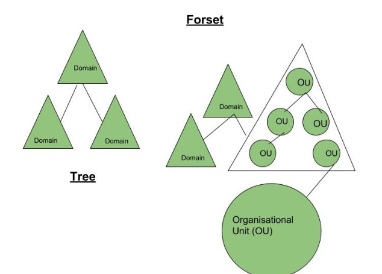
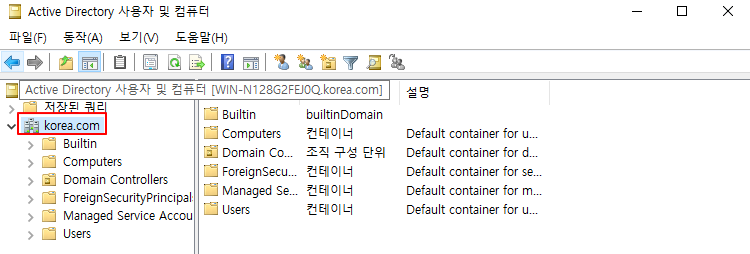
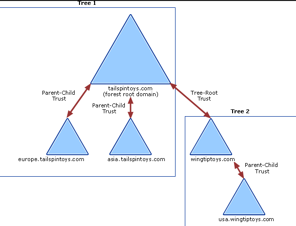
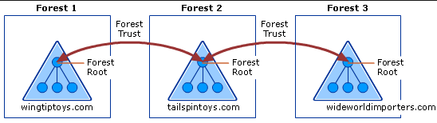
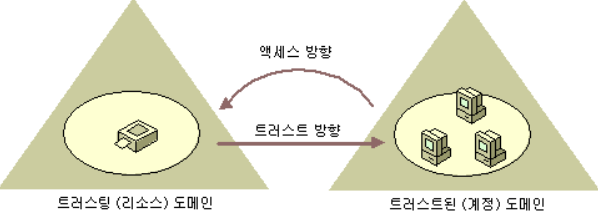

# AD (Active Directory)

- Network 환경이 커질수록 Object의 개수가 많아지기 때문에 관리하는 것이 어려워진다.
- 사용자가 Resource의 위치(IP 주소)와 해당 Server의 Local 사용자 계정 정보를 알고 있어야        정상적으로 접근 할 수 있다.
- 이와 같은 문제점을 해결하기 위해 중앙 서버에 공통된 Database를 생성한다.
    - 각 Server와 Client는 중앙의 DB를 공유하여 Object를 검색한다.

즉, 중앙에서 사용자 인증 및 권한 부여 처리가 가능하도록 처리해주는 서비스를 **`Directory Service`**  

- Windows에서 사용하는 **Directory Service**를 **`Active Directory`**라고 한다.
- AD는 **LDAP**을 사용하여 AD 상에서 Resource를 효과적으로 검색할 수 있다.

### Object

- **User, Computer, Share Folder, Printer** 등 각종 자원을 의미한다.

### Directory

- **Object** 정보를 저장할 수 있는 정보 저장소를 의미한다.

### Directory Service

- Object를 **생성, 관리, 검색, 사용** 등 유용하게 활용할 수 있는 서비스를 의미한다.

### ADDS (Active Directory Domain Service)

- **Windows Server**에서 제공하는 **Directory Service**를 의미한다.

---

## Active Directory 용어




### 1. 도메인 (Domain)

**Active Directory**의 가장 기본이 되는 단위이다.

- **AD**가 설치된 **Windows Server**가 하나의 `Domain`이라고 보면 된다.
- 관리를 하기 위한 하나의 큰 단위의 범위를 표현하며, 관리를 위해서 지역적인 범위로 구분될 수 있다.
- Domain은 상속 적인 개념으로 부모 Domain과 자식 Domain으로 나뉠 수도 있다.




### 2. 트리 (Tree)

**트리**는 `Domain의 집합`이다. 물리적인 개념보다 논리적인 개념으로 보면 된다.

- 제일 상위의 Root Domain 이름을 가지는 Domain과 계층 구조로 이루어져 있는 구조.

**예시**

Root DC (Parent DC ) : [korea.com](http://korea.com) 

Second DC (Child DC) : busan.korea.com

```json
부모-자식 관계를 Tree 구조라고 할 수 있다. 
```




### 3. 포레스트 (Forest)

**포레스트**는 하나 이상의 Tree의 집합이다. 

- Forest를 만드는 이유는 Tree의  확장이다.



Forest2 : Forest1과 Forest3의 모든 기본 Resource에 Access 할 수 있다. 

Forest1 : Forest2의 모든 기본 Resource에 Access 할 수 있다.

Forest3 : Forest2의 모든 기본 Resource에 Access 할 수 있다. 

**예시**

Forest Root Domain : [example111.co m](http://example111.com) 

Tree DC : [example222.com](http://example222.com) 

약간 요런 느낌 ! 

### 4. Forest Root Domain

- Forest와 동일하지만, 특정 Root Domain에 전체 Forest에 대한 Root 권한을 주는 것이다.

### 5. Site

Active Directory의 논리적 구조인 **Domain Forest**가 **물리적**으로 구성된 환경이다.

- Active Directory 간에 Replication (복제) 할 때 주로 사용된다.

### 6. Domain Controller (DC)

**AD DS**를 설치한 Server는 **DC**라고 한다.

- Tree 구조에서는 DC가 Replication을 수행한다.

### 7. 글로벌 카탈로그 (GC, Global Catalog)

GC는 중앙에 정보를 저장하는 일종의 저장소이다.

사용자가 Logon 시, 각각의 Domain 정보를 제어하려고 할 때, 빠르게 제어할 수 있도록 경로를 파악하고 응답해주는 역할을 한다. 

- 즉, GC가 없다면 Network Login을 할 수 없고 Local Login만 가능하다.

**`Domain 상에서 처음 생긴 DC가 GC의 역할을 수행하며, GC는 추가할 수 있다.`**

- Site 별로 GC를 두면 Traffic을 분산 시키는 효과를 준다.

---

## Forest Trust

### Trust란 ?

Domain간 또는 Forest 간에 설정한 관계이다. 

회사와 회사 간에도 서로 정보를 공유하기 위해서는 신뢰 관계가 형성 되어 있어야 할 것이다. 

이처럼, 각 `Domain-Domain, Tree-Tree, Forest-Forest` 사이에서 서로의 Resource를 사용하려면     **신뢰 관계**가 즉, **Trust**가 맺혀 있어야 한다. 

- Trust (A Domian → B Domain) : A Trusting Domain / 단방향 Trust
    - Access (B Domain → A Domain) : B Domain이 A Domain의 Resource를 제어함.
    - **`Trust 방향과 Access의 방향은 반대임!`**
    
    


### 단방향 Trust (One Way Trust)

말 그대로 한쪽에서 한쪽으로 인증 경로가 형성이 되어있는 관계이다. 

- A → B Resource Access 가능
- B → A Resource Access 불가능

### 양방향 Trust (Two Way Trust)

말 그대로 양쪽으로 인증 경로가 형성이 되어있는 관계이다.

즉, 양쪽에서 모두 Resource에 대한 접근이 가능하다는 것이다 ! 

- A → B Resource Access 가능
- B → A Resource Access 불가능

### 전이적 Trust

전이적 Trust는 계층 구조를 고려해서 Domain간에 자동으로 형성된다.

- A와 B가 Trust 관계가 맺어져 있음. B와 C가 Trust가 맺어져 있음.
- 전이적 Trust는 A와 C가 자동으로 Trust가 맺어진다.
- 전이적 Trust는 주로 **양방향 Trust**에서 일어난다.

### 비전이적 Trust

비전이적 Trust는 전이적 Trust와 다르게 직접적으로 Trust를 설정한 도메인 간에만 적용된다.

- 즉 특정한 두 도메인 간에만 Trust가 맺어진다.
- A와 B가 Trust 관계가 맺어져 있음. C 도메인에는 아무런 영향이 없음.