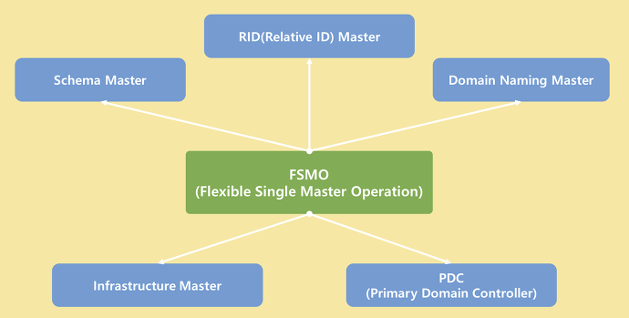

# Active FSMO (Flexible Single Master Operation)

Active Directory의 Domain 구성은 **Multi Master(멀티 마스터)** 복제이다.

```markdown
Multi Master 복제란 ?

- 하나의 Domain에서 여러 Domain Controller가 Master Role을 가지는 것을 의미한다. 
- 예를 들어, Parent - Child 구조에서 Parent DC와 Child DC 전부 Master Role을 가지고 있는 것이다.
```

Domain Controller들은 각각의 Active Directory DataBase를 가지고 있으며 상호 간의 **Replication**  즉, **복제**를 통해서 Database를 일치 시킨다.

Domain 내에서 모든 DC가 동일하게 **Master Role**을 가지고 작동하더라도 `주요 작업들과 여러 DC  들을 관리`할 **Main DC**가 필요하다.

이러한 역할을 하는 **Main DC**를 **`작업 마스터(Operation Master)`**라고 한다.

- Operation Master 역할을 하는 DC는 반드시 1 대만 존재 해야 한다.
- 또한 Operation Master가 장애가 생기거나 Network 연결이 끊길 경우, 다른 Server가 역할을 계속 수행 해야 한다.

이렇게, **Operation Master** 역할을 하는 **DC**를 `유연하게 지정하고 위임하는 역할`을 하는 모델을                      **FSMO** 라고 하는 것이다.

---

## FSMO Role

각 Master 별 역할은 AD Forest 또는 Domain에서 하나만 존재 할 수 있다.



### Schema Master (스키마 마스터)

- Active Directory Schema는 **Active Directory의 모든 개체들의 속성과 Class를 정의**하는 DB이다.
- **Schema Master**는 AD Schema에 대한 모든 **업데이트를 제어**한다.
- 주요 목적은 **다른** **Domain Controller**에 자신의 Schema를 **복제**하는 역할을 담당한다.

### Domain Naming Master (도메인 명명 마스터)

- 주요 역할을 Forest에 새로운 Domain을 추가하거나 제거하는 것을 제어한다.
    - 즉, Domain Naming Master가 동작하지 않으면 새로운 Domain을 추가하거나 제거하지 못함
- 또한 Domain Naming Master는 Global Catalog와 같은 Server에 위치해야 한다.

### Infrastructure Master (인프라 마스터)

- 주요 역할은 GC에서 Domain 간 참조 및 개체를 업데이트한다.
    - 예를 들어, “A 도메인” 그룹에 “B 도메인” 구성원이 포함되어 있다면…
        
        인프라 마스터는 B 도메인에 개체 데이터를 복제하고 유지하는 역할을 담당한다. 
        

### Primary Domain Controller Emulater (주 도메인 컨트롤러 에뮬레이터)

- 모든 FSMO 역할 중에서 광범위한 기능을 가지고 있어 가장 많이 사용되는 역할이다.
- 시간 동기화, 암호 업데이트 처리, Group Policy 업데이트 같은 주요한 역할을 수행한다.
- 또한 각 Domain의 PDC와 Forest의 PDC와도 동기화를 하기도 한다.

### Relative ID Master (상대 ID 마스터)

- Active Directory는 보안 식별자 (SID)를 사용하여 객체를 고유하게 식별한다.
    - SID는 일반적으로 Domain 내에서 고유한데, 이를 가능하게 하는 것이 **RID**이다.
    
    ```markdown
    S-1-5-21-500              # SID
    
    SID에서 500이 RID이다. 
    
    RID는 객체에 할당되는 숫자로 SID가 전역적으로 고유하도록 한다.
    ```
    
    - 즉, AD에서 생성되는 모든 객체는 **SID + RID**가 할당되어 객체의 고유 값을 보장한다.
- “A DC”에서 객체를 생성한 SID+RID 값과 “B DC”에서 객체를 생성한 SID+RID 값이 같다면 객체의 고유 값에 문제가 발생할 것이다.
- 이러한 고유성을 Active Directory RID Pool에서 관리해준다.
- 즉, 객체의 고유 값을 보장해주는 역할을 Relative ID Master에서 담당하는 것이다.