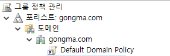
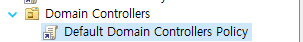
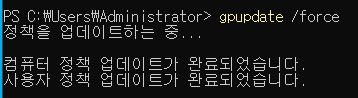
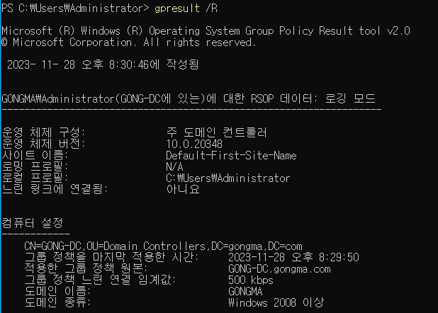
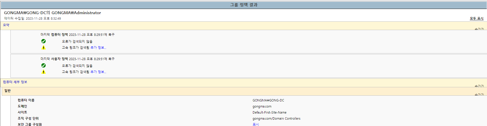
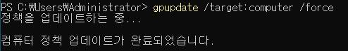
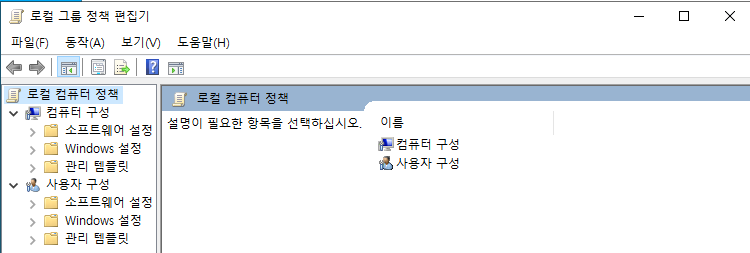
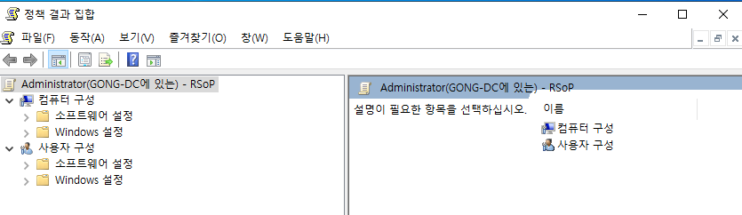

# Active Directory Group Policy

## Group Policy는 무엇이고 GPO는 어떻게 동작할까 ?

그룹 정책 (Group Policy)는 모든 Microsoft Active Directory 환경에서 매우 중요한 역할을 한다. 

그럼, 그룹 정책 (Group Policy)은 무엇이고 어떻게 동작할까 ? 알아야 할 필수적인 내용을 공부해 봅시다 ! 

---

## Group Policy의 개요

위에서 언급한 것처럼 Group Policy는 Active Directory 환경에서 꽤나 중요한 비중을 가지고 있다.

주요한 목적은 **AD Domain 전역의 User와 Computer를 중앙에서 관리할 수 있도록 하는 것** 이다. 

- User, Administrator, Server, Domain Controller 등등 ..

```markdown
[PC1 ... PC1000] - 이 모든 PC가 skill.com 도메인에 가입되어있다.
이 때, 이 PC들은 제어판을 사용 할 수 없도록 설정 하고 싶다.

GP를 사용하지 않는 경우 : 하나하나 각각의 PC마다 설정을 해줘야 한다. 
GP를 사용하는 경우 : 중앙에서 한번의 설정으로 인하여 모든 PC에 영향을 미친다. 
```

**Group Policy**를 활용해서 할 수 있는 일 몇 가지를 알아보자. 

1. **Password 길이** 및 **복잡성 요구 사항** 같은 `비밀번호 정책`을 수립. 
2. **이동식 Drive** 사용을 `차단`하기.
3. **PowerShell, Cmd**에 대한 접근을 `차단`하여 악성 Code를 실행 시킬 수 없게 하기.
4. Computer 시작 또는 종료 시 **특정 Script 실행**하기. 
    - 예를 들어, 종료 전 Computer를 정리하는 Script 실행 등등
5. 제어판 및 작업 관리자를 사용할 수 없게 하기.

이렇게 Group Policy는 매우 가치가 높은 기능이며 굉장히 강력한 기능이다. 특히 Organization 단위로 관리를 할 때 유용하게 사용될 수 있다. 

---

## Group Policy의 집합, GPO

그럼 Group Policy는 어떻게 동작할까 ?

**Group Policy**는 `Group Policy Objects` (이하 GPO)라는 **정책 집합**으로 구성된다.

Microsoft는 수천 가지의 정책과 설정을 제공하며 GPO에는 그 수천 가지의 정책이 들어 있다. 

아래 두 가지의  GPO는 Active Directory Domain이 생성될 때 자동으로 만들어진다. 

1. **기본 도메인 정책 - Default Domain Policy** 
    - **비밀번호 정책, 계정 잠금 정책, Kerberos 정책**의 세 가지 주요 영역에 대해 Domain의 모든 사용자와 Computer를 위한 기준 설정을 수립한다.




1. **기본 도메인 컨트롤러 정책 - Default Domain Controller Policy**
    - 간단히 말해, Domain의 모든 Domain Controller에 대한 기준 보안 및 감사 설정 등을 수립함.
        
        

        

**GPO**는 **Site, Domain OU**와 같은 하나 이상의 **AD Container**에 `적용(연결)`되어야 효과를 낼 수 있다. 

- 예를 들어, Group Policy를 사용해서 [skill.com](http://skill.com)이라는 IT OU의 User를 대상으로 더 복잡한 비밀번호를 요구할 때…
- [skill.com](http://skill.com) IT OU에 새 GPO를 연결하여야지 GPO의 효과를 볼 수 있는 것이다.

즉, GPO는 특정 AD Container에 연결하지 않으면 **아무런 효과를 볼 수 없다**. 

```markdown
대부분의 Organization은 Microsoft가 제공하는 정책 중에서 극히 일부만 사용하지만
몇 년에 걸쳐 IT 환경에 다양한 측면을 세밀하게 제어하기 위해 수백,수천 개의 GPO를 구현하게 되었다.
```

## GPO의 처리

위에서 언급한 것처럼 GPO는 Active Directory Container에 연결하지 않으면 아무런 효력을 가질 수 없다.  

### 하지만 ?

이 과정은 간단한 1 대 1 (1 Container - 1 GPO)의 관계가 아니다. 모든 GPO는 여러 Container에 연결 될 수 있으며, 반대로 모든 Conatiner는 여러 GPO에 연결될 수 있다. 

```markdown
하나의 Container (OU, Domain 등) : 여러개의 GPO 연결 가능 
하나의 GPO : 여러개의 Container에 연결 가능

예를 들어, OU에 연결된 GPO가 있다면 하위 OU까지 GPO의 영향을 받는다. 
마찬가지로 OU에 적용된 GPO는 그 OU 내의 모든 사용자와 Computer에게 영향을 미치게 되고 상속 개념으로 인해 하위 OU의 모든 사용자와 Computer에게도 적용된다.

또한, SiteDomain 또는 OU를 다른 Trust Domain의 GPO에 연결 할 수도 있다. (권장하지는 않음!)
```

기본적으로 GPO는 다음과 같은 순서대로 처리되는데, 뒤에 나오는 GPO가 앞의 설정을 덮어쓴다. 

```markdown
GPO가 앞의 설정을 덮어쓴다 ?

만약 화면보호기를 10분 후로 동작 되도록 구성하였다. 
하지만 그 후 GPO에 5분 후로 동작 되도록 구성 되어 있다면 설정이 덮어 씌어져 5분 후로 동작 되는 것이다.
```

1. **Local (개별 컴퓨터)** : gpedit.msc에서 설정된 Local Computer 정책
2. **Site** : Site에 연결된 GPO
3. **Domain** : 말 그대로인 Domain에 연결되어있는 GPO
4. **Organization Unit(이하 OU)** : Domain 내의 OU에 연결되어 있는 GPO  

하지만 다음과 같은 방법으로 **특정 Domain, Site 또는 OU**에 **GPO가 적용되는 방식** 또는 순서를 직접 관리 할 수 있다. 

1. **우선 순위 변경**
    - 우선순위를 변경하여 높은 우선순위를 가지는 GPO가 먼저 실행된다.
2. **상속 차단**
    - 기본적으로 하위 OU는 상위  OU로부터 모든 GPO를 상속 받지만 이 상속을 차단할 수 있다.
3. **GPO 강제 적용** 
    - 다른 GPO가 설정 되어 있더라도 무조건 이 GPO를 강제로 먼저 적용한다.
4. **GPO 강제 해제** 
    - AD Container에 적용되어 있는 특정 GPO를 강제로 연결을 해제 할 수 있다.

---

## Group 정책 관리와 위임

Microsoft는 Group Policy 관리를 위해 **그룹 정책 관리 콘솔** (Group Policy Management Console)    이하, `**GPMC**`를 제공한다.  

IT Admin은 **gpmc.msc**를 사용하여 **GPO를 만들고, 복사하고, 백업하고, 복원하고 보고서를 작성**할 수 있다. 

기본적으로 **Domain Administrator Group**의 모든 구성원은 **GPO**를 만들고 제어할 수 있다. 

하지만 **특정 GPO**를 만들고 편집하고 연결하는 다양한 작업의 권한을 **부가 적인 IT 관리자**에게         `위임`할 수 있다.

```markdown
위임의 예시 

**Microsoft Office Application**을 관리하는 Team에 **Desktop Office** 설정을 관리하는 데 사용되는 GPO를 편집할 권한을 부여하는 것
```

하지만 위임을 설정할 때는 신중하게 설정해야 한다.

- 특정 개체에게 위임을 하는 순간 한번에 여러 명이 GPO 관리 권한을 가지게 된다.
- 또한, 이러한 권한을 Domain 수준에서 위임 되는 경우가 많으므로 권한을 가진 사람은 한 두 개의 GPO가 아닌 Domain의 모든 GPO를 손에 쥐게 된다.
    - 여기에는 Domain의 핵심인 Domain Controller에 적용되는 GPO도 포함된다.

---

## Group Policy와 관련된 Command

1. **gpupdate /force**   
    - Group 정책을 즉시 갱신하는데 사용된다.
        
       

        ```powershell
        gpupdate /force
        ```
        
2. **gpresult /R**   
    
   

    
- 현재 사용자 또는 Computer에 적용된 Group Policy의 결과를 표시한다.
    
    ```powershell
    gpresult /R
    ```
    
1. **gpresult /h**    
    
    

    
- gpresult 결과를 HTML 파일로 내보낸다.

```powershell
gpresult /h C:\path\to\output\file.html
```

1. **gpupdate /target**
    
  

    
- User 또는 Computer 에 대한 Group 정책을 갱신한다.

```powershell
gpupdate /target:User /force 
gpupdate /target:computer /force 
```

1. **gpupdate /force /boot**
    - Group Policy를 갱신하고 System을 재 시작 한다.
    
    ```powershell
    gpupdate /force /boot
    ```
    
2. **gpupdate /logoff**
    - Group Policy를 갱신하고 사용자를 LogOff 한다.
    
    ```powershell
    gpupdate /logoff 
    ```
    

1. **gpedit.msc** 
    
    

    
- Local Group Policy 편집기를 실행한다.

```powershell
gpedit.msc 
```

1. **rsop.msc**
    
    

- 결과 집합 Policy Objects를 확인하기 위한 정책 편집기를 실행한다.

```powershell
rsop.msc 
```