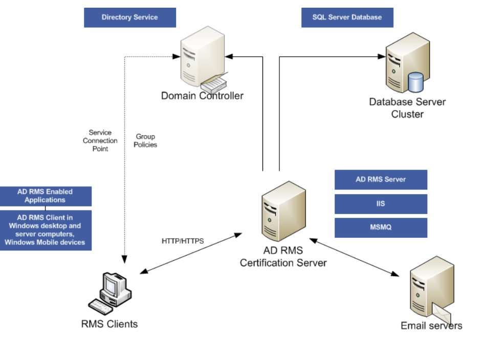

# AD RMS란 ?




**AD RMS**는 `IRM(Information Rights Management)`을 사용하여 문서를 보호한다. 

- AD RMS(Rights Management Service)를 사용하면 개인 또는 관리자가 IRM을 통해서                              문서, 통합 문서 및 프레젠테이션에 대한 Access 권한을 지정할 수 있다.
- 이는 승인되지 않은 사람이 중요한 정보의 사용을 방지하는데 사용된다.

```php
IRM을 사용하여 Access를 제한하면 권한 자체가 문서 파일 자체에 저장되므로 어디에 있든 유지가 된다.
```

---

## AD RMS가 사용되는 경우

AD RMS가 지원하는 IRM Solution은 다음과 같다.

1. **권한 유지** 
- `정보가 이동, 전송 또는 전달`되는 위치에 상관없이 권한이 유지가 된다.
    - RMS의 권한 자체는 File에 저장되므로 파일의 경로가 달라지거나 전달 되더라도 Access 권한은 그대로 유지가 된다.
        
        ```markdown
        예시 
        
        C:\import\info.txt -> C:\Users\USER\Desktop\info.txt 
        # 파일의 경로가 달라져도 info.txt에 대한 권한은 유지가 된다. 
        
        예시 2
        # 메일로 A의 info.txt를 B에게 보냈다. 
        A@gmail.com -> B@gmail.com 
        # B에서도 A로부터 받은 File의 Access 권한은 그대로 유지가 된다. 
        ```
        
2. **Access 제어**
- **계좌, 고객 데이터** 등 `민감한 정보`가 의도적으로 다른 사람에게 공개되는 것을 방지한다.
    - Access를 제어하여, 특정 File이나 Folder 등에 권한을 제어함으로써 허락된 개체만 Resource를 열어 볼 수 있기 때문이다.
3. **파일 Timeout**
- **지정된 기간이 지나면** 문서의 내용을 `더 이상 볼 수 없도록` 파일 만료를 지원한다.
    - RMS는 File의 만료 기간을 설정할 수 있다.
    - 그러므로 지정한 시간이 지나면 File의 내용을 볼 수 없도록 하여 보안을 상승 시킨다.
4. **기타 동작 방지**
- 권한을 받은 사용자여도 특정 동작을 제한할 수 있다.
    
    ```markdown
    예시 
    
    권한을 받은 사용자는 무단으로 배포하기 위해 Copy & Paste를 하려고 한다. 
    권한을 받은 사용자 2는 무단으로 외부에 공개하기 위해 Print를 하려고 한다. 
    
    이렇게 무단으로 사용하는 것을 방지하기 위해 아무리 권한을 받은 사용자라도 특정 동작을 제한 시킬 수 있다.
    ```