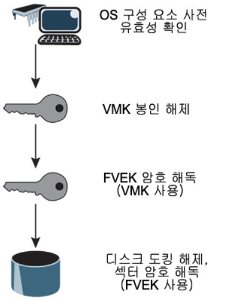
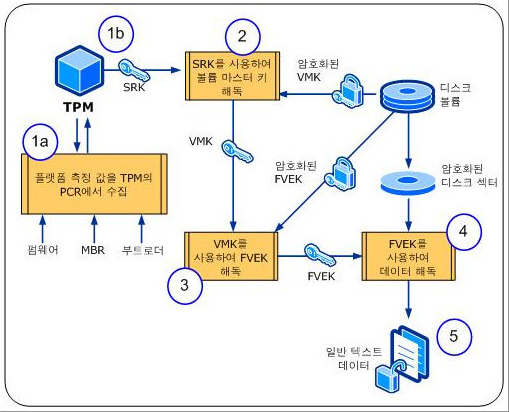
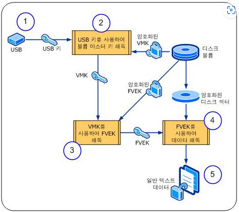

# Windows Bitlocker

Bitlocker란 무엇인가 ?

---


## Bitlocker란 ?

**Bitlocker**는 Data 도난 및 분실, 또한 부적절하게 서비스 해제된 Device의 노출 위협을 해결하는 Solution 중 하나 이다.

**Windows OS내의 내장**된 **HDD, USB**같은 저장 매체를 암호화하여 Data를 보호하는 기술이다. 전체 Disk를 암호화하는 **FDE(Full Disk Encryption)**이라 고도 불린다.

**Bitlocker 기술**은 특정한 파일이나 폴더를 암호화 하는 것이 아닌 Device 전체 또는 Partition 전체를 암호화하는 것이 특징이다. 

또한 Bitlocker 기술은 Windows에 일반적으로 설치 되어 있는 신뢰 할 수 있는 모듈 - **TPM과 함께 사용** 되었을 때 **최대 성능의 보호**를 제공한다. 

---

## Bitlocker의 Data 암호화 방식

Bitlocker는 **128Bit Key와 함께 AES 암호화 알고리즘**을 사용한다. 

- Key Length를 늘리고 싶을 땐 Group Policy나 Bitlocker WMI 공급자를 통해 256 Bit로 Key를 늘릴 수 있다.

또한 Bitlocker는 AES로 Data를 암호화 하기 전에 `디퓨저 알고리즘`도 사용한다.

```markdown
디퓨저 알고리즘이란 ?

간단히 설명하자면 ..
일반 Text가 조금이라도 변경이 되면 암호화된 암호 Text의 전체 Sector를 변경하는 알고리즘이다.
이러한 알고리즘을 통해 공격자가 Key나 Data를 알아내기 힘들게 할 수 있다.
```

## Bitlocker의 Key 구조

암호화 기능을 사용하려면 Key에 대해서 잘 알아야 하며 Bitlocker도 예외는 아니다.

Bitlocker는 정교하지만 다소 복잡한 Key 구조를 가지고 있다.

Bitlocker로 암호화 할 때의 Sector는 먼저 **FVEK(Full Volume Encryption Key)**로 암호화 한다.

- 사용자는 FVEK를 사용하지도, Access를 할 수도 없다.

FVEK는 또 다시, **VMK(Volume Master Key)**로 다시 암호화된다. 

- 이러한 수준의 추상화는 나름대로 장점도 있지만 암호화 프로세스가 다소 이해하기 어려울 수도 있다는 단점도 존재한다.

외부에 FVEK가 노출되면 **모든 Sector를 다시 암호화** 해야 하므로 집중 보호되는 기밀 데이터로 보관된다. 이러한 작업은 시간이 많이 소요 되기 때문에 System에서는 **VMK**를 대신 사용한다.

- **FVEK**는 VMK로 암호화되어 Volume의 Metadata의 일부로 Disk 자체에 저장이 된다.
- **FVEK**가 Local에 저장되긴 하지만 **무조건 암호화**되어 저장이 된다.

### 그럼 VMK는 ?

VMK도 하나 이상의 Key 보호기를 통해서 `보호` 된다.

- 기본 Key 보호기는 **TPM**이다.

**TPM**을 **USB 드라이브**에 저장된 `부분 Key, 숫자 PIN`과 함께 사용하면 **보안을 강화** 할 수 있다.

- 이러한 방식을 이중 인증 방식 이라고 한다.

Computer에 호환이 되지 않는 TPM 칩과 BIOS가 없는 경우 키 보호키를 USB에 저장하여 Bitlocker를 사용할 수 있다.

- 이렇게 USB에 저장하여 **키 보호키**를 활용하여 Bitlocker를 풀 수 있는 Key를 **시작 Key**라고 한다.

### 복구

System이 시작될 때 System에서는 TPM을 Query 하고 USB Port를 확인하여 적절한 Key 보호기를     검색한다.

또한, 필요한 경우 System이 사용자에게 Key 보호기를 요청하는데 이것을 `복구` 라고 한다.

Key 보호기를 찾으면 아래와 같이 **VMK, FVEK, Encryption Data** 순서로 복구 된다. 




## TPM이 포함되어 있는 Bitlocker의 암호 해독 과정

TPM에 시작 키를 구성하는 경우의 Bitlocker 암호 해독 과정에 대한 흐름은 아래의 그림과 같다.




1. BIOS가 시작되고 TPM을 초기화한다.  
    - **신뢰할 수 있는 구성 요소**가 ****TPM과의 상호 작용을 통해 **구성 요소 측정 값**을 TPM의 **PCR**에 저장한다.
2. **PCR**에 저장된 구성 요소 측정 값이 일치 하다면 TPM은 **SRK**를 사용하여 **VMK를 해독**한다.
3. 암호화된 **FVEK**를 **Volume에서 읽은 후** SRK로 해독한 **VMK**를 가지고 FVEK를 해독한다.
4. 암호화된 Disk Sector에 있는 Data에 **Access** 할 때 **FVEK를 사용**하여 **Data를 해독**한다.
5. 일반 **해독된 Data가** 응용 프로그램 및 Process 에 **제공된다.** 

## USB 장치를 사용하는 Bitlocker의 암호 해독 과정



1. 부팅 시 OS가 시작되고 **USB Key**가 들어 있는 **USB 장치를 연결하라는 Message**가 표시된다. 
2. USB 장치 **내부**에 있는 **USB Key**를 사용하여 **VMK가 해독** 된다. 
3. **암호화된 FVEK**를 **Volume**에서 읽어 들이고 이를 **해독할 때 VMK**를 사용한다.
4.  **Disk Sector에 Access** 할 때 FVEK를 사용하여 **해독**한다.
5. 일반 **해독된 Data가** 응용 프로그램 및 Process 에 **제공된다.** 

이럴 경우에는 Bitlocker는 시작 키를 USB 장치에 저장하게 되며 Windows 부팅 시 USB 장치를 장착해야만 부팅이 진행 된다. 

```powershell
즉, TPM 때와는 달리 부팅시 USB 장치를 반드시 Computer에 장착시키는 추가적인 과정을 거쳐야한다.
```

이 방식의 장점이자 단점이라면…

- USB Key를 여러 벌 복사해 둘 수 있다는 것이다.
- 해당 Computer에 접근할 수 있는 사용자를 원하는 대로 추가할 수 있지만 …
- 이는 곧 USB Key가 유출될 가능성을 높여준다.

---

## Bitlocker의 장점과 단점

### 장점

1. Disk 암호화를 통해 자료를 안전하게 보호할 수 있다.
    - 예를들어.. USB Memory 등에서 활용 시 분실하더라도 자료 유출 걱정을 하지 않아도 된다.
    - 노트북의 경우 HDD를 암호화한 경우에도 마찬가지이다.
2. 사용법이 비교적 쉬운 편이다. 

### 단점

1. 암호화 작업 시 오래 걸린다. 
2. Microsoft Windows에서만 적용이 되기 때문에 다른 OS를 사용하는 경우 Bitlocker를 사용할 수 없다. 
3. 암호를 잊어버리면 진짜 끝장이다. 물론 복구 키를 따로 제공하지만, 이것도 잊어버리면 대책이 없다.