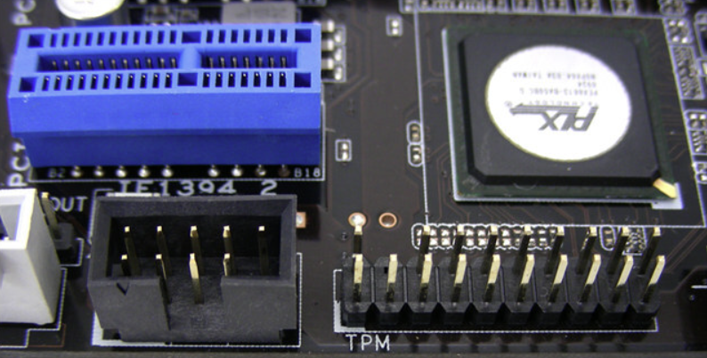
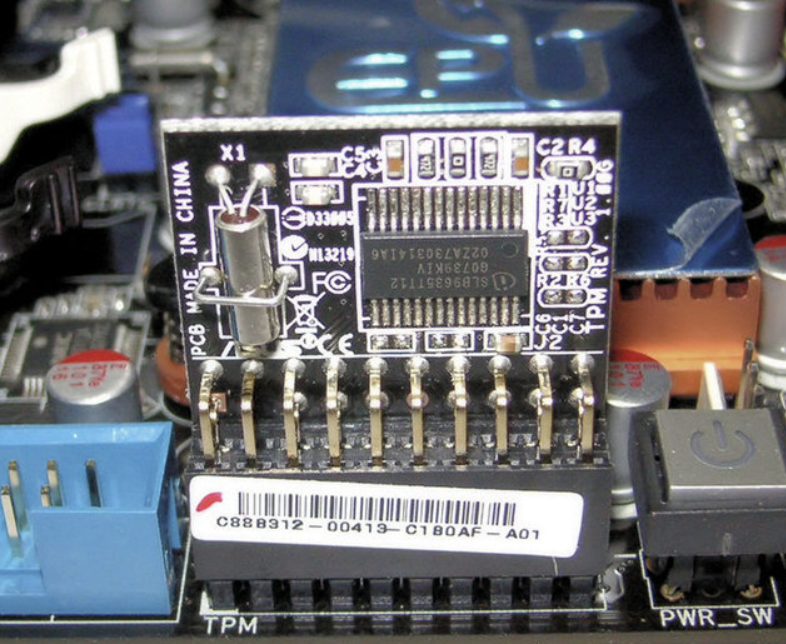
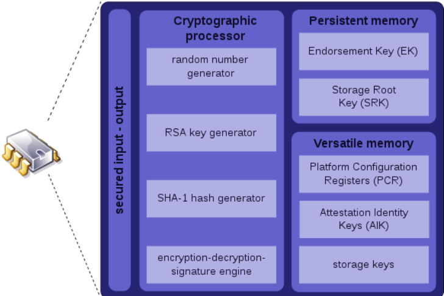
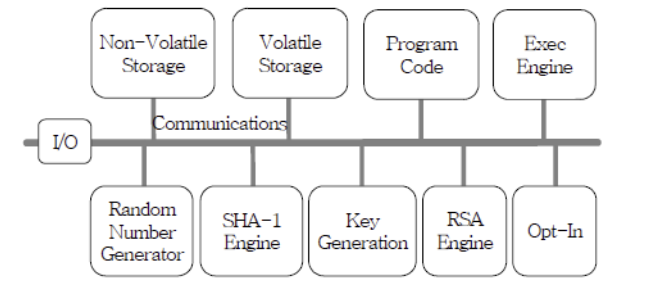

# TPM (Trust Platform Module)

## TPM은 무엇일까 ?

TPM을 한 줄로 간단하게 설명하면 Password, 디지털 인증서 암호화 Key를 저장할 수 있는 공간과 RSA와 SHA-? 등의 암호화 기법이 포함된 **Hardware 칩**을 의미한다. 

즉, **TPM을 활용하여 암호화가 되어있는 Hard Disk**를 떼서 다른 곳에 붙여도 **해독을 할 수 없는 것**이다.

> 노트북의 지문 인식 인증 방식의 지문 정보도 TPM 모듈에서 관리가 된다.
> 
- 아래는 TPM 칩이 장착되어 있지 않은 상태이다.




- 아래는 TPM 칩이 장착이 되어 있는 상태이다.



Bitlocker를 사용하여 암호화를 진행할 시 …

### 1. TPM이 장착이 되어 있을 때

TPM이 장착이 되어 있을 때는, 별도의 인증 정보를 제공하지 않고 바로 System에 접근할 수 있다.

아래에서 자세히 설명하겠지만 TPM은 고유한 Key를 가지고 있다.

- TPM은 고유한 Key를 사용해서 Disk를 암호화 한다.
- 그러므로, TPM 칩 없이는 암호화를 해독할 수 없다. 즉, 암호화한 메인보드가 아니면 해독할 수 없다는 뜻이다.

### 2. TPM이 장착되어 있지 않을 때

TPM이 장착되어 있지 않은 경우에는 별도의 인증 정보를 제공해야 한다. 

- 일반적으로는 Password나 USB Key를 요구한다.
- 즉, TPM이 없는 경우에는 인증 정보를 별도로 관리해야 하므로 TPM을 사용하는 것보다      안전성이 떨어지는 것이다.

---

## TPM의 구성




TPM은 위와 같이 구성되어 있다. TPM에서 K로 끝나는 것들은 거의 다 Key로 보면 된다.

## Cryptographic processor

Data, Disk의 암호화 및 복호화를 수행한다.

### 1. Random number generator (이하 RNG)

- RNG는 예상 못하는 무작위 난수이다.
- 암호화 알고리즘에서 사용하는 Key를 생성할 때 사용된다.
- TPM 모델에 따라서 다르지만, 주로 128bit 또는 256bit이다.

### 2. RSA key generator

- 위에서 생성한 난수를 가지고 Key Pair를 생성한다.
- 이 Key Pair는 Data와 DIsk를 암호화하고 복호화 할 때 주로 사용되는 Key이다.

### 3. SHA-1 hash generator

- 말 그대로 SHA Engine을 담고 있다.
- TPM 1.2 Version 에서는 SHA-1 Hash Algorithm 만을 사용한다.

### 4. Encryption-Decryption-signature Engine

- Cryptographic processor의 주요 기능을 처리한다.
- Hash 함수 및 생성한 Key Pair로 암호화 복호화 기능을 모두 수행한다.

## Persistent Memory

### 1. Endorsement key, Storage Root key

- 각 TPM 칩에는 EK라는 고유한 RSA Key Pair가 저장 되어 있다.
- SW는 EK에 절대로 Access 할 수 없게 설계 되어 있다.
- EK는 user/admin이 System의 Owner가 되면 SRK를 생성하기 위해 EK를 사용한다.

```markdown
EK : TPM 제조사에서 TPM 칩을 만들 때마다 새로운 EK가 생성되며, 이 Key는 TPM의 고유한 식별자 역할을 한다.
SRK : TPM내에서 다양한 Key를 저장하고 보호하는데 사용된다. TPM은 Data를 보호하기 위해 Key를 사용하는데 이러한 Key들이 SRK에 의해 보호된다..
```

## Versatile memory

### 1. Platform Configuration Registers (이하 PCR)




- 8~24개로 구성된 Computer의 정보이다.
- 외부에서 직접 쓰기가 불가능 하고 정해진 절차에 의해 값을 Extend 한다.

### PCR의 주요 구성 요소

**Non-Volatile Storage** 

- 비 휘발성 Memory이며 **SRK,EK**가 저장된다.

**Random Number Generator**

- 위에서 설명했던 것처럼 **무작위의 난수 값**이다.

**Volatile Storage**

- 휘발성 Memory이며 **PCR,AIK**가 저장된다.

### 2. Attestation Identity Keys (이하 AIK)

- TPM이 장착된 Device가 다른 장비와 통신하기 위해 신뢰할 수 있는 Device인지 확인하려면      **TPM이 가지고 있는 EK**를 확인 해야 한다.
    - 그러나 TPM의 EK가 자주 노출 되는 경우는 보안적으로 별로 좋지 않다.

그래서 나온 개념이 `AIK`이다.

```markdown
AIK란?

- Attestation 증명서를 발급하여 TPM이 부팅 및 운영 중 수행하는 작업을 증명할 수 있다.
- 또한 Device의 신뢰성을 증명하고  외부 System이나 프로그램에서 TPM을 검증할 수 있도록 하는 보안 기술이다.
```

### 3. Storage keys

- 위 RSA Key Generate에서 만들어 Key들을 보관하는 곳이다.

---

## TPM 1.2  vs  TPM 2.0

TPM Version은 주로 **1.2 와 2.0**으로 나누어 진다.

**TPM 2.0**은 TPM 1.2에 비해서 알고리즘, 암호화, 계층 구조 등 주요한 이점을 실질적으로 제공한다.

**Google이나 Microsoft** 같은 기술 선도업체는 2017년에 **SHA-1 기반의 서명 또는 인증서에 대한 지원을 하지 않겠다**고 발표하기도 하였다.

### TPM 1.2 vs TPM 2.0


 

**위의 구성도가 TPM 1.2 Version 의 구성도 이다.** 

**TPM 2.0**은 위의 구성도 에서 여러가지 **추가적인 옵션을 지원**한다.

### Hash 알고리즘 및 암호화 알고리즘

**TPM 1.2** 

- TPM 1.2 Version에서는 RSA 및 SHA-1 Hash Algorithm 사용 만을 허용한다.

**TPM 2.0**

- TPM 2.0 Version 에서는 RSA 외에도 다양한 암호화 알고리즘인 ECC, AES 등을 지원한다.
- 암호화 Key의 더욱 다양한 길이를 지원한다.

### 장치 암호화

**TPM 1.2** 

- TPM 1.2 Version 에서는 장치 암호화를 지원하지 않는다.

**TPM 2.0** 

- TPM 2.0 Version 에서는 장치 암호화를 지원한다.

### PCR 확장

**TPM 1.2** 

- TPM 1.2 Version 에서는 주로 24개의 PCR을 지원하였다.

**TPM 2.0** 

- TPM 2.0 Version 에서는 최소 24개에서  시작하여 더 많은 PCR을 지원할 수 있다.
- 이로써 더 정밀하게 PCR의 무결성을 확인할 수 있다.

### Log Event

**TPM 1.2** 

- TPM 1.2는 별도의 Log 기능이 존재하지 않았다.

**TPM 2.0** 

- TPM 2.0 Version 에서는 Event Log 및 Audit (감사) 메커니즘을 제공하여 시스템의 보안 사건을 기록하거나 쉽게 모니터링 할 수 있다.