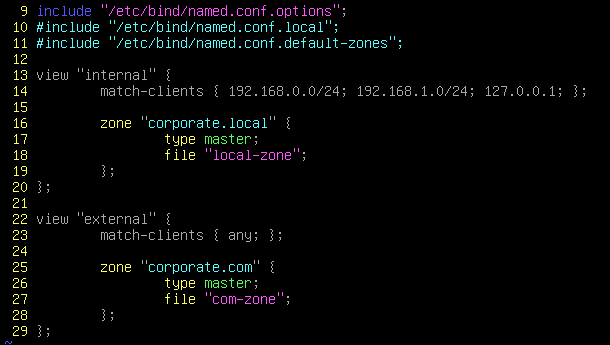

# BIND9_basic
### BIND 란 ?
```
BIND는 DNS 서비스를 위한 모든 기능을 갖춘 확장 가능한 오픈 소스 소프트웨어
BIND9은 DNS 네임 서버를 구축하고 레코드를 관리할 수 있도록 도와주는 패키지
```
### BIND9 구성 파일
```
named.conf 파일은 BIND9의 기본 구성 파일이다.
DNS 서버가 실행될 때 메인 설정 파일로 사용되며, 주요 옵션과 설정 내용이 포함됨
이 파일을 사용하여 아래와 같은 중요한 구성 옵션을 설정할 수 있음

1. View : DNS 서버가 클라이언트 별로 다른 DNS 데이터를 제공할때 사용되는 DNS 뷰를 정의 
(자세한건 뒤에 나옴)

2. Zone : DNS 존을 정의하고 관리하는데 사용, 각 존은 해당 존 파일의 경로와 유형과 관련된 설정을 포함

3. Include : 다른 구성 파일을 named.conf 에 포함하여 설정을 모듈화하고 간결하게 유지
( named.conf.local 및 named.conf.options 와 같은 추가 파일을 포함)

4. Options : 다양한 전반적인 DNS 서버 옵션을 구성, named.conf.options 파일에서 사용할 수 있는 옵션을 사용할 수 있음

5. Logging : DNS 서버의 로그 관리, 로그 파일 위치, 레벨 및 형식을 구성

6. Key : TSIG 또는 DNSSEC 키를 정의, 보안 관리 설정에 사용

7. Zone-statistics: 존 통계에 관한 정보를 구성
```

```
/etc/bind/named.conf.options 파일에는 구성에 필요한 옵션을 지정할 수 있는 위치에 대한 참조가 포함되어 있으며 열 가지를 수정하여 BIND9을 구성할 수 있다.

1. acl <acl 이름> <범위> : LAN을 정의하는 지시문
(정의 하지 않으면 모든 IP 주소로부터 DNS 쿼리를 허용하는 기본 동작을 따름) 

2. allow-query <범위> : 서버에 DNS 쿼리를 보낼 수 있는 IP 주소를 정의하는 지시문
(정의 하지 않으면 기본적으로 모든 클라이언트의 DNS 쿼리를 허용함)
(ACL 이름을 범위에 넣어 쿼리를 지정 할 수 있음)

3. forwarders <범위> : 이 서버가 재귀 쿼리를 전달할 DNS 서버를 정의하는 지시문
(정의 하지 않아도 recursion 방식으로 동작) 

4. directory <directory 위치> : DNS 서버 작업 디렉토리를 설정하는 지시문
(정의 하지 않으면 기본 값으로 /var/cache/bind 로 지정)

5. listen-on <IP 주소> : 특정 IP 주소 또는 인터페이스에서 수신을 대기 하게 하는 지시문
( 정의 하지 않으면 모든 인터페이스에서 수신을 대기)

6. recursion <yes/no> : 서버에 대한 재귀적인 DNS 쿼리를 허용하는 지시문 
(recursion no 를 할 경우 iterative DNS 쿼리를 허용함)
(기본 동작 방식은 recursion yes)

7. allow-recursion : 특정 클라이언트 그룹에 대한 재귀 쿼리 액세스를 제어하는 지시문
( recursion 이 활성화되어 있을 때 특정 클라이언트에게만 재귀 쿼리를 허용)

8. dnssec-validation <yes/no> : DNSSEC 검증을 활성화 또는 비활성화. 외부에서 수신한 DNS 데이터의 DNSSEC 서명을 검증하도록 설정
( 기본 동작 방식은 dnssec-enable yes; )

9. dnssec-enable <yes/no> : DNSSEC 지원을 활성화 또는 비활성화. DNS 서버의 자체 DNSSEC 서명 및 관리와 관련 있으며, 서버가 DNS 데이터에 서명을 추가하는데 사용
( 기본 동작 방식은 dnssec-validation auto; )

10. zone-statistics <yes/no> : BIND9 DNS 서버의 존 파일에 대한 통계 정보를 수집하는데 사용
( 기본 동작 방식은 zone-statistics yes; )

모든 configuration 이 끝난 경우 bind9 을 재시작 해줘야 한다.
```

---
# BIND9_view
### VIEW 란 ?
```
DNS 뷰는 동일한 DNS 서버에서 다른 관점으로 다른 DNS 데이터를 제공하는 방법을 제공

예를 들면 내부 뷰는 내부 네트워크에서만 볼 수 있게 설정하고, 외부 뷰는 외부 네트워크에서만 볼 수 있게 설정할 수 있다.

뷰를 사용하면 DNS 서버가 서로 다른 클라이언트 또는 네트워크 그룹에 대해 다른 DNS 데이터를 반환할 수 있기 때문에 내부/외부 네트워크 관리등에 유용하고 보안, 성능에 대한 요구사항을 충족 시킬 수 있다.
```

### VIEW 구성 파일
```
named.conf 에서 VIEW 를 구성할 수 있다.
view 는 관점에 따라 분류되기 때문에 BIND9 구성파일에 사용한 옵션을 구분해서 적을 수 있다.
(view 에서 쓰는게 일반적인 match-clients 도 있긴 함)
```
## VIEW Example


```
1. include 명령을 통해 다른 구성 파일인 named.conf.options 를 참조
2. View "internal" , view "external" 로 나눠 내부 클라이언트의 DNS 레코드와 외부 클라이언트의 DNS 레코드를 구분
3. View "internal" 에는 192.168.0.0/24, 192.168.1.0/24, 127.0.0.1 네트워크 대역만 DNS 쿼리가 가능하게 나누어 주고 View "external" 에는 내부 네트워크를 제외한 모든 네트워크에 대한 쿼리를 허용
( 127.0.0.1 은 localhost 주소로 DNS 서버가 내부 DNS 레코드와 쿼리가 가능하게 설정 )
4. corporate.local Zone 과 corporate.com Zone 을 만들어 내부 쿼리와 외부 쿼리를 나눈다.
5. zone 의 Type `master` 로 하고 zone 구성 파일은 local-zone, com-zone 으로 한다
(type 에 대해서는 Same_Knowledge 에 자세히 설명)
(file의 기본 디렉토리는 /var/cache/bind/ 밑에 둔다 )
6. zone을 간단히 구성하면 내부 클라이언트(network 가 192.168.0.0/24, 192.168.1.0/24)에서는 내부 zone 에 구성한 DNS 데이터에, 외부 클라이언트(내부 외의 모든 네트워크)에서는 외부 zone 에 구성한 DNS 데이터에 쿼리를 할 수 있게 된다.
( zone 구성은 나중에 다시 설명하면서 이어서 만들 예정 )
```
---
# BIND9_Master&Slave
### Zone
```
DNS 서버 소프트웨어에서 "zone"은 DNS 데이터의 논리적인 영역을 가르킴
특정 도메인의 일부로서 해당 도메인 아래의 모든 리소스 레코드를 관리하는 단위
각 DNS 존은 하나 이상의 DNS 레코드를 포함하며, 이러한 레코드들은 해당 도메인의 이름 해석 및 관리를 위해 사용

Zone 에는 Type 이 여러가지 있다.

1. Master Zone (Primary Zone)
    주 존으로, 해당 존의 데이터를 생성하고 수정할 수 있는 권한을 갖는다.
    이것은 주로 DNS  데이터를 관리하고 동기화 하는데 사용

2. Slave Zone (Secondary Zone)
    주 존에서 데이터를 복제하고 유지하는 역할을 한다.
    주로 로드 밸런싱 및 고가용성을 위해 사용

3. Stub Zone
    다른 DNS 서버의 정보를 가지며, 주로 외부 도메인의 데이터를 가져와 로컬 DNS서버에서
    캐싱할 때 사용 

4. Forward Zone
    일반적으로 DNS 서버가 다른 외부 DNS 서버로 DNS 쿼리를 전달하는 데 사용

5. Reverse Zone
    IP 주소를 호스트 이름으로 해석하는 데 사용된다.
    주로 역방향 DNS 조회를 지원하기 위해 사용

6. View-based Zone
    동일한 DNS 존을 다른 관점에서 보게끔 하는데 사용
    서로 다른 IP 주소 범위에 대해 다른 데이터를 제공하는데 유용

7. DNSSEC-signedZone (DNSSEC Zone)
    DNSSEC 서명된 존으로, 데이터의 무결성을 보장하고 보안을 강화하기 위해 사용

8. Dynamically Updateable Zone (Dynamic Zone)
    동적으로 업데이트될 수 있으며, 주로 다이나믹 DNS 업데이트 프로토콜을 사용하여 동적
    호스트 레코드를 관리하는데 사용
```