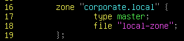
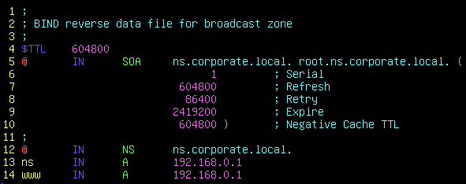
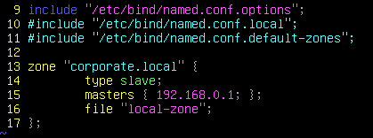
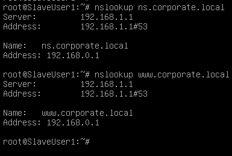

# BIND9_Master&Slave
### Zone
```
DNS 서버 소프트웨어에서 "zone"은 DNS 데이터의 논리적인 영역을 가르킴
특정 도메인의 일부로서 해당 도메인 아래의 모든 리소스 레코드를 관리하는 단위
각 DNS 존은 하나 이상의 DNS 레코드를 포함하며, 이러한 레코드들은 해당 도메인의 이름 해석 및 관리를 위해 사용

Zone 에는 Type 이 여러가지 있다.

1. Master Zone (Primary Zone)
    주 존으로, 해당 존의 데이터를 생성하고 수정할 수 있는 권한을 갖는다.
    이것은 주로 DNS  데이터를 관리하고 동기화 하는데 사용

2. Slave Zone (Secondary Zone)
    주 존에서 데이터를 복제하고 유지하는 역할을 한다.
    주로 로드 밸런싱 및 고가용성을 위해 사용

3. Stub Zone
    다른 DNS 서버의 정보를 가지며, 주로 외부 도메인의 데이터를 가져와 로컬 DNS서버에서
    캐싱할 때 사용 

4. Forward Zone
    일반적으로 DNS 서버가 다른 외부 DNS 서버로 DNS 쿼리를 전달하는 데 사용

5. Reverse Zone
    IP 주소를 호스트 이름으로 해석하는 데 사용된다.
    주로 역방향 DNS 조회를 지원하기 위해 사용

6. View-based Zone
    동일한 DNS 존을 다른 관점에서 보게끔 하는데 사용
    서로 다른 IP 주소 범위에 대해 다른 데이터를 제공하는데 유용

7. DNSSEC-signedZone (DNSSEC Zone)
    DNSSEC 서명된 존으로, 데이터의 무결성을 보장하고 보안을 강화하기 위해 사용

8. Dynamically Updateable Zone (Dynamic Zone)
    동적으로 업데이트될 수 있으며, 주로 다이나믹 DNS 업데이트 프로토콜을 사용하여 동적
    호스트 레코드를 관리하는데 사용

9. Hint Zone 
    root 서버의 레코드 정보가 적혀있는 파일을 참조하여 root 서버의 위치를 알게 해줌
```

## Master Zone
1. DNS 데이터를 주되게 관리하며 신뢰할 수 있는 답변을 제공
### Master_example (View 쪽과 연결되어있음 Server)


- 도메인이 corporate.local 인 Zone 을 만듬
- Type 은 Master로 주최되는 Zone
- file 은 local-zone이라는 파일에 저장



- ns.corporate.local 은 corporate.local 의 네임서버의 위치를 의미함
- ns.corporate.local, www.corporate.local 의 Domain Name 을 192.168.0.1 로 해석해줌 
#### 결과 (User1)


- User1은 서버의 위치를 192.168.0.1 로 설정해놔야함
- local-zone 파일에 구성한대로 ns.corporate.local, www.corporate.local 모두 192.168.0.1 로 해석


## Slave Zone
1. 데이터 복제 : Master Zone 에서 복사한 데이터를 미러링하고 동일한 정보를 저장한다.
2. 고가용성 : Master Zone 가 shutdown 되어도 복제한 데이터를 미리 저장해 놓았기 때문에 Slave Zone 에서는 여전히 DNS 쿼리를 처리 할 수 있으므로 서비스의 지속성을 보장한다.
3. 분산 데이터 배포 : 여러개의 Slave Zone를 사용하여 동일한 정보를 여러 지역 또는 서버에 분산하여 로드 밸런싱 효과를 얻을 수 있다.
- Master zone 이 업데이트가 될 경우
  - Slave Server 에서 DNS 프로토콜의 AXFR(Zone Transfer) 또는 IXFR(Incremental Zone Transfer) 를 사용함으로써 Slave Zone 을 업데이트 한다
  - 중요한 점은 Slave DNS 서버가 주기적으로 Master DNS 서버로부터 변경된 존 파일을 가져오거나 새로 고침하는 데 의존한다는 것, Slave 존은 적기에 업데이트를 받아와야 함
  - 이러한 주기를 적절하게 구성하면 Master 및 Slave 간의 DNS 데이터 일관성을 유지할 수 있음
- Slave Server 의 보안설정
  - 누구든지 Master Server에서 zone을 받아와서 Slave Server가 되는 경우 보안에 문제가 생길 수 있기에 주의 해야 한다.
      - Master Zone의 보안 설정으로 존의 데이터를 업데이트할 권한을 지정 클라이언트에게 부여하는 allow-update 명령어가 있다. 위 지시어를 사용하여 특정 IP 주소, IP 주소 범위, 혹은 인증된 클라이언트에 대한 업데이트를 허용하게 하여 무단 업데이트로부터 존의 데이터를 보호할 수 있다.
      - Slave Zone의 보안 설정으로 Master zone에서 Slave zone 으로 데이터를 전송할 때 어떤 클라이언트에게 전송할 수 있는지 정의하는 allow-transfer 명령어가 있다. 위 명령어를 통해 특정 IP 주소나 IP 주소 범위, 인증된 서버에 대한 전송을 제한함으로써 데이터의 무단 전송을 방지할 수 있다.
  - 우선 DNS 데이터 전송을 보호하기 위해 TSIG 를 사용하여 인증을 수행하고 데이터를 암호화
  - Master DNS 서버에서 Slave DNS 서버로 전송되는 데이터가 네트워크에서 안전하게 전송되도록 네트워크 액세스를 제한 (방화벽 또는 ACL을 사용하여 허용된 IP 주소만이 데이터를 받도록 설정)
  - Slave DNS 서버는 데이터를 받기만 하고 수정 권한이 없어야 함 (데이터를 수신하는 서버가 수정할 수 없도록 설정)
  - 시스템을 업데이트하고 모니터링하여 보안 취약점을 식별하고 보안 업데이트를 적용
  - Master와 Slave 간의 통신은 안전한 채널을 통해 이루어져야 함 (일반적으로 VPN 또는 SSH를 사용하여 통신을 보호)
  

### Slave_example (View 와 연결되어 있음 Slave_Server)


- 도메인이 corporate.local 인 Zone 을 만듬
- Type 은 Slave 로 주권이 없으며 주기적으로 Master 서버로부터 존 전송을 요청하도록 구성됨
- masters \<Master 서버 IP> 옵션을 사용하여 마스터의 위치를 찾아줌
- BIND9 시스템을 재시작하면 자동으로 local-zone 파일이 만들어지고 master zone에서 데이터를 받아와 저장해 놓지만 직접 들어가면 보기 어렵게 나옴
#### 결과 (SlaveUser1)


- SlaveUser1은 서버의 위치를 192.168.1.1(Slave_server 의 IP) 로 설정해놔야함
- User1 처럼 Master_server에서 구성한대로 나옴