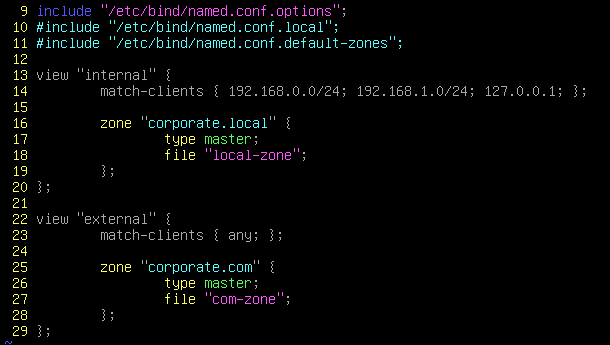
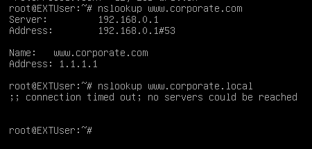

# BIND9_view
### VIEW 란 ?
```
DNS 뷰는 동일한 DNS 서버에서 다른 관점으로 다른 DNS 데이터를 제공하는 방법을 제공

예를 들면 내부 뷰는 내부 네트워크에서만 볼 수 있게 설정하고, 외부 뷰는 외부 네트워크에서만 볼 수 있게 설정할 수 있다.

뷰를 사용하면 DNS 서버가 서로 다른 클라이언트 또는 네트워크 그룹에 대해 다른 DNS 데이터를 반환할 수 있기 때문에 내부/외부 네트워크 관리등에 유용하고 보안, 성능에 대한 요구사항을 충족 시킬 수 있다.
```

### VIEW 구성 파일
```
named.conf 에서 VIEW 를 구성할 수 있다.
view 는 관점에 따라 분류되기 때문에 BIND9 구성파일에 사용한 옵션을 구분해서 적을 수 있다.
(view 에서 쓰는게 일반적인 match-clients 도 있긴 함)
```
## VIEW Example 
### Server


```
1. include 명령을 통해 다른 구성 파일인 named.conf.options 를 참조

2. View "internal" , view "external" 로 나눠 내부 클라이언트의 DNS 레코드와 외부 클라이언트의 DNS 레코드를 구분

3. View "internal" 에는 192.168.0.0/24, 192.168.1.0/24, 127.0.0.1 네트워크 대역만 DNS 쿼리가 가능하게 나누어 주고 View "external" 에는 내부 네트워크를 제외한 모든 네트워크에 대한 쿼리를 허용
( 127.0.0.1 은 localhost 주소로 DNS 서버가 내부 DNS 레코드와 쿼리가 가능하게 설정 )
    - localhost 는 주로 사용자가 사용하기 편한방식으로 나타내는 루프백 주소이다. IPv4 주소와 IPv6 주소 둘다 포함하고 있으며 대부분의 OS에서 IPv6 주소를 우선시 한다.
    - localhost 의 IPv4 주소는 127.0.0.1 이다.
    - localhost 의 IPv6 주소는 ::1 이다.

4. corporate.local Zone 과 corporate.com Zone 을 만들어 내부 쿼리와 외부 쿼리를 나눈다.

5. zone 의 Type `master` 로 하고 zone 구성 파일은 local-zone, com-zone 으로 한다
(type 에 대해서는 Same_Knowledge 에 자세히 설명)
(file의 기본 디렉토리는 /var/cache/bind/ 밑에 둔다 )

6. zone을 간단히 구성하면 내부 클라이언트(network 가 192.168.0.0/24, 192.168.1.0/24)에서는 내부 zone 에 구성한 DNS 데이터에, 외부 클라이언트(내부 외의 모든 네트워크)에서는 외부 zone 에 구성한 DNS 데이터에 쿼리를 할 수 있게 된다. 
( zone 구성은 나중에 다시 설명하면서 이어서 만들 예정 )
```
### 결과(EXTUser {IP : 1.1.1.1})



- EXTUser는 네트워크 대역이 사설이 아닌 네트워크이기 때문에 corporate.com에 쿼리가 됨
- view "internal" 은 네트워크 대역이 정해져 있기 때문에 쿼리를 하지 못함