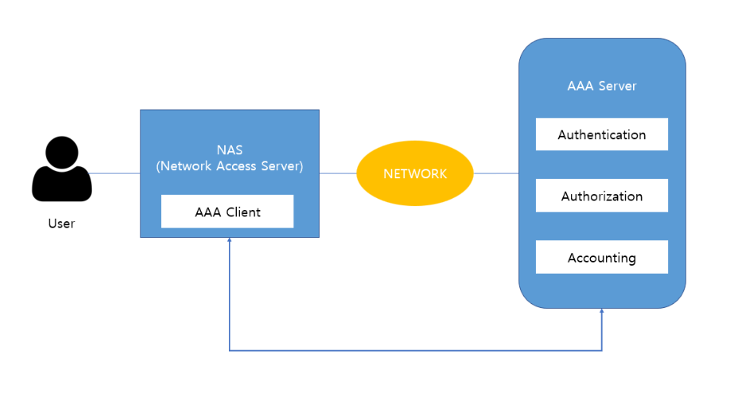
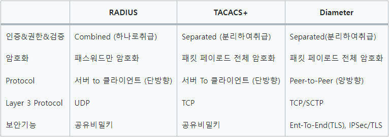

# AAA

## AAA 란?
- 인증(Authentication), 권한부여,인가(Authorization), 계정관리(Accounting) 를 통틀어 이르는 말이다.
- 사용자가 네트워크에 접근하여 자원을 사용하려고 하는 것을 제어하기 위해 사용되는 기술이다.
- AAA는 분산 보안을 위해 필요한 핵심 특성/기능/서비스들을 열거한 포괄적인 용어이다. (특정 System, Protocol을 지칭하는 것이 아니다.)


### 인증 (Authentication)
- 망, 시스템 접근을 허용하기 전에 사용자의 신원을 검증하는 것
### 권한부여,인가 (Authorization)
- 검증된 사용자에게 어떤 수준의 권한과 서비스를 허용하는 것
### 계정관리 (Accounting)
- 인가가 이루어진 후 사용자가 행한 행위의 기록, 사용자의 자원에 대한 사용 정보를 모아서 과금, 감사, 용량증설, 리포팅 등을 수행하는 것 

## AAA 특징 및 구조
### 특징
- 분산된 클라이언트/서버 구조를 가지고 있다.
    - AAA Server : 분산된 정보를 중앙에서 저장, 관리, 허용 여부 통지 등을 한다.
    - AAA Client : 원격 사용자의 인증용 정보를 중앙의 서버에게 전달한다.
### 구조



```
1. AAA 구조에서 각 사용자들은 네트워크 망에 대한 접근을 요청한다.

2. 요청을 받은 NAS(Network Access Server)의 AAA Client는 사용자가 제공한 정보를 
AAA Server에게 전달하여 적절한 인증 및 인가가 이뤄질 수 있도록 한다.

3. AAA Server가 해당 사용자에 대한 인증과 인가를 마치면 AAA Client는 
이 결과 및 관련 데이터를 전달 받아서 해당 사용자의 접근을 허용하거나 거부한다.

4. NAS는 연결이 설정되어 종료되기까지 일어나는 사용자의 기록들을 수집함으로써, 
AAA 서버에게 과금 메시지를 보낼 수 있다.
```

## AAA Protocol 종류
```
AAA Protocol 종류로는 대표적으로 RADIUS, TACASC+, Diameter 가 있다.
```


- RADIUS
    ```
    Remote Authentication Dial In User Service
    (통상적으로 ISP에서 사용하는 전화 등에 의한 원격 접속에 대한 인증용 서버를 지칭)

    NAS에 대한 사용자 인증 및 권한부여의 용도로 사용된다.

    클라이언트/서버 모델로 RADIUS 서버는 사용자 인증 및 권한 부여를 담당하며, 클라이언트로부터의 요청을 처리한다.

    RADIUS는 일반적으로 UDP를 사용하여 패킷을 교환하며, 간단한 통신을 제공한다.
    (인증,인가 : 포트번호 1812, 계정관리 : 포트번호 1813)

    PAP(Password Authentication Protocol), CHAP(Challenge Handshake Authentication Protocol), PPP(Point-to-Point) 등 다양한 방법을 지원한다.
    ```
- TACACS+
    ```
    Terminal Access Controller Access-Control System Plus
    
    네트워크 장치에 대한 인증, 권한 부여 및 계정(회계) 서비스의 용도로 사용된다.

    클라이언트/서버 모델로 TACACS+ 는 RADIUS와 같으며, 사용자 인증 및 권환 부여를 처리한다.

    TACACS+는 TCP를 사용하여 안정적인 연결을 제공하며, 패킷 교환에 있어 신뢰성을 강조한다.
    (TCP 49번 포트를 사용)

    사용자별로 세분화된 명령어 권한을 부여할 수 있는 특징을 가지고 있다.
    ```
- Diameter
    ```
    이동 통신 네트워크에서 사용되는 프로토콜이다.

    Diameter는 RADIUS의 확장으로 고안되었으며, 높은 확장성을 가지고 다양한 네트워크 요구 사항을 지원한다.

    TCP나 SCTP를 사용하며 안정적인 연결을 제공하고, 강화된 보안 기능을 포함하고 있다.

    Diameter는 다양한 서비스, 예를 들어 이동성 관리, IP 관리, QoS 설정 등을 지원하는 특징이 있다.
    ```